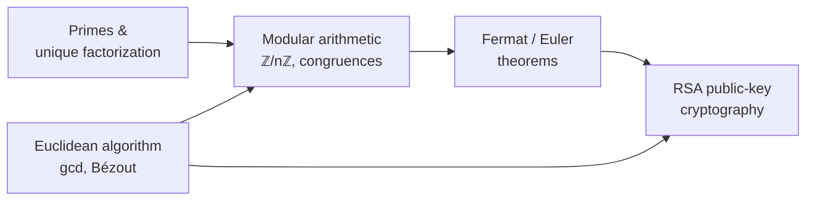

# Number Theory

Number theory studies the integers and their arithmetic — divisibility, primes, and the
patterns of remainders. It is one of the oldest branches of mathematics and, thanks to
public-key cryptography, one of the most consequential today. Its questions are easy to
state and often astonishingly deep, and its structures are the concrete instances that
motivate [abstract algebra](abstract-algebra.md).

## Divisibility, primes, and the GCD

$a$ **divides** $b$ (written $a \mid b$) when $b = ka$ for some integer $k$. A **prime** is
an integer $> 1$ divisible only by 1 and itself. The **Fundamental Theorem of Arithmetic**
says every integer $> 1$ factors into primes *uniquely* (up to order) — primes are the
multiplicative atoms of the integers, and Euclid proved there are infinitely many.

The **greatest common divisor** $\gcd(a,b)$ is the largest integer dividing both. The
**Euclidean algorithm** computes it fast by repeated remainder-taking:
$\gcd(a,b) = \gcd(b, a \bmod b)$, stopping when the remainder is 0. Its extended form also
produces integers $x, y$ with $ax + by = \gcd(a,b)$ (Bézout's identity) — the key to
*inverting* numbers modulo $n$.

## Modular arithmetic and congruences

Fix a modulus $n$ and identify integers that leave the same remainder. We write
$a \equiv b \pmod{n}$ ("$a$ is congruent to $b$ mod $n$") when $n \mid (a-b)$. This is
arithmetic "on a clock": addition and multiplication respect congruence, so we can compute
with remainders alone. The residues $\{0,1,\dots,n-1\}$ form the ring
$\mathbb{Z}/n\mathbb{Z}$ from [abstract algebra](abstract-algebra.md); when $n$ is prime it
is a *field*, and every nonzero element is invertible.

Two theorems drive the applications:

- **Fermat's Little Theorem** — if $p$ is prime and $p \nmid a$, then
  $a^{p-1} \equiv 1 \pmod{p}$.
- **Euler's theorem** — its generalization: $a^{\varphi(n)} \equiv 1 \pmod{n}$ when
  $\gcd(a,n)=1$, where $\varphi(n)$ counts the integers below $n$ coprime to it.

## A worked example: why RSA works

Pick two large primes $p,q$ and let $n = pq$, so $\varphi(n) = (p-1)(q-1)$. Choose a public
exponent $e$ coprime to $\varphi(n)$, and compute the private exponent $d$ as its inverse:
$ed \equiv 1 \pmod{\varphi(n)}$ — found with the extended Euclidean algorithm. Encryption is
$c = m^e \bmod n$; decryption is $m = c^d \bmod n$. Euler's theorem guarantees
$m^{ed} \equiv m \pmod n$, so decryption undoes encryption. Security rests on a factoring
asymmetry: multiplying $p$ and $q$ is trivial, but recovering them from $n$ is believed
intractable at scale. Easy forward, hard backward — a *trapdoor*.

## Why it matters

Number theory is the mathematical foundation of the security we rely on daily. Public-key
schemes (RSA, Diffie–Hellman, elliptic-curve), digital signatures, and hash-based
constructions all live in modular arithmetic over primes — see
[../security/index.md](../security/index.md). More broadly, it is the concrete soil from
which [abstract algebra](abstract-algebra.md) grew: rings, fields, and groups were first
abstracted from exactly these integer patterns. Its algorithmic side — primality testing,
factoring, the Euclidean algorithm — sits squarely in
[discrete mathematics](discrete-mathematics.md).

## References

- [Discrete Mathematics and Its Applications](rosen-discrete-mathematics.md) — Kenneth Rosen (number theory and cryptography chapters)
- [Principles of Mathematical Analysis](rudin-principles-of-mathematical-analysis.md) — Walter Rudin, for the analytic side of the integers and reals
