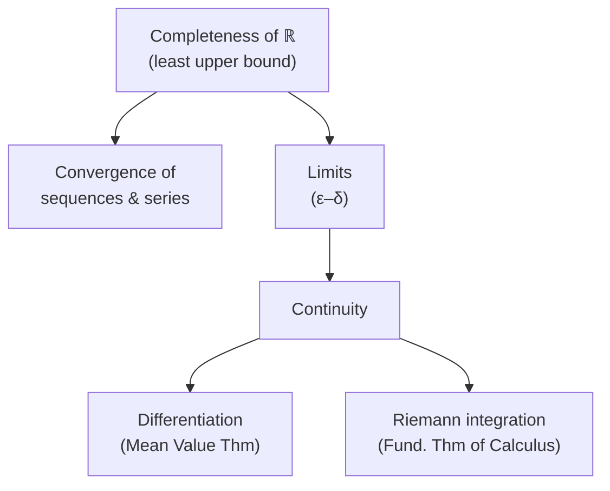

# Real Analysis

Real analysis is the rigorous foundation beneath [calculus](calculus.md). Where an
introductory course treats limits, derivatives, and integrals as intuitive operations,
analysis asks the harder question: *what do these words actually mean, and why do the
theorems hold?* The answer rests on a careful theory of the real numbers, of limits, and
of the machinery of proof from [mathematical proof and logic](mathematical-proof-and-logic.md).

## The completeness of the reals

Everything begins with what distinguishes $\mathbb{R}$ from $\mathbb{Q}$. The rationals
have "holes" — $\sqrt{2}$ is missing — and analysis cannot live on a set full of gaps. The
**completeness axiom** fills them: every nonempty set of reals that is bounded above has a
*least upper bound* (supremum) that is itself real. Equivalently, every Cauchy sequence of
reals converges. This single property is what makes limits behave, and nearly every deep
theorem in the subject traces back to it.

## Sequences, series, and convergence

A sequence $(a_n)$ **converges** to $L$ if its terms eventually stay arbitrarily close to
$L$. Formalized with quantifiers this is the epsilon-N definition:

$$ \forall \varepsilon > 0 \;\; \exists N \;\; \forall n \ge N : \; |a_n - L| < \varepsilon. $$

Reading it aloud: *for any tolerance you name, however small, there is a point beyond which
every term lands inside that tolerance.* A **Cauchy sequence** is one whose terms bunch
together ($|a_m - a_n|$ small for large $m,n$); completeness says Cauchy is equivalent to
convergent in $\mathbb{R}$. An infinite **series** $\sum a_n$ converges when its partial
sums converge, and analysis supplies the tests — comparison, ratio, root, integral — that
decide when it does.

## Limits and the epsilon-delta definition

The epsilon-delta definition of a function limit is the conceptual heart of the subject.
We say $\lim_{x \to c} f(x) = L$ when

$$ \forall \varepsilon > 0 \;\; \exists \delta > 0 \;\; \forall x : \; 0 < |x - c| < \delta \implies |f(x) - L| < \varepsilon. $$

The structure is a challenge-and-response: an adversary picks a target tolerance
$\varepsilon$ around the output, and we must exhibit an input tolerance $\delta$ that meets
it. This quantifier dance replaces the vague "gets close to" of first-year calculus with
something you can actually prove theorems about.

## Continuity, differentiation, integration

- **Continuity.** $f$ is continuous at $c$ when $\lim_{x\to c} f(x) = f(c)$ — no jumps, no
  holes. On a *closed, bounded* interval, continuous functions are automatically bounded,
  attain their max and min (**Extreme Value Theorem**), and hit every intermediate value
  (**Intermediate Value Theorem**). These follow from completeness, not from drawing pictures.
- **Differentiation.** The derivative is the limit of the difference quotient. The
  **Mean Value Theorem** — that some interior slope equals the average slope — is the engine
  behind most first-order reasoning about functions.
- **Riemann integration.** The integral is built as a limit of sums over ever-finer
  partitions: upper sums squeeze down and lower sums push up, and the function is
  *integrable* when they meet. The **Fundamental Theorem of Calculus** then ties integration
  back to differentiation, justifying the calculus you already knew.

## A worked example

Prove $\lim_{x\to 3}(2x+1)=7$. Given $\varepsilon>0$, note $|(2x+1)-7| = 2|x-3|$. Choose
$\delta = \varepsilon/2$. Then $0<|x-3|<\delta$ forces $|(2x+1)-7| = 2|x-3| < 2\delta =
\varepsilon$. The proof *constructs* the required $\delta$ from $\varepsilon$ — that
explicit construction is what "rigor" buys us over hand-waving.

## Why it matters

Analysis is where calculus stops being a bag of tricks and becomes deductive mathematics.
Its uniform-convergence and integration theory underwrite probability and measure (see
[../statistics/index.md](../statistics/index.md)), its epsilon-delta thinking generalizes
directly into [topology](topology.md) and metric spaces, and its convergence results are
exactly what let us reason about whether iterative optimization in [../ai/](../ai/machine-learning.md)
actually settles down. It also trains the proof discipline of
[mathematical proof and logic](mathematical-proof-and-logic.md) on genuinely subtle claims.

## References

- [Principles of Mathematical Analysis](rudin-principles-of-mathematical-analysis.md) — Walter Rudin ("baby Rudin"), the canonical rigorous treatment
- [Calculus](spivak-calculus.md) — Michael Spivak, a proof-first bridge from calculus into analysis
