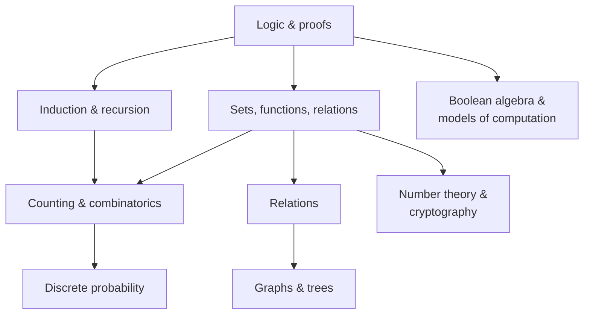

# Discrete Mathematics and Its Applications (Kenneth Rosen)

Kenneth Rosen's *Discrete Mathematics and Its Applications* is the standard,
comprehensive introduction to discrete mathematics for computer science and
mathematics undergraduates. It is encyclopedic in coverage and applications-heavy —
its examples lean consistently toward computing (algorithms, cryptography, formal
languages) — which is why it is the default text where discrete math meets a CS
curriculum. It is broad rather than deep: it introduces a large number of topics
with many worked examples and exercises, serving as the on-ramp to the specialized
courses that follow.

## Scope and approach

Discrete mathematics is the mathematics of countable, structured, non-continuous
objects — the natural counterpart to the continuous world of
[calculus.md](calculus.md). Rosen's chapters map the standard territory:

- **Logic and proofs** — propositional and predicate logic, rules of inference, and
  proof techniques (direct, contrapositive, contradiction, induction). This
  chapter is the foundation the rest of the book stands on; see
  [mathematical-proof-and-logic.md](mathematical-proof-and-logic.md).
- **Sets, functions, sequences, sums, and matrices** — the basic structures used
  everywhere else.
- **Algorithms** — pseudocode, growth of functions, and big-O/complexity analysis.
- **Number theory and cryptography** — divisibility, modular arithmetic, primes,
  the Euclidean algorithm, and RSA as the payoff application.
- **Induction and recursion** — mathematical and strong induction, recursive
  definitions, and structural induction.
- **Counting** — the product and sum rules, permutations, combinations, the
  pigeonhole principle, and the binomial theorem.
- **Discrete probability** — probability on finite sample spaces, expected value,
  Bayes' theorem.
- **Advanced counting** — recurrence relations, generating functions,
  inclusion–exclusion.
- **Relations** — properties, closures, equivalence relations, partial orders.
- **Graphs** — terminology, connectivity, Euler and Hamilton paths, shortest paths,
  planarity, coloring; the entry point to [graph-theory.md](graph-theory.md).
- **Trees** — spanning trees, traversal, and tree-based algorithms.
- **Boolean algebra** and **modeling computation** — logic gates, finite-state
  machines, grammars, and Turing machines.

## The dependency spine

## Why it matters for computing

Every topic here recurs in computer science: logic and proofs in formal
verification, counting and recurrences in algorithm analysis, number theory in
cryptography, graphs in networks and data structures, and automata in compilers.
Rosen is the shared vocabulary a CS student carries into the rest of the
curriculum — see [../computer-science/index.md](../computer-science/index.md).

## Related notes

- [discrete-mathematics.md](discrete-mathematics.md) — the field concept this book anchors.
- [graph-theory.md](graph-theory.md) — the graph chapters expanded.
- [mathematical-proof-and-logic.md](mathematical-proof-and-logic.md) — the logic and
  proof foundation the book builds on.
- [../computer-science/index.md](../computer-science/index.md) — where these tools
  are applied.

## References

- [Discrete Mathematics and Its Applications — Kenneth H. Rosen (McGraw-Hill)](https://www.mheducation.com/highered/product/discrete-mathematics-its-applications-rosen/M9781259676512.html)
