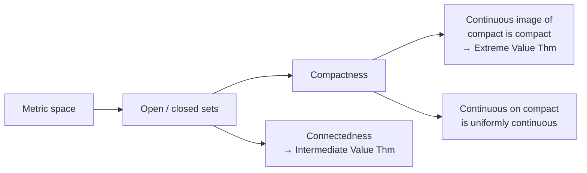

# Principles of Mathematical Analysis (Walter Rudin)

Walter Rudin's *Principles of Mathematical Analysis* — universally called **"baby
Rudin"** to distinguish it from his graduate *Real and Complex Analysis* — is the
canonical undergraduate real analysis text. It is famous for its extreme economy:
proofs are stripped to their logical essentials, motivation is minimal, and the
reader is expected to supply the intuition and fill the gaps. This makes it terse
and demanding, but also a model of clean mathematical exposition once the reader
has the maturity to read it.

## Scope and approach

Rudin builds analysis on the most general reasonable footing from the start.
Rather than working only on the real line, he introduces **metric spaces** early
and does topology (open and closed sets, compactness, connectedness) in that
general setting, so that later results about `ℝ` and `ℝⁿ` are special cases of
theorems already proved abstractly. The progression:

- **The real and complex number systems** — constructed via Dedekind cuts;
  the least-upper-bound property and the field/order structure.
- **Basic topology** — metric spaces, open/closed sets, compactness (with the
  Heine–Borel theorem), connectedness, and the topology of the reals.
- **Numerical sequences and series** — convergence, Cauchy sequences,
  completeness, and convergence tests.
- **Continuity** — defined topologically (via open sets) as well as by limits;
  uniform continuity and the behavior of continuous maps on compact sets.
- **Differentiation and the Riemann–Stieltjes integral** — the mean value theorem,
  and integration generalized to integrators of bounded variation.
- **Sequences and series of functions** — uniform convergence, the crucial
  distinction from pointwise convergence, equicontinuity, the Stone–Weierstrass
  theorem.
- **Functions of several variables** and an introduction to the **Lebesgue theory**
  in the closing chapter.

Compared with [spivak-calculus.md](spivak-calculus.md), which covers overlapping
one-variable material with more hand-holding and motivation, Rudin moves faster,
generalizes sooner (metric spaces from the outset), and reaches further
(multivariable analysis, measure theory). The standard trajectory is Spivak for a
first rigorous pass, Rudin to consolidate and generalize.

## What "compactness" buys you

Much of Rudin's power comes from doing topology first, so that theorems fall out
of a few structural facts:

## Related notes

- [real-analysis.md](real-analysis.md) — the field this book defines for a generation.
- [calculus.md](calculus.md) — the computational subject analysis puts on rigorous footing.
- [spivak-calculus.md](spivak-calculus.md) — the gentler rigorous predecessor.
- [mathematical-proof-and-logic.md](mathematical-proof-and-logic.md) — the proof
  fluency Rudin presumes.

## References

- [Principles of Mathematical Analysis — Walter Rudin (McGraw-Hill)](https://www.mheducation.com/highered/product/principles-mathematical-analysis-rudin/M9780070542358.html)
