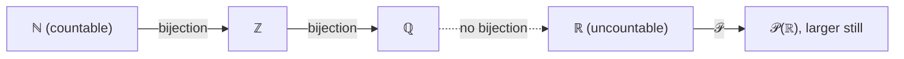

# Set Theory

Set theory is the common language of modern mathematics: nearly every object — a number,
a function, a vector space, a probability event — is ultimately *encoded as a set*. It
gives us a precise vocabulary for collections, relationships between them, and, most
strikingly, a rigorous way to compare **sizes of infinity**. It sits directly on top of
[mathematical proof and logic](mathematical-proof-and-logic.md), whose quantifiers express
every set-theoretic claim.

## Sets and operations

A **set** is an unordered collection of distinct elements; membership x ∈ A is the single
primitive. Sets combine through union A ∪ B, intersection A ∩ B, difference A \ B, and
complement Aᶜ; the **power set** 𝒫(A) is the set of all subsets of A. De Morgan's laws
(¬ distributing over ∧/∨) reappear here as (A ∪ B)ᶜ = Aᶜ ∩ Bᶜ. Two sets are equal iff
they have the same elements — proved by showing mutual inclusion (A ⊆ B and B ⊆ A), the
standard set-equality proof pattern.

## Relations and functions

The **Cartesian product** A × B is the set of ordered pairs (a, b). A **relation** from A
to B is any subset R ⊆ A × B. Special relations organize mathematics:

- An **equivalence relation** (reflexive, symmetric, transitive) partitions a set into
  disjoint **equivalence classes** — the mechanism behind modular arithmetic in
  [number theory](number-theory.md) and quotient structures in
  [abstract algebra](abstract-algebra.md).
- A **partial/total order** ranks elements.

A **function** f: A → B is a relation pairing each a ∈ A with exactly one f(a) ∈ B. Its
properties drive everything downstream:

| Property | Meaning | Consequence |
|---|---|---|
| Injective (one-to-one) | distinct inputs → distinct outputs | left-invertible |
| Surjective (onto) | every b hit | right-invertible |
| Bijective | both | invertible; A and B "same size" |

Functions are the connective tissue across HAL: [linear maps](linear-algebra.md) are
functions, [derivatives](calculus.md) act on functions, and random variables in
[probability](../statistics/probability.md) are functions on a sample space.

## Cardinality and countability

Bijection is the tool for *measuring* infinite sets. Two sets have the same **cardinality**
when a bijection exists between them. A set is **countable** if it is finite or has a
bijection with ℕ. Remarkably, ℤ and even ℚ are countable — the rationals can be listed by
a diagonal enumeration. But **Cantor's diagonal argument** shows ℝ is *uncountable*: assume
a list of all reals in (0,1), then build a new real differing from the n-th listed real in
its n-th digit; it is on no line, contradiction. So |ℝ| > |ℕ|, and infinities come in
different sizes. Cantor's theorem generalizes this: |𝒫(A)| > |A| always.

The diagonal argument is not a curiosity: the identical technique proves the halting
problem undecidable in [computer science](../computer-science/index.md) — uncountability
and uncomputability are the same idea in different clothing.

## ZFC in brief

Naive set theory — "any property defines a set" — collapses under **Russell's paradox**:
the set R = {x : x ∉ x} both is and isn't a member of itself. The fix is **ZFC**
(Zermelo–Fraenkel with Choice), an axiom system that builds sets constructively
(extensionality, pairing, union, power set, infinity, replacement, foundation) and adds
the **Axiom of Choice** (every collection of nonempty sets has a choice function). ZFC is
the de facto foundation of mathematics. For the informal, working version — sets as a
modeling tool rather than an axiomatic edifice — see
[naive set theory](naive-set-theory.md).

## Why it matters (including AI/CS)

Sets, relations, and functions are the data model of computing: a database table is a
relation, a hash map is a function, a type is a set of values. Countability marks the
boundary of what algorithms can even enumerate. In AI, feature spaces, hypothesis classes,
and probability spaces are all set-theoretic; the notion of a function as a mapping is the
literal definition of a [machine learning](../ai/machine-learning.md) model.

## References

- [Rosen, *Discrete Mathematics and Its Applications*](rosen-discrete-mathematics.md) —
  sets, functions, relations, cardinality.
- [Rudin, *Principles of Mathematical Analysis*](rudin-principles-of-mathematical-analysis.md)
  — countability and the construction of ℝ.
