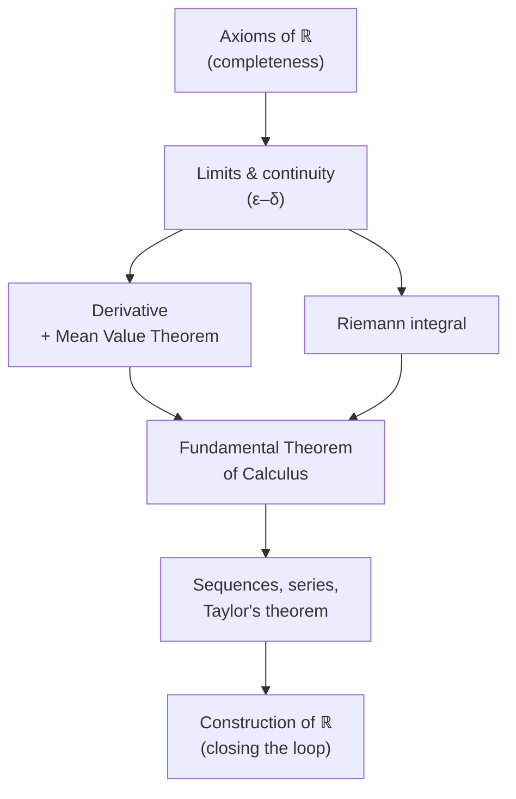

# Calculus (Michael Spivak)

Michael Spivak's *Calculus* is, despite its title, an **introduction to real
analysis wearing a first-year calculus disguise**. Where a typical calculus course
teaches techniques of differentiation and integration and takes the underlying
theory on faith, Spivak sets out to prove everything, starting from the properties
of the real numbers, and treats the "calculus" as the payoff of a carefully built
theory. It is the canonical rigorous, proof-first calculus text, widely used in
honors sequences and as a bridge into higher mathematics.

## Scope and approach

The book opens not with derivatives but with the **axioms of the real numbers** —
the field and order properties, and crucially the *completeness* (least upper
bound) property that separates the reals from the rationals and makes limits work.
From there Spivak develops:

- **Functions and their properties** — treated as a first-class object, defined
  precisely, before any calculus is done to them.
- **Limits and continuity** — with the full ε–δ definition, and the theorems that
  depend on completeness (intermediate value, extreme value, uniform continuity).
- **The derivative** — defined as a limit, with the mean value theorem as the
  central engine from which the qualitative behavior of functions is deduced.
- **Integration** — the Riemann integral built from upper and lower sums, followed
  by the fundamental theorem of calculus proved rather than asserted.
- **Infinite sequences and series** — convergence, power series, and Taylor's
  theorem with real error bounds.
- **A construction of the reals** — the closing chapters (Dedekind cuts / Cauchy
  sequences) show that the number system the whole book rests on can itself be
  built, closing the logical loop.

Spivak's hallmark is the difficulty and quality of the exercises: many are small
theorems, and the problem sets are as much the content as the text. The prose is
witty and unusually motivated for a rigorous book — he explains *why* a definition
has to be the way it is, not just what it is.

## Where it sits

Spivak occupies a deliberate middle ground: more rigorous than an engineering
calculus text, but gentler and more motivated than
[rudin-principles-of-mathematical-analysis.md](rudin-principles-of-mathematical-analysis.md),
which covers similar analytic ground at higher speed and generality (metric
spaces, for instance). A common path is Spivak first, then Rudin.

## Related notes

- [calculus.md](calculus.md) — the concept this book grounds in rigor.
- [real-analysis.md](real-analysis.md) — the field Spivak is really an entry to.
- [rudin-principles-of-mathematical-analysis.md](rudin-principles-of-mathematical-analysis.md)
  — the natural next step up in rigor and generality.
- [mathematical-proof-and-logic.md](mathematical-proof-and-logic.md) — the proof
  discipline the exercises demand.

## References

- [Calculus, 3rd ed. — Michael Spivak (Cambridge University Press)](https://www.cambridge.org/9780521867443)
