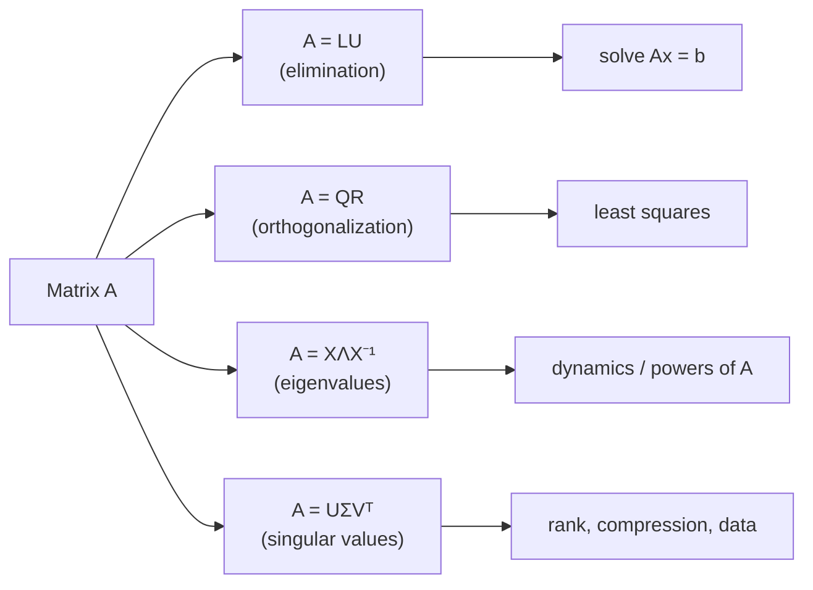

# Introduction to Linear Algebra (Gilbert Strang)

Gilbert Strang's *Introduction to Linear Algebra* (MIT, now in its 6th edition) is
the textbook that anchors MIT's 18.06 course, and it is the standard first
exposure to the subject for engineers, scientists, and anyone who will later use
matrices computationally. Its defining trait is a **geometric, applications-first
pedagogy**: rather than opening with axioms and abstract vector spaces, Strang
starts from concrete systems of linear equations and the two ways to read a
matrix — as a collection of columns (the *column picture*) and as a collection of
rows (the *row picture*) — and builds the whole theory outward from `Ax = b`.

## Scope and approach

The book treats linear algebra as the study of what a matrix *does* to vectors,
not merely as bookkeeping for solving equations. The organizing idea is that
nearly every question reduces to understanding four subspaces attached to a
matrix `A`: the **column space**, the **nullspace**, the **row space**, and the
**left nullspace**. Strang calls this the "fundamental theorem of linear algebra,"
and he returns to it repeatedly. Elimination (`A = LU`), orthogonality
(`A = QR`, projections, least squares), the eigenvalue decomposition
(`A = XΛX⁻¹`), and the singular value decomposition (`A = UΣVᵀ`) are all
presented as different factorizations that reveal different structure.

Roughly, the arc runs:

- **Vectors and matrices** — linear combinations, dot products, matrix
  multiplication understood as combining columns.
- **Solving `Ax = b`** — Gaussian elimination, `LU` factorization, invertibility.
- **Vector spaces and the four subspaces** — rank, independence, basis, dimension,
  and how the four subspaces fit together.
- **Orthogonality** — projections, least squares, Gram–Schmidt, `QR`.
- **Determinants** — treated as useful but secondary (contrast with
  [axler-linear-algebra-done-right.md](axler-linear-algebra-done-right.md), which
  demotes them even further).
- **Eigenvalues and eigenvectors** — diagonalization, symmetric matrices,
  positive definite matrices, and the SVD as the crowning decomposition.
- **Applications** — differential equations, Fourier, graphs and networks, and
  increasingly, data science and machine learning.

Strang deliberately favors intuition and worked examples over maximal rigor. A
proof is given when it illuminates; when a computation makes the idea clearer, he
computes. This makes the book an ideal *first* course and a poor substitute for a
proof-based abstract-algebra treatment — the two roles are complementary.

## The factorization view

## Why it matters for AI

The SVD, least squares, projections, and eigen-decompositions Strang emphasizes
are exactly the linear-algebra machinery underneath modern machine learning:
every layer of a [neural network](../ai/neural-networks.md) is an affine map
followed by a nonlinearity, gradient descent moves through a space whose geometry
is governed by these decompositions, and dimensionality reduction (PCA) is the SVD
in disguise. Strang's later editions lean explicitly into this connection. For the
underlying concept, see [linear-algebra.md](linear-algebra.md); for how the
mathematics feeds learning algorithms, see
[machine-learning](../ai/machine-learning.md).

## Related notes

- [linear-algebra.md](linear-algebra.md) — the field concept this book anchors.
- [axler-linear-algebra-done-right.md](axler-linear-algebra-done-right.md) — the
  abstract, determinant-free counterpart for a second, proof-based pass.
- [neural-networks.md](../ai/neural-networks.md) — where the matrix machinery is put
  to work.

## References

- [Introduction to Linear Algebra — Gilbert Strang (MIT)](https://math.mit.edu/~gs/linearalgebra/)
- [MIT 18.06 Linear Algebra (OpenCourseWare)](https://ocw.mit.edu/courses/18-06-linear-algebra-spring-2010/)
