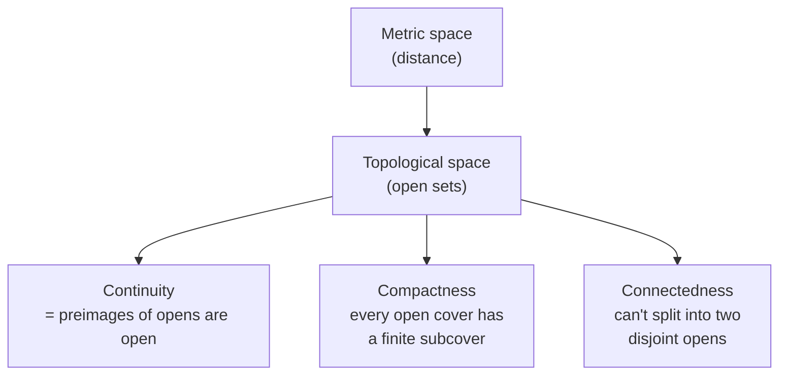

# Topology

Topology is the study of the properties of a space that survive continuous deformation —
stretching, bending, and twisting, but never tearing or gluing. It is often called
"rubber-sheet geometry": to a topologist a coffee mug and a doughnut are the same object
because one can be deformed into the other without cutting. By keeping only what deformation
preserves, topology extracts the essence of "nearness" and "continuity" from
[real analysis](real-analysis.md) and turns them into a general theory.

## Open sets and topological spaces

The genius of topology is to define everything in terms of **open sets** rather than
distance. A **topological space** is a set $X$ together with a collection of subsets (the
*open sets*) satisfying three rules: $X$ and $\emptyset$ are open, any union of open sets is
open, and any *finite* intersection of open sets is open. A **closed set** is the complement
of an open one. That minimal structure — no numbers, no distances — is enough to define
limits, continuity, and convergence.

## Metric spaces: where distance still lives

Most familiar spaces are **metric spaces**: sets with a distance function $d(x,y)$ obeying
non-negativity, symmetry, and the triangle inequality $d(x,z) \le d(x,y) + d(y,z)$. A metric
*induces* a topology — the open sets are unions of open balls — so every metric space is a
topological space, and the epsilon-delta reasoning of [real analysis](real-analysis.md) is
exactly the metric-space case. Topology is the generalization that keeps the useful
conclusions while dropping the crutch of a specific distance.

## Continuity, generalized

Here is the unifying payoff. In [real analysis](real-analysis.md), continuity is an
epsilon-delta statement about distances. Topology reveals the true definition underneath it:
a function $f: X \to Y$ is **continuous** exactly when the preimage of every open set is
open. No epsilons, no deltas — just open sets. The analytic definition is what this becomes
once $X$ and $Y$ carry a metric. This is the sense in which topology *generalizes* continuity.

## Compactness and connectedness

Two properties do most of the heavy lifting:

- **Compactness** generalizes "closed and bounded." A space is compact when every open cover
  has a finite subcover. Its power is that continuous functions on a compact space are
  well-behaved — they attain their maximum and minimum (the topological form of the Extreme
  Value Theorem from [real analysis](real-analysis.md)).
- **Connectedness** captures being "in one piece": a space is connected if it cannot be split
  into two disjoint nonempty open sets. The Intermediate Value Theorem is really the statement
  that continuous images of connected sets are connected.

## A worked example

The open interval $(0,1)$ and the whole real line $\mathbb{R}$ are *homeomorphic* —
topologically identical — because $x \mapsto \tan\!\big(\pi(x - \tfrac12)\big)$ is a
continuous bijection with continuous inverse between them. Length is not a topological
property, so "bounded" is not either; yet neither is compact, and both are connected. What
survives deformation is the structural fact, not the measurement.

## Why it matters

Topology is the rigorous ground under [real analysis](real-analysis.md) and the language of
modern geometry. In machine learning it underwrites the **manifold hypothesis**: the idea
that high-dimensional data (images, text embeddings) actually lies on a low-dimensional curved
surface, so learning good [representations](../ai/representation-learning-and-embeddings.md)
means discovering that manifold's shape. Topological data analysis uses compactness and
connectedness to extract features invariant to noise, and the connectedness of the reals is
exactly what makes the continuity-based reasoning of analysis and optimization trustworthy.

## References

- [Principles of Mathematical Analysis](rudin-principles-of-mathematical-analysis.md) — Walter Rudin (metric spaces, compactness, connectedness)
- [Linear Algebra Done Right](axler-linear-algebra-done-right.md) — Sheldon Axler, for the vector-space structures topology is often built over
