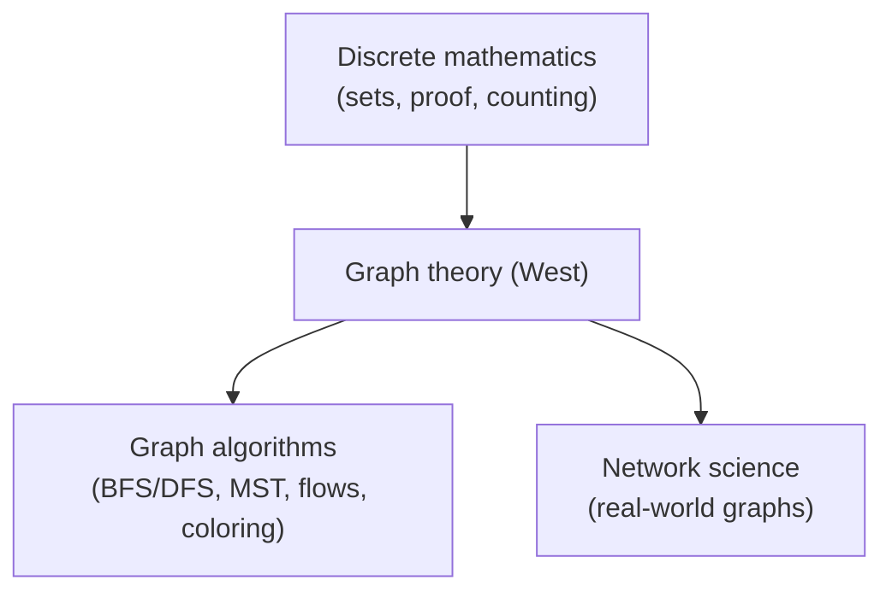

# Introduction to Graph Theory (Douglas B. West)

Douglas B. West's *Introduction to Graph Theory* is the standard undergraduate and
early-graduate textbook for the subject in North America. It is prized for its
breadth, its careful and uniform proof style, and an enormous, well-graded exercise
set that makes it as much a problem book as a survey. West's stated aim is to teach
the *methods* of graph theory — how theorems are actually proved — rather than to
catalog results, so the book leans on a small number of recurring proof techniques
(extremality, induction on vertices or edges, counting two ways, the pigeonhole
principle) applied again and again across topics.

## Scope and approach

The book is comprehensive at an introductory level, moving from foundations to
several near-research topics while keeping prerequisites light (basic proof fluency
and a little linear algebra). The main arc:

- **Fundamental concepts** — graphs, subgraphs, degree, paths and cycles, isomorphism,
  and the handshake lemma. Bipartite graphs and their characterization by even cycles.
- **Trees and distance** — spanning trees, Cayley's formula, minimum spanning trees,
  and shortest paths.
- **Matchings and factors** — König's theorem, Hall's marriage theorem, Tutte's
  theorem, and the max-flow/min-cut connection.
- **Connectivity and paths** — vertex/edge connectivity, Menger's theorem, network
  flows (max-flow min-cut).
- **Graph coloring** — vertex and edge coloring, Brooks' and Vizing's theorems,
  chromatic polynomials, and the structure behind the four-color theorem.
- **Planarity** — Euler's formula, Kuratowski's and Wagner's characterizations, and
  the dual graph.
- **Edges, cycles, and additional topics** — Eulerian and Hamiltonian graphs, Ramsey
  theory, extremal graph theory (Turán's theorem), and random graphs.

West develops each theorem with full proof and situates it among alternatives, which
makes the book a reliable reference as well as a teaching text. Compared with
[diestel-graph-theory.md](diestel-graph-theory.md) — the leaner, more advanced
graduate reference — West is broader in elementary coverage and far richer in
exercises, and is the more common first course.

## Where it sits

Graph theory is the branch of [discrete-mathematics.md](discrete-mathematics.md)
that supplies the objects — vertices and edges — underneath both algorithm design and
network modeling. Many of West's structural theorems (matchings, max-flow/min-cut,
shortest paths, spanning trees) are the correctness arguments behind classic
algorithms treated computationally in
[../computer-science/introduction-to-algorithms.md](../computer-science/introduction-to-algorithms.md).
The same graphs, taken as empirical objects with degree distributions and community
structure, are the subject of
[../systems-thinking/network-science.md](../systems-thinking/network-science.md).

## Related notes

- [graph-theory.md](graph-theory.md) — the concept this book anchors.
- [discrete-mathematics.md](discrete-mathematics.md) — the parent field.
- [../computer-science/introduction-to-algorithms.md](../computer-science/introduction-to-algorithms.md) — where these structures become algorithms.
- [../systems-thinking/network-science.md](../systems-thinking/network-science.md) — graphs as empirical networks.

## References

- [Introduction to Graph Theory — Douglas B. West (Pearson)](https://www.pearson.com/en-us/subject-catalog/p/introduction-to-graph-theory/P200000006320)
