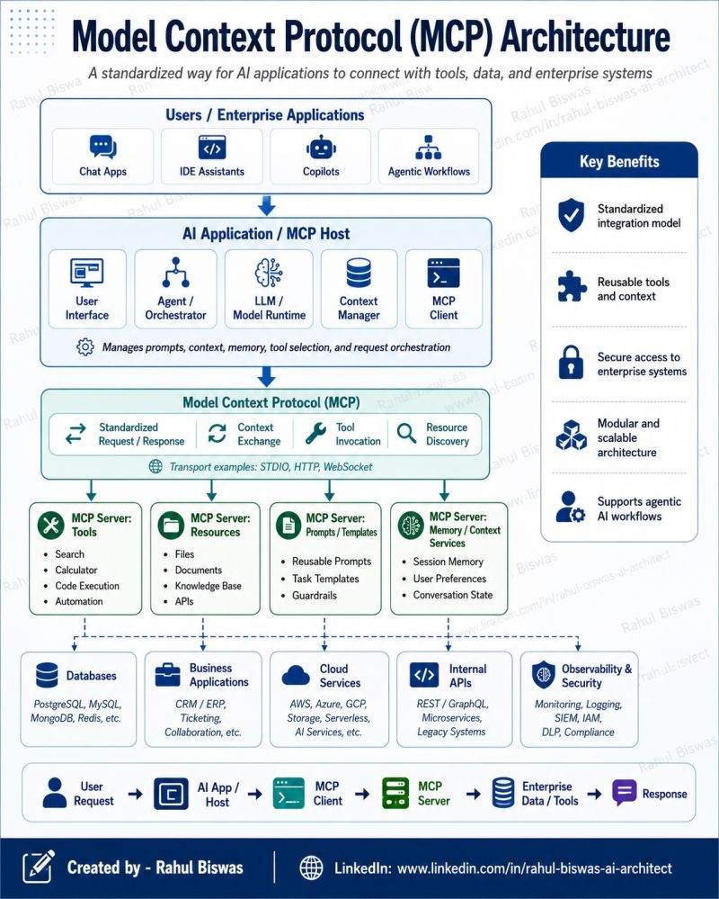

# Model Context Protocol (MCP) Architecture

A diagram (Rahul Biswas) of MCP as a standardized way for AI applications to connect with
tools, data, and enterprise systems.

- **Users / enterprise applications:** chat apps, IDE assistants, copilots, agentic
  workflows.
- **AI application / MCP host:** user interface, agent/orchestrator, LLM/model runtime,
  context manager, MCP client — manages prompts, context, memory, tool selection, and
  request orchestration.
- **Model Context Protocol (MCP):** standardized request/response, context exchange, tool
  invocation, resource discovery. Transport examples: STDIO, HTTP, WebSocket.
- **MCP servers** by type:
  - *Tools* — search, calculator, code execution, automation.
  - *Resources* — files, documents, knowledge base, APIs.
  - *Prompts / Templates* — reusable prompts, task templates, guardrails.
  - *Memory / Context services* — session memory, user preferences, conversation state.
- **Backends:** databases (Postgres/MySQL/Mongo/Redis), business apps (CRM/ERP), cloud
  services, internal APIs, observability & security.

Request flow: user request → AI app/host → MCP client → MCP server → enterprise
data/tools → response. Benefits: standardized integration, reusable tools/context, secure
access, modular & scalable, supports agentic workflows.

## Cross-links

The tooling/integration layer (layer 5) of [Agentic Engineering Stack](agentic-engineering-stack.md)
and the "tool integration" layer of [Agent Harness Engineering](agent-harness-engineering.md),
detailed. MCP appears as a connector in [AI Harness Architecture](ai-harness-architecture.md)
and [The AI Factory Stack](ai-factory-stack.md).

## References

- 
