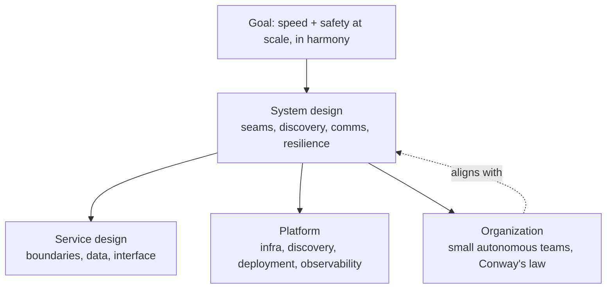

# Microservice Architecture — Aligning Principles, Practices, and Culture

By Nadareishvili, Mitra, McLarty, and Amundsen (O'Reilly, 2016). The book's
central move is to reframe microservices away from "small services" and toward
an *outcome*: the ability to keep changing a system quickly without breaking it,
even as the system and the organization grow. Everything else — service size,
technology, tooling — is derived from that goal, not the other way around.

## Microservices as a goal, not a size

The authors resist defining microservices by lines of code or narrow scope. The
value proposition is **speed and safety at scale, in harmony**: the point is to
make change *fast* (ship independently, frequently) and *safe* (a change in one
place doesn't cascade into failures elsewhere), and to sustain both as the system
scales. "In harmony" is the hard part — most architectures trade speed against
safety, and gaining scale usually costs you both. A service being small is only
useful insofar as smallness buys independent, low-risk change. If you get speed
and safety at scale from differently-shaped services, you're still doing
microservices "the microservices way."

This is deliberately outcome-first: rather than prescribing a reference diagram,
the book gives principles and lets teams derive the concrete design that fits
their goals and constraints.

## Designing the microservices system

A key reframing: the unit of design is not the individual service but the
**system** of services. An individual service can be beautifully built and the
whole still be slow and brittle. So the design work is about the properties of
the system — how services are found, how they communicate, how failure is
contained, how the whole is deployed and observed — with individual service
design nested inside that. Standardize the *interactions and interfaces* between
services (the seams), and leave the *internals* of each service free to vary.
That split is what preserves team autonomy without producing chaos.

## Service boundaries via DDD bounded contexts

Where do the boundaries go? The book leans on **Domain-Driven Design**: draw
service boundaries along **bounded contexts** — regions of the domain where a
model and its language are internally consistent. A boundary drawn on a bounded
context tends to align with a real business capability, which keeps a service
cohesive and loosely coupled to its neighbors. Splitting inside a bounded context
(e.g., cutting one consistent model across two services) creates chatty,
tightly-coupled services and defeats the purpose. See
[Domain-Driven Design](domain-driven-design.md) for bounded contexts and
ubiquitous language, the tools used to find these seams.

Within a service, the internal structure is the team's choice — the same
separation-of-concerns discipline captured in
[Clean Architecture](clean-architecture.md) (keep domain logic independent of
delivery and infrastructure) applies inside each service's boundary.

## Data and transactions

Each service owns its data; there is no shared database backdoor. That
independence is what makes deployment and scaling independent — but it removes the
single-database transaction as a tool. Consistency across services becomes
**eventual** rather than immediate: coordinate with events, sagas, and
compensating actions instead of distributed ACID transactions. The tradeoff is
explicit — you give up strong global consistency to buy autonomy and resilience,
so the design job is deciding *where* eventual consistency is acceptable and
where a boundary must be redrawn to keep a truly-atomic operation inside one
service.

## The microservices platform

Independent services multiply operational surface area, so the book treats a
**platform** as a prerequisite, not a nicety. The platform is the shared
capability layer that makes running many services tractable:

- **Infrastructure & deployment** — automated, repeatable, independent deploys
  (containers/immutable artifacts, pipelines) so any service can ship on its own
  cadence.
- **Service discovery & routing** — services find and talk to each other without
  hardcoded locations.
- **Runtime concerns** — configuration, secrets, health, logging, metrics, and
  distributed tracing, provided consistently so teams don't each reinvent them.

Crucially the platform is a *product for the service teams*: it lowers the cost
of doing the right thing so autonomy doesn't collapse under operational load.

## Organizational alignment (Conway's law)

The book is emphatic that architecture and org structure are the same problem
seen twice. **Conway's law** — systems mirror the communication structure of the
organizations that build them — is used as a design tool, not a warning: if you
want loosely-coupled, independently-deployable services, you need
loosely-coupled, independently-operating **small autonomous teams**, each owning
a service (or a small set) end to end, including its runtime. Try to run
microservices with a big centralized, hand-off-heavy org and the communication
paths will re-couple the services no matter how you draw the diagram. Team
boundaries and service boundaries should be designed together.

## Adoption and culture

Microservices are presented as a journey, not a switch. Adoption is incremental —
typically peeling capabilities off a monolith along bounded-context seams rather
than a big-bang rewrite — and it succeeds or fails on **culture** as much as
technology. The practices that matter: automation and DevOps discipline (so
frequent, safe deploys are routine), teams empowered to make and own decisions,
comfort with eventual consistency and partial failure, and continuous
organizational change to match the evolving architecture. The recurring theme:
you cannot buy microservices as a technology; you adopt them as a way of working.

## References

- [Microservice Architecture — Aligning Principles, Practices, and Culture (O'Reilly)](https://www.oreilly.com/library/view/microservice-architecture/9781491956328/)
