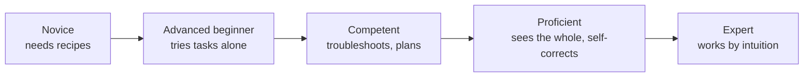

# Pragmatic Thinking and Learning

Andy Hunt's *Pragmatic Thinking and Learning: Refactor Your "Wetware"* argues that the
constraint on a knowledge worker's output is not tools or languages but the brain running
them. Software is imagined and built in your head before it exists in any editor, so the
highest-leverage investment is improving how you think and learn. The book pulls from
cognitive science, neuroscience, and learning theory and turns each idea into something
you can act on tomorrow. It pairs with [The Pragmatic Programmer](../software-engineering/the-pragmatic-programmer.md)
(same author, same pragmatic stance) and gives the cognitive backbone to the deliberate
practice described in [Learning the Craft](../ai-org/learning-the-craft.md).

## The Dreyfus model: novice to expert

Hunt's spine is the Dreyfus brothers' five-stage model of skill acquisition. Skill is not a
single ladder you climb once; it is acquired **per skill**, so the same person can be an
expert in one domain and a rank novice in another.

- **Novice** — little experience, wants clear rules and step-by-step recipes. Context-free
  rules help, but novices can't tell which rules apply when things go sideways.
- **Advanced beginner** — starts breaking free of fixed rules and can try tasks on their
  own, but still lacks the big picture and gets rattled when information doesn't fit.
- **Competent** — can build mental models, troubleshoot novel problems, and plan
  deliberately. This is a comfortable, capable middle where many practitioners plateau.
- **Proficient** — sees situations holistically rather than as a list of parts, understands
  context, and can self-correct by reflecting on prior performance. Can learn from others'
  experience, not just their own.
- **Expert** — works largely from **intuition and pattern recognition**, not conscious
  rules. Experts often can't articulate *why* they know an answer; forcing them onto a rigid
  checklist actively degrades their performance.

Key implications Hunt draws from the model:

- **Rules help novices and cripple experts.** A checklist rescues a beginner but reduces an
  expert to beginner-level output. Match the guidance to the stage.
- **The novice/expert distribution is a rough bell curve**, with most people in the middle,
  so tools and processes designed for one end fail the majority.
- **Intuition is real signal, not fluff** — an expert's hunch is compressed experience and
  deserves to be trusted even before it can be justified.
- **You climb by shifting from rules toward context and self-reflection**, not by learning
  more rules. Deliberately practicing metacognition (thinking about your own thinking) is
  what moves you up.

## The brain as a dual-CPU: L-mode vs R-mode

Hunt models the brain as a machine with two processing modes sharing one bus (so only one
runs at a time), a metaphor loosely mapped onto brain hemispheres but really about two ways
of thinking:

- **L-mode (linear)** — verbal, analytic, step-by-step, logical. Good at rule-following,
  language, and detail. "Sees the trees."
- **R-mode (rich)** — nonlinear, intuitive, synthetic, pattern-matching, holistic. The
  source of insight, metaphor, and the "aha." "Sees the forest."

The industry over-values L-mode and starves R-mode, yet R-mode is where creative
problem-solving and expert intuition come from. R-mode runs constantly in the background
and surfaces answers on its own schedule (in the shower, on a walk), so two practical moves
follow: **capture insight 24x7** — always carry a way to record ideas, because R-mode output
is fleeting — and deliberately **feed and invoke R-mode** by turning up sensory input,
drawing, writing by hand, changing environment, and letting the mind wander. The productive
pattern is an **R-mode to L-mode flow**: let R-mode generate raw, unfiltered material, then
hand it to L-mode to refine and verify. Don't let the analytic critic kill the idea before
it's fully formed.

## Debugging your own mind

Your "wetware" ships with bugs. Hunt catalogs the systematic errors that distort judgment
and urges treating them like defects to be caught and worked around:

- **Cognitive biases** — anchoring, confirmation bias, fundamental attribution error, and
  the rest. They feel like clear thinking from the inside, which is exactly why they're
  dangerous.
- **Generational affinity** — the era you grew up in silently shapes your assumptions and
  values, coloring how you and your teammates read a situation.
- **Personality tendencies** — models like the Myers-Briggs axes describe stable
  dispositions (introvert/extravert, etc.) that bias how you take in and act on information.
- **Hardware bugs** — deeper wiring quirks, like the brain's bias toward the negative and
  its tendency to trust vivid, recent, or emotionally charged input over accurate input.

The defense is awareness plus deliberate counter-moves: seek disconfirming evidence, slow
down on high-stakes calls, and distrust the effortless certainty of a snap judgment.

## Learning deliberately

Learning is not passive intake of facts — it's a skill you can do well or badly, and doing
it well is deliberate:

- **SMART objectives** — frame learning goals as Specific, Measurable, Achievable,
  Relevant, and Time-boxed, so "get better at X" becomes something you can actually pursue
  and verify.
- **Pragmatic Investment Plan (PIP)** — manage your knowledge like a financial portfolio:
  invest **concretely and regularly**, **diversify** across skills, balance low-risk (mature
  tech) against high-risk/high-reward (emerging tech), and **review and rebalance**
  periodically. The point is consistent, intentional investment, not cramming.
- **SQ3R** — a deliberate reading method: **Survey** (scan structure), **Question** (form
  questions before reading), **Read**, **Recite** (restate in your own words), **Review**.
  Active reading beats passive highlighting.
- **Mind maps** — a nonlinear, visual note form that engages R-mode: a central idea with
  radiating branches, using color and imagery to reveal structure and connections a linear
  outline would hide.
- **Teach to learn, document to learn** — the real value of writing and teaching is the
  *process*, which forces you to organize and expose the gaps in your own understanding.
- **Gain experience by doing** — play and exploration to learn, and **embed failing in
  practice**: build safe environments where failure is cheap so you can learn from it
  without real consequence. Pressure and fear shut down cognition, so lower the stakes.

## Managing focus and attention

Attention is the scarce resource, and the modern environment shreds it:

- **Context-switching is expensive.** Every interruption carries a large recovery cost;
  reloading mental state after a break is not free, so guard blocks of focused time.
- **Multitasking is a myth for cognitive work** — you're really thrashing between tasks and
  paying the switch cost each time.
- **Manage your knowledge** deliberately (personal wikis, notes) so you offload memory and
  free attention for thinking rather than remembering.
- **Defocus to focus** — deliberate diffuse states (walking, showering, stepping away) let
  R-mode work the problem; forcing constant hard focus starves the very mode that produces
  insight. Optimize your working context to reduce interruptions and support deep work.

## The through-line

The book's recurring refrain is **"consider the context"**: the right rule, the right
learning mode, and the right level of guidance all depend on where you and the task sit.
Improving as a practitioner is less about accumulating facts and more about deliberately
upgrading the machine that processes them — which is exactly the mindset behind
[Learning the Craft](../ai-org/learning-the-craft.md) and the practices in
[The Pragmatic Programmer](../software-engineering/the-pragmatic-programmer.md).

## References

- [Pragmatic Thinking and Learning: Refactor Your "Wetware" — Andy Hunt (Pragmatic Bookshelf)](https://pragprog.com/titles/ahptl/pragmatic-thinking-and-learning/)
