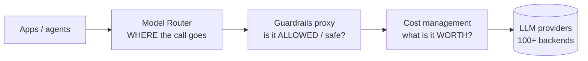

# Model Router

A **single control point every model call passes through** — one interface to
many LLM providers, instead of each app talking to each provider directly. Karan
Sampath (Anthropic): *"Gateways are all you need."* It presents one interface to
many backends (call 100+ LLM APIs in a uniform format) and centralizes what you
don't want scattered across services: **routing across tiers, rate limiting, key
management, caching, and logging.**

This is the *how* behind [matching models to tasks](models.md) — the router is
where that routing policy actually lives.

## One layer of three

Deliberately separate concerns, each kept legible:

- **Model router** — decides *where* a call goes.
- **Guardrails proxy** — decides whether it's *allowed and safe*. See
  [guardrails proxy](guardrails-proxy.md).
- **Cost management** — decides what it's *worth* / sets budgets. See
  [cost management](cost-management.md).

Because routing is centralized, you can **run cheap models on triage and
summarization while reserving expensive ones for hard reasoning** — a policy the
gateway *enforces* rather than each developer remembering to.

## Why it matters

Without a gateway: per-app provider integrations multiply, a model swap means
touching every service, and there's no single place to apply caching or observe
what's happening. With one: the org gets a **single root of trust for model
access** — change providers, enforce a routing policy, or instrument every call
from one place. As agent fleets grow, that consolidation keeps model access from
sprawling across the codebase.

## Caching — the cheapest win to centralize

An agent runs in a loop and passes *"all those prior tool calls back through
every time"* — you pay for the same context on every step. Agentic sessions are
heavily **input-skewed**, so that repeated context is most of the bill. (Same
tokenomics as [context engineering](context-engineering.md).) Three layers
stack:

| Layer | What it does |
|---|---|
| **Prompt / prefix (KV) caching** | Providers cache the unchanged prompt prefix (system prompt, loaded files), billed at a fraction; router enables it for every app instead of each wiring it up. |
| **Exact-match caching** | Identical request returns a stored response — trivial, but real for repeated calls. |
| **Semantic caching** | Return a stored answer when a new prompt is *close enough* in meaning; trades a similarity threshold for more hits. |

Doing it here means cache policy, keys, and hit-rate monitoring live in **one
place** rather than scattered across services. Common implementation: **LiteLLM**
(SDK + proxy for 100+ LLM APIs).

## Related

- [Models — Match Models to Tasks](models.md) — *which* model; the router is *how*.
- [MCP Configuration Reference](mcp-configuration-reference.md) — the other
  centralized-connectivity layer for agents.

## References
- [Model Router — Tessl Patterns](https://tessl.io/patterns/agentic-platform/model-router/)
