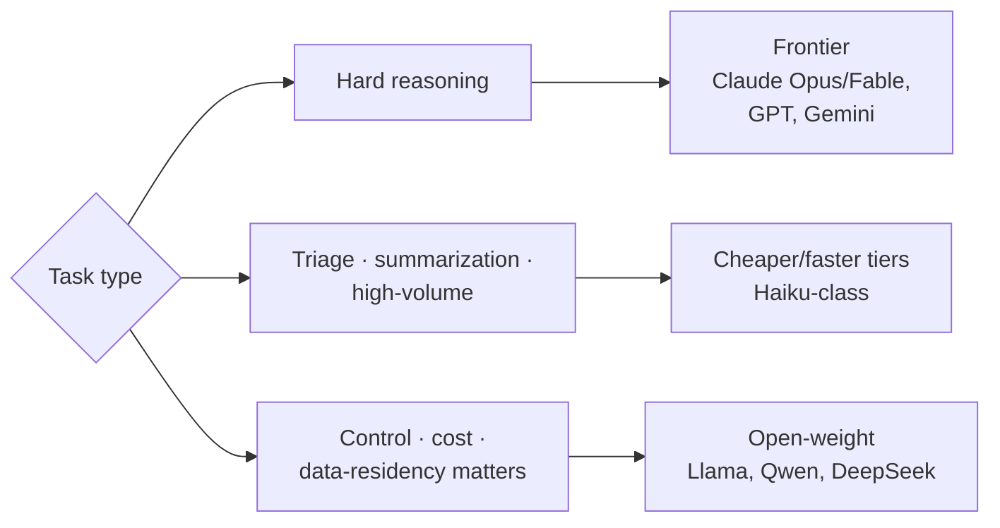

# Models — Match Models to Tasks

Models are the **raw capability** the rest of the agentic platform is built on —
the gateway, runtime, and evals all exist to get more out of them. The pattern
is **not "pick the best model" but "match models to tasks."**

A [**model router**](model-router.md) is *how* you route across these; this
pattern is about *which* to choose and *why*.

## Task-to-model fit is real and measurable

- Benchmarking **seven frontier models** on autonomous research work: one won
  overall even under a cost constraint — **yet on ML-engineering tasks an open
  model surpassed every frontier model.**
- Code editing: on Aider's leaderboard, an open **32B Qwen-Coder** slotted
  *between* two proprietary tiers, ahead of a same-generation GPT model.

*"Best model" is the wrong frame; "best model for this task, at this price" is
the right one.*

## Why it matters

Model choice is the **single biggest lever on both cost and quality** — and a
moving target: unattended task length has roughly **doubled every seven months**
(METR), so today's right answer expires fast. (Same trend powering
[loop engineering](loop-engineering.md).)

**The tension:** proprietary frontier models lead on capability but cede control
and send data out; open-weight models trade some peak capability for
**ownership, privacy, predictable cost**. That gap narrowed fast — DeepSeek-R1
shipped MIT-licensed, roughly on par with a proprietary reasoning model. *"AI in
the cloud is not aligned with you; it's aligned with the company that owns it"*
— ownership is itself a feature you may be buying.

**The discipline:** treat the model as a **swappable component** —

- **Benchmark for *your* tasks**, not [public leaderboards](public-benchmarks.md)
  (which routinely rank two models as "statistical twins" that feel nothing alike
  in real work — see [evals & LLM-as-a-judge](evals-llm-as-a-judge.md)).
- **Route by difficulty.**
- **Avoid hard-coupling to one provider** so you can move as the frontier moves.

## Serving the model

Choosing a model is only half of it — **an open-weight model is just weights
until something serves it.** An **inference engine** turns a trained model into
a live, callable API; a general web server (FastAPI) isn't built for it — AI
workloads need **streaming, batching, speculative decoding**. De-facto standard
is **vLLM**, whose PagedAttention delivers ~**24× the throughput** of naive
HuggingFace serving — what makes self-hosting open models affordable.

So the open-vs-proprietary choice carries a **hidden cost**: a proprietary API
makes serving *someone else's* problem; an open model means **you own the
serving stack** — GPUs, batching, autoscaling, uptime — in exchange for the
control and data-residency you were after.

## Related

- [The AI Factory Stack](ai-factory-stack.md) — where the LLM sits among RAG,
  vector DB, agents, guardrails, evals.
- [Layers of AI](layers-of-ai.md) — the model as the base capability layer.

## References
- [Models — Tessl Patterns](https://tessl.io/patterns/agentic-platform/models/)
