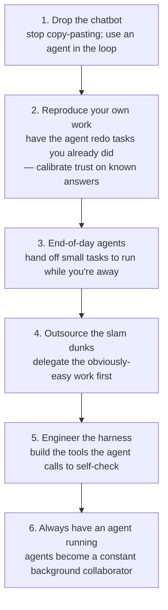

# My AI Adoption Journey (Hashimoto)

Mitchell Hashimoto's measured, first-person account of moving from AI skeptic to
running agents continuously. It's the origin of the *engineer-the-harness*
discipline that [Harness Engineering (Sensors & Simulators)](harness-engineering.md)
credits him with popularizing. Notably, he wrote the post by hand and says so
explicitly — a deliberate signal given the subject.

His premise: adopting any meaningful tool passes through three phases —
**(1) inefficiency, (2) adequacy, (3) workflow-altering discovery** — and you
have to force yourself through the first two to reach the third.

## The six steps

The pivotal step for this wiki is **Step 5: Engineer the Harness** — when the
agent struggles, don't just correct it; build the sensor, tool, or guardrail it
can call to catch that class of mistake itself. That's the
[self-improving harness loop](self-improving-harness-loop.md) stated as a
personal practice: the harness accumulates from your own correction history
rather than arriving pre-built.

By **Step 6**, the mode of work has inverted — you're steering agents that run
continuously rather than typing every line, the same trajectory pushed to its
limit in [Extreme Harness Engineering for Token Billionaires](extreme-harness-engineering-token-billionaires.md).

## References
- [My AI Adoption Journey — Mitchell Hashimoto](https://mitchellh.com/writing/my-ai-adoption-journey)
