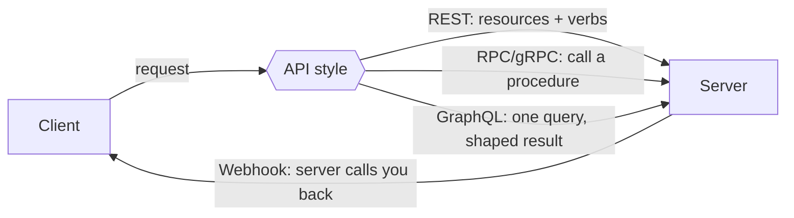

# APIs and Web Services

An **API** (application programming interface) over the network is a contract:
one program exposes operations that another program calls, usually over HTTP.
The **web service** is the running system behind that contract. APIs are the
internet's integration surface — the reason a phone app, a partner's backend,
and a third-party dashboard can all use the same system without sharing a
codebase. Where [how-the-web-works.md](how-the-web-works.md) describes a browser
fetching pages for a human, APIs describe machines talking to machines.

## Architectural styles

- **REST** models the system as **resources** addressed by URLs, manipulated
  with HTTP verbs (`GET`, `POST`, `PUT`, `PATCH`, `DELETE`) and status codes.
  It leans on HTTP's own semantics — caching, statelessness, uniform interface.
  It is the default for public web APIs. See
  [../web-frontend/rest-api-design-rulebook.md](../web-frontend/rest-api-design-rulebook.md).
- **RPC / gRPC** models calls as **invoking a remote procedure** — you call a
  named function with typed arguments. gRPC uses Protocol Buffers over HTTP/2 for
  compact, fast, strongly-typed calls; it excels for internal service-to-service
  communication.
- **GraphQL** lets the client specify **exactly what data it needs** in a single
  query, avoiding over- and under-fetching. It trades REST's simple caching for
  flexibility, and centralizes the schema.

These sit on the protocols in [network-protocols.md](network-protocols.md) and
[http-and-the-web.md](http-and-the-web.md).

## Webhooks: the callback direction

Most API calls are client-initiated. A **webhook** inverts this: you register a
URL, and when an event happens (a payment clears, a build finishes) the service
sends an HTTP request **to you**. Webhooks are the request/response cousin of
event streaming; for durable, high-volume, decoupled event flow the pattern
graduates to a message bus — see
[../distributed-systems/messaging-and-event-streaming.md](../distributed-systems/messaging-and-event-streaming.md).

## Authentication and authorization

An API must know who is calling and what they may do:

- **API keys** — a shared secret string identifying the caller. Simple; coarse;
  best for server-to-server and low-sensitivity access.
- **OAuth 2.0** — a delegation framework: a user authorizes an app to act on
  their behalf without sharing their password, via scoped, revocable tokens. The
  standard for "log in with…" and third-party access.
- **JWT (JSON Web Token)** — a signed, self-describing token carrying claims
  (who, what scopes, expiry). Servers verify the signature without a database
  lookup, which makes it popular for stateless auth. It is a token *format*
  often used to carry OAuth access tokens.

All of these ride on TLS — the token is only as safe as the channel. See
[tls-ssl-and-certificates.md](tls-ssl-and-certificates.md) and
[network-security.md](network-security.md).

## Rate limiting

To protect capacity and enforce fair use, APIs cap how many requests a caller
may make per window (common algorithms: token bucket, sliding window). Exceeding
the limit returns `429 Too Many Requests`, usually with a `Retry-After` header.
Rate limiting is both a reliability control (shed load) and a security control
(blunt abuse and brute force).

## Versioning

APIs are contracts, and contracts change. Versioning lets a provider evolve
without breaking existing clients:

| Strategy            | Example                            |
|---------------------|------------------------------------|
| URL path            | `/v1/users`, `/v2/users`           |
| Header              | `Accept: application/vnd.api+json;v=2` |
| Query parameter     | `/users?version=2`                 |

The discipline is to add without breaking, deprecate loudly, and remove slowly —
detailed in [../web-frontend/rest-api-design-rulebook.md](../web-frontend/rest-api-design-rulebook.md).

## APIs as a protocol layer

APIs are increasingly how tools and models integrate, not just apps. Emerging
standards define how an AI agent discovers and calls external capabilities over a
uniform interface — see
[../ai-platform/model-context-protocol.md](../ai-platform/model-context-protocol.md),
which applies the same "contract over the network" idea to tool use by models.

## References

This is a synthesized Concept note. Foundational material on HTTP semantics that
APIs build on is in
[grigorik-high-performance-browser-networking.md](grigorik-high-performance-browser-networking.md)
and [cloudflare-learning-center.md](cloudflare-learning-center.md).
