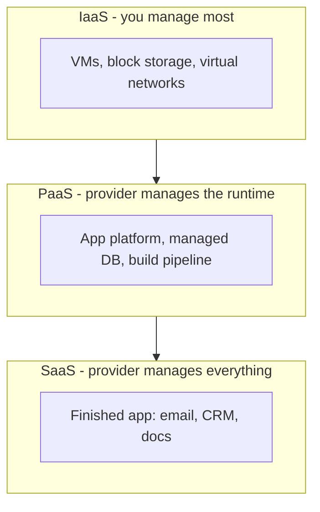

# Cloud Computing

Cloud computing is renting computing resources — servers, storage, networking,
databases — on demand over the internet, instead of owning and operating
hardware. The defining shift is economic and operational: capacity becomes
**elastic** (scale up and down on demand) and **pay-as-you-go** (billed for
what you use), turning capital expense into operating expense and removing the
need to provision for peak load in advance. This changed hosting from "buy a
server, rack it, maintain it" to "call an API and it exists a minute later."

## The service models

The classic framing is a spectrum of how much the provider manages versus how
much you do:

- **IaaS (Infrastructure as a Service):** raw compute, storage, and networking
  primitives — you assemble and operate everything above the hypervisor (EC2,
  Compute Engine). Most control, most responsibility.
- **PaaS (Platform as a Service):** you deploy code; the provider runs the
  runtime, scaling, and often the database. Aligns with the managed-platform
  path in [hosting-and-deployment.md](hosting-and-deployment.md).
- **SaaS (Software as a Service):** a finished application delivered over the
  web (Gmail, Salesforce). You consume it; you operate nothing.

## Major providers

The market is dominated by **AWS**, **Microsoft Azure**, and **Google Cloud
Platform**, with second-tier providers (Oracle Cloud, IBM, Alibaba) and
developer-focused clouds (DigitalOcean, Fly.io, Render). They differ in
breadth, pricing, and specialty services, but the core primitives rhyme across
all of them.

## Regions and availability zones

Providers organize capacity geographically:

- A **region** is a geographic area (e.g. `us-east-1`) — you choose one for
  latency to users, data-residency law, and cost.
- An **availability zone (AZ)** is an isolated datacenter (or cluster) within a
  region with independent power and networking. Running across multiple AZs is
  how you survive a single datacenter failure.

Designing for AZ/region failure is the networking-and-availability side of the
[../distributed-systems/index.md](../distributed-systems/index.md) discipline.

## Core primitives

Nearly every workload is built from four building blocks:

| Primitive          | Examples                                  |
|--------------------|-------------------------------------------|
| Compute            | VMs, containers, functions                |
| Storage            | Object (S3), block (EBS), file            |
| Networking         | VPCs, subnets, load balancers, DNS        |
| Managed databases  | Relational, key-value, document, cache    |

Provisioning these repeatably and reviewably is the job of
[../devops-sre/infrastructure-as-code.md](../devops-sre/infrastructure-as-code.md);
running containerized compute at scale is the job of
[../devops-sre/kubernetes.md](../devops-sre/kubernetes.md).

## Serverless

**Serverless** pushes elasticity to its limit: you deploy functions (AWS Lambda)
or managed containers, and the platform runs them only when invoked, scaling to
zero when idle and billing per request. There is still a server — you just never
provision, patch, or scale it. It fits event-driven and spiky workloads well and
struggles with long-running, latency-sensitive, or stateful ones.

Specialized compute — like GPU-backed inference — is increasingly rented the same
way; see [../ai-platform/serving-llms-vllm-skypilot.md](../ai-platform/serving-llms-vllm-skypilot.md)
for provisioning cloud GPUs for model serving.

## The shared-responsibility model

Security in the cloud is split: the provider secures the cloud **of** the
infrastructure (physical facilities, hypervisor, managed-service internals); you
secure what you put **in** it (your data, access controls, OS patches on IaaS,
application code). The dividing line moves up the stack as you go from IaaS to
PaaS to SaaS — the more the provider manages, the more of the security burden
shifts to them. Misunderstanding where the line sits is a leading cause of cloud
breaches. See [network-security.md](network-security.md).

## References

This is a synthesized Concept note. Introductory material on cloud networking,
regions, and CDNs is in
[cloudflare-learning-center.md](cloudflare-learning-center.md).
