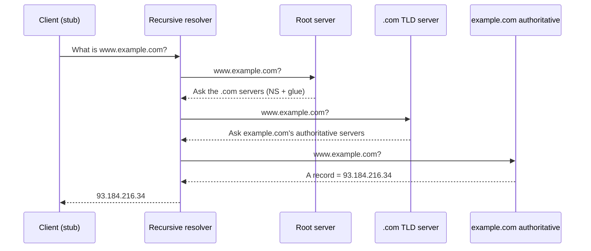

# DNS — The Domain Name System

The **Domain Name System** is the internet's phone book: it translates the
human-friendly names people type (`example.com`) into the numeric
[IP addresses](ip-addressing-and-routing.md) that routers actually use to move
packets. Names are stable and memorable; addresses change and are opaque. DNS
sits between the two so a site can move to a new host, add servers, or shift
providers without anyone having to relearn a number. Nearly every online
interaction — loading a page, sending mail, calling an API — begins with a DNS
lookup, which is why [how the web works](how-the-web-works.md) starts here.

## A hierarchical, delegated namespace

The name space is a tree, read right-to-left. A fully qualified name like
`www.example.com.` decomposes into an implicit **root** (`.`), a **top-level
domain** (`.com`), a **second-level domain** (`example`), and a **subdomain**
(`www`). No single machine holds the whole database; instead each level
**delegates** authority for the level below it. The root servers know who runs
each TLD, the TLD servers know who is authoritative for each registered domain,
and the domain's own **authoritative** servers hold the actual records. This
delegation is what lets a distributed database serve billions of names with no
central bottleneck — a design shared with [distributed systems](../distributed-systems/index.md).

## Resolution: turning a name into an address

The work is done by a **recursive resolver** (usually run by your ISP or a
public service like `1.1.1.1` or `8.8.8.8`). The client asks the resolver once
and gets a final answer; the resolver does the legwork, walking the hierarchy
with a series of **iterative** queries in which each server answers "I don't
know, but ask this next server."

DNS classically rides on **UDP port 53** for speed — a lookup is a single small
request and reply, and the cost of an occasional loss is a cheap retry. Large
answers or zone transfers fall back to TCP. Because plain DNS is unencrypted and
easily observed or tampered with, modern deployments increasingly use **DNS over
TLS (DoT)** and **DNS over HTTPS (DoH)** to protect the query, and **DNSSEC** to
cryptographically sign records so a resolver can detect forged answers — see
[network security](network-security.md).

## Record types

The authoritative server stores **resource records**, each a typed mapping:

| Type | Maps | Purpose |
|------|------|---------|
| `A` | name → IPv4 address | The core hostname-to-address lookup |
| `AAAA` | name → IPv6 address | The IPv6 equivalent |
| `CNAME` | name → another name | Alias one name to a canonical one |
| `MX` | domain → mail server + priority | Where to deliver email |
| `TXT` | name → arbitrary text | SPF/DKIM, domain verification, ACME challenges |
| `NS` | zone → authoritative name server | Delegation to the servers for a zone |

`NS` records are the glue that implements delegation; `TXT` records quietly do a
lot of work, from anti-spam policy to proving domain control for
[certificate issuance](tls-ssl-and-certificates.md).

## Caching and TTL

Walking the full hierarchy on every request would be slow and would hammer the
root and TLD servers. Instead every record carries a **time-to-live (TTL)** in
seconds, and resolvers (and the OS, and the browser) **cache** answers until the
TTL expires. The common case therefore never leaves the local resolver. TTL is
an explicit tradeoff: a long TTL means faster lookups and less load but slower
propagation when a record changes; a short TTL makes changes take effect quickly
at the cost of more queries. This is why operators lower TTLs *before* a planned
migration and why DNS changes can take hours to be seen everywhere. Caching also
means [hosting and deployment](hosting-and-deployment.md) cutovers must account
for stale records still pointing at the old host.

## Why it matters

DNS is a single point that everything else depends on — a resolution failure
looks like the whole internet is down, and a poisoned or hijacked record can
silently redirect users to an attacker. It is also the leverage point for
availability and performance: geo-aware and latency-based DNS routing sends each
user to the nearest server, and it underpins load balancing and failover across
the fleet described in [hosting and deployment](hosting-and-deployment.md) and
[cloud computing](cloud-computing.md).

## References

- [Cloudflare Learning Center](cloudflare-learning-center.md)
- [Stevens — TCP/IP Illustrated](stevens-tcp-ip-illustrated.md)
- [Computer Networks](../computer-science/computer-networks.md)
