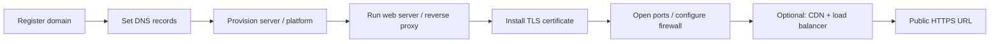

# Hosting and Deployment

Getting something you built onto the public internet means bridging a gap:
locally it runs at `localhost` on your machine, but a public site needs a
**name** people can type, an **address** that name resolves to, a **server**
that answers, **encryption** so the connection is trusted, and usually a layer
of **caching and load distribution** in front. This note is the practical path
from `localhost` to a live URL.

## From localhost to public URL



## 1. Register a domain

A domain name (`example.com`) is leased, not bought, from a **registrar**
(Namecheap, Cloudflare, Google Domains, etc.) which coordinates with the
registry for the top-level domain. Registration buys you the right to control
that name's DNS records — the actual pointing happens next.

## 2. Point DNS records at your server

DNS records connect the human name to machines. The records that matter for
hosting:

| Record  | Purpose                                           |
|---------|---------------------------------------------------|
| `A`     | Maps a name to an IPv4 address                    |
| `AAAA`  | Maps a name to an IPv6 address                    |
| `CNAME` | Aliases a name to another name (e.g. to a PaaS)   |
| `MX`    | Directs email for the domain to mail servers      |
| `TXT`   | Arbitrary text: domain verification, SPF/DKIM     |

For a raw server you set an `A`/`AAAA` record to its IP; for a managed platform
you usually set a `CNAME` to a hostname the platform gives you. Changes take
time to propagate because resolvers cache records for the TTL. See
[dns.md](dns.md).

## 3. Servers vs managed platforms

- **VPS / bare metal** (DigitalOcean droplet, EC2 instance, Hetzner): you get a
  Linux box and full control — and full responsibility for the OS, web server,
  certificates, and updates. See
  [../linux/networking-on-linux.md](../linux/networking-on-linux.md).
- **Managed platforms (PaaS)** (Vercel, Netlify, Render, Fly.io, Heroku): you
  push code and the platform handles servers, TLS, scaling, and often the CDN.
  Less control, far less operational burden.

The trade is control versus toil; most projects start on a platform and move to
raw infrastructure only when they outgrow it. See
[cloud-computing.md](cloud-computing.md) and, for packaging the app to ship,
[../devops-sre/software-distribution.md](../devops-sre/software-distribution.md).

## 4. Web servers and reverse proxies

A **web server** answers HTTP requests. **nginx** (and Caddy, Apache) commonly
sits in front of your application as a **reverse proxy**: it terminates TLS,
serves static files, and forwards dynamic requests to the app process on a
local port. This decouples the public-facing surface from the app and is where
you concentrate TLS, compression, and routing config.

```nginx
server {
    listen 443 ssl;
    server_name example.com;
    ssl_certificate     /etc/letsencrypt/live/example.com/fullchain.pem;
    ssl_certificate_key /etc/letsencrypt/live/example.com/privkey.pem;
    location / {
        proxy_pass http://127.0.0.1:3000;   # forward to the app
    }
}
```

## 5. TLS certificates

HTTPS requires a certificate proving you control the domain. **Let's Encrypt**
issues them free and automatically via the ACME protocol; tools like `certbot`
obtain and renew them (certificates are short-lived, ~90 days, so automated
renewal is essential). Managed platforms provision and renew certificates for
you invisibly. See [tls-ssl-and-certificates.md](tls-ssl-and-certificates.md).

## 6. Ports and firewalls

The server listens on specific **ports** — 80 for HTTP, 443 for HTTPS, 22 for
SSH. A **firewall** (ufw, security groups, iptables) controls which ports accept
inbound traffic. The usual hardening step is to open only 80/443 to the world
and restrict SSH. Getting from localhost to public often just means "the app
binds to `0.0.0.0` instead of `127.0.0.1`, and the firewall allows the port." See
[network-security.md](network-security.md).

## 7. CDNs and load balancers

- A **CDN** (content delivery network) caches static assets at edge locations
  near users, cutting latency and offloading your origin.
- A **load balancer** spreads traffic across multiple server instances,
  enabling horizontal scaling and health-checked failover.

Both put a distributed layer between the user and your origin, which is why the
first hop in [how-the-web-works.md](how-the-web-works.md) is frequently an edge
node rather than your actual server.

## References

This is a synthesized Concept note. Practical explanations of DNS records, CDNs,
and reverse proxies are in
[cloudflare-learning-center.md](cloudflare-learning-center.md).
