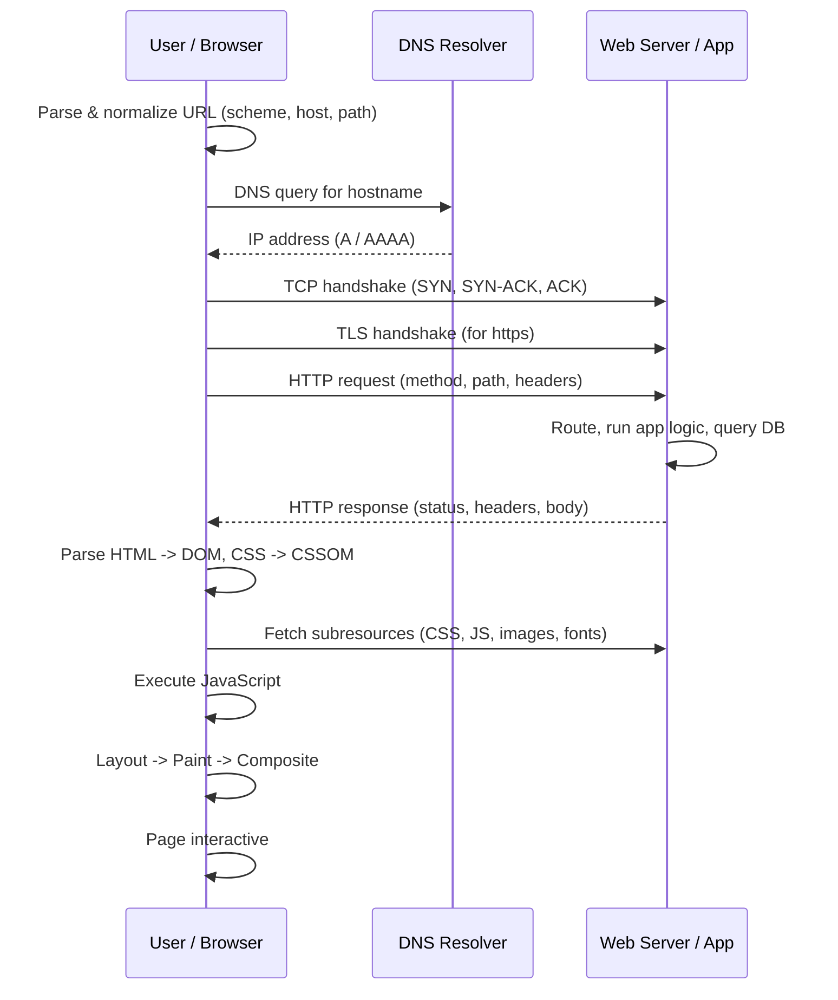

# How the Web Works

Typing a URL and pressing Enter kicks off a long, ordered chain of steps that
spans name resolution, transport, encryption, an application-layer request, and
finally the browser's own rendering pipeline. Understanding the full sequence —
end to end — is the single most useful mental model in networking, because every
other concept (DNS, TCP, TLS, HTTP, CDNs, APIs) slots into one of these stages.

This note walks the request from **address bar to interactive page**, in order.

## The end-to-end sequence

## Step by step

1. **Parse the URL.** The browser splits the URL into scheme (`https`), host
   (`example.com`), optional port, path, query string, and fragment. Missing
   pieces get defaults (port 443 for https, `/` for the path). It also checks
   caches (HSTS, service workers) that might short-circuit later steps.

2. **DNS resolution.** The host is a name, not an address, so the browser asks a
   resolver to translate `example.com` into an IP address. This may be answered
   from the browser cache, OS cache, or a recursive resolver walking the DNS
   hierarchy. See [dns.md](dns.md).

3. **TCP connection.** With an IP in hand, the browser opens a transport
   connection via the three-way handshake (SYN / SYN-ACK / ACK), establishing a
   reliable, ordered byte stream. See
   [network-protocols.md](network-protocols.md) and
   [osi-and-tcp-ip-models.md](osi-and-tcp-ip-models.md).

4. **TLS handshake (for https).** Before any HTTP data flows, the client and
   server negotiate encryption: agree on a cipher, verify the server's
   certificate against a trusted CA, and derive session keys. Modern TLS 1.3
   folds this into one round trip. See
   [tls-ssl-and-certificates.md](tls-ssl-and-certificates.md).

5. **HTTP request.** The browser sends a request line (method + path + version),
   headers (Host, Accept, Cookie, User-Agent…), and possibly a body. For a page
   load this is usually a `GET`. See [http-and-the-web.md](http-and-the-web.md).

6. **Server / app processing.** The request may first hit a CDN edge, load
   balancer, or reverse proxy, then reach an application server. The app routes
   the request, runs business logic, queries databases or downstream services,
   and assembles a response. See
   [hosting-and-deployment.md](hosting-and-deployment.md) and
   [apis-and-web-services.md](apis-and-web-services.md).

7. **HTTP response.** The server returns a status code (200, 301, 404, 500…),
   response headers (Content-Type, Cache-Control, Set-Cookie…), and a body —
   typically an HTML document for the initial navigation.

8. **Parse HTML → DOM.** The browser tokenizes the HTML and builds the **Document
   Object Model**, a tree of nodes representing the page structure. Parsing is
   incremental: the browser starts building the DOM before the full document
   arrives.

9. **Parse CSS → CSSOM.** Stylesheets (inline, embedded, or fetched) are parsed
   into the **CSS Object Model**, which maps style rules onto elements. CSS is
   render-blocking: the browser needs it before it can paint.

10. **Fetch subresources.** As the parser encounters `<link>`, `<script>`,
    ``, and `` references, it issues more HTTP requests. A `<script>`
    without `async`/`defer` blocks parsing until it downloads and runs.

11. **JavaScript execution.** Scripts run against the DOM/CSSOM, mutating the
    page. In a single-page application the initial HTML may be a near-empty shell
    and JS builds the entire UI client-side. See
    [../web-frontend/spa-design-and-architecture.md](../web-frontend/spa-design-and-architecture.md)
    and the composition patterns in
    [../web-frontend/learning-patterns.md](../web-frontend/learning-patterns.md).

12. **Render tree, layout, paint, composite.** The browser combines the DOM and
    CSSOM into a render tree (visible nodes with computed styles), computes each
    element's geometry (**layout / reflow**), fills pixels (**paint**), and
    combines layers on the GPU (**composite**).

13. **Interactive.** Event listeners are wired up and the page responds to input.
    The gap between "first pixels" and "fully interactive" is what web-performance
    work targets — deferring scripts, streaming HTML, and cutting round trips.

## Why the ordering matters

Each stage has a cost, and the costs compound because they are **serial for the
first byte**: DNS, then TCP, then TLS, then the request must all complete before
the server even sees the request. This is why performance techniques attack the
early stages — DNS prefetch, connection reuse (keep-alive, HTTP/2 multiplexing),
TLS session resumption, and edge caching via a CDN. Once the HTML arrives, the
bottleneck shifts to the rendering pipeline, where render-blocking CSS and
parser-blocking JS dominate.

The chain also explains where failures surface: a DNS problem looks different
from a TLS certificate error, which looks different from a `500` from the app.
Knowing which stage owns a symptom is half of debugging the web.

## References

This is a synthesized Concept note. The canonical treatment of the request
lifecycle and browser networking is
[grigorik-high-performance-browser-networking.md](grigorik-high-performance-browser-networking.md);
introductory explanations of each stage are in
[cloudflare-learning-center.md](cloudflare-learning-center.md).
