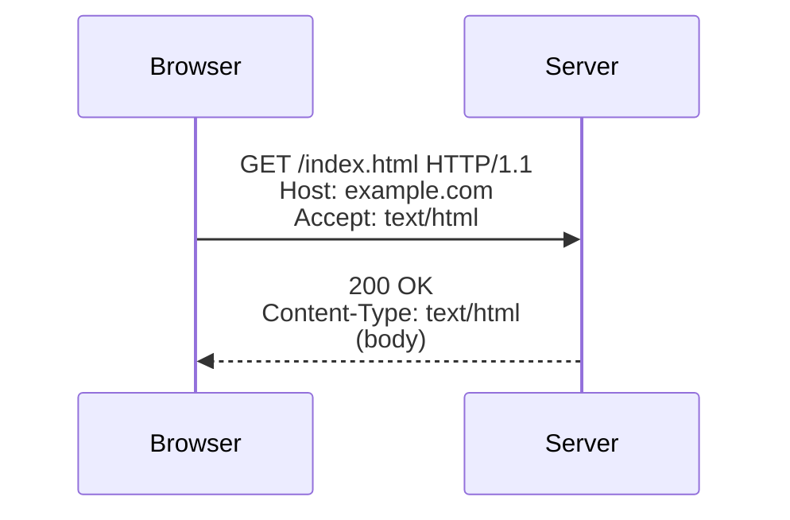

# HTTP and the Web

**HTTP** (HyperText Transfer Protocol) is the application-layer protocol the web
runs on. It defines how a client (usually a browser) and a server exchange
**resources** — HTML pages, images, JSON, anything addressable by a URL. Its
success comes from being simple and text-based enough to reason about by hand,
yet general enough to carry the entire web. The canonical deep-dive is
[Grigorik — High Performance Browser Networking](grigorik-high-performance-browser-networking.md).

## Request and response

Every exchange is one **request** and one **response**. The request names a
**method**, a target URL, a set of **headers**, and an optional body; the
response returns a **status code**, headers, and a body.

Methods carry meaning: `GET` reads, `POST` creates or submits, `PUT` replaces,
`PATCH` partially updates, `DELETE` removes. `GET`, `PUT`, and `DELETE` are meant
to be **idempotent** (repeating them has the same effect as doing them once), and
`GET` should be **safe** (no side effects) — properties that make retries and
caching sound. These verbs are the backbone of
[REST over HTTP](apis-and-web-services.md).

Status codes group into five classes: `1xx` informational, `2xx` success
(`200 OK`, `201 Created`), `3xx` redirection (`301` permanent, `304 Not
Modified`), `4xx` client error (`400`, `401 Unauthorized`, `403`, `404 Not
Found`, `429 Too Many Requests`), and `5xx` server error (`500`, `503`).

## Headers

Headers are the extensible metadata channel that carries almost all of HTTP's
richness: content negotiation (`Accept`, `Content-Type`), authentication
(`Authorization`), caching (`Cache-Control`, `ETag`), and security (`Strict-
Transport-Security`, `Content-Security-Policy` — see
[web security](../security/web-security.md)). Most protocol evolution happens in
headers rather than in the request line.

## Statelessness, cookies, and sessions

HTTP is **stateless**: each request is self-contained and the server keeps no
memory of prior ones. This is what lets any server in a fleet handle any request,
enabling the horizontal scaling of [cloud computing](cloud-computing.md). But
real applications need continuity (a logged-in user, a shopping cart), so state
is layered on top. The server sets a **cookie** via `Set-Cookie`; the browser
returns it on subsequent requests, letting the server tie them to a **session**
(or validate a self-contained token like a JWT). Cookie flags (`Secure`,
`HttpOnly`, `SameSite`) are a front line of web security.

## The evolution: HTTP/1.1 → HTTP/2 → HTTP/3

| | HTTP/1.1 | HTTP/2 | HTTP/3 |
|---|----------|--------|--------|
| Framing | Text | Binary | Binary |
| Concurrency | One request per connection at a time | Multiplexed streams over one TCP connection | Multiplexed streams over QUIC |
| Transport | TCP | TCP | QUIC (over UDP) |
| Head-of-line blocking | At the HTTP level | Removed at HTTP level, remains at TCP level | Removed entirely |
| Header compression | None | HPACK | QPACK |

HTTP/1.1 forced browsers to open many parallel TCP connections to fetch a page's
resources, because a slow response blocked the connection behind it.
**HTTP/2** multiplexes many logical **streams** over a single connection, so
requests no longer wait in line — but because it still rides on TCP, a single
lost packet stalls *all* streams (TCP head-of-line blocking). **HTTP/3** replaces
TCP with **QUIC**, a transport built on UDP that provides independent streams and
folds the [TLS handshake](tls-ssl-and-certificates.md) into the connection setup,
so a loss on one stream no longer stalls the others and connections establish in
fewer round trips.

## Caching

HTTP caching is what makes the web fast and cheap: a response can be stored and
reused instead of re-fetched. `Cache-Control` sets freshness (how long a response
may be reused without asking) and `ETag`/`Last-Modified` enable **revalidation**
(a conditional request that returns a tiny `304 Not Modified` if nothing
changed). Caches live in the browser, in corporate proxies, and in the CDN edge
nodes central to [hosting and deployment](hosting-and-deployment.md). Correct
cache headers are one of the highest-leverage performance tools on the web.

## Why it matters

HTTP is the lingua franca of the internet — not just for browsers but for APIs,
microservices, and mobile apps. Its statelessness, uniform methods, and caching
are the reasons the web scales, and its disciplined use is the foundation of
[good API design](../web-frontend/rest-api-design-rulebook.md). Understanding
where state, security, and latency actually live in the protocol is what
separates a working integration from a fast, secure one.

## References

- [Grigorik — High Performance Browser Networking](grigorik-high-performance-browser-networking.md)
- [Cloudflare Learning Center](cloudflare-learning-center.md)
- [Computer Networks](../computer-science/computer-networks.md)
