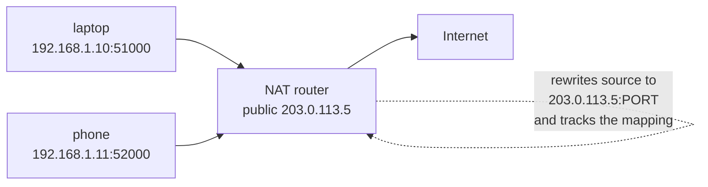
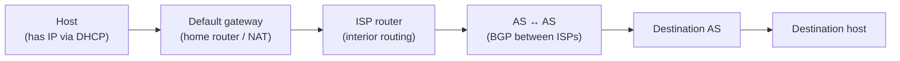

# IP Addressing and Routing

Two problems have to be solved for a packet to cross the internet: **addressing**
(how every host gets a unique, structured name) and **routing** (how tens of
thousands of independent networks cooperate to move a packet from any host to any
other). Together they are the machinery behind IP's best-effort delivery
described in [network-protocols](network-protocols.md), and they build directly on
the [layered model](osi-and-tcp-ip-models.md). Names are turned into addresses by
[DNS](dns.md); routing itself is a shortest-path problem over a
[graph](../math/graph-theory.md) of routers.

## IPv4 vs IPv6

- **IPv4** — 32-bit addresses, written as four dotted decimals (`192.0.2.15`).
  That is ~4.3 billion addresses, long since **exhausted**, which is why NAT and
  IPv6 exist.
- **IPv6** — 128-bit addresses, written as eight hex groups
  (`2001:db8::1`, with `::` compressing a run of zeros). The address space is
  effectively unlimited (~3.4×10³⁸). IPv6 also simplifies the header and makes NAT
  unnecessary, restoring true end-to-end addressing.

An IP address is *hierarchical*: a leading **network prefix** identifies the
network, the remaining bits identify the host within it. This structure is what
makes routing scalable — routers reason about prefixes, not individual hosts.

## Subnets and CIDR

**CIDR** (Classless Inter-Domain Routing) notation writes an address plus a
prefix length: `192.0.2.0/24` means "the first 24 bits are the network, the last
8 identify hosts" — 256 addresses. The `/n` is effectively a **subnet mask**
(`/24` = `255.255.255.0`). CIDR replaced the old rigid Class A/B/C system with
arbitrary-length prefixes, which lets address blocks be sized to need and lets
routers **aggregate** many prefixes into one route (a `/16` summarizes 256 `/24`s),
keeping routing tables small. **Subnetting** is splitting one block into smaller
ones to structure an internal network.

## Private addresses and NAT

Certain ranges are reserved as **private** and never routed on the public
internet: `10.0.0.0/8`, `172.16.0.0/12`, and `192.168.0.0/16`. Homes and offices
number their internal devices from these ranges, then share a single public
address using **NAT** (Network Address Translation).

NAT rewrites the source address (and port) of outbound packets to the router's
public address, records the mapping in a translation table, and reverses it on the
replies. It was a stopgap for IPv4 exhaustion and works well for outbound
connections, but it breaks the end-to-end model — inbound connections need
explicit port forwarding, and it complicates peer-to-peer protocols. IPv6's
abundance is meant to make NAT obsolete.

## DHCP — automatic addressing

A host joining a network usually does not know its address. **DHCP** (Dynamic Host
Configuration Protocol) assigns one automatically: the client broadcasts a
discovery request, a DHCP server offers an address lease, and hands back the
address, subnet mask, default gateway (the router), and DNS servers. This is why
plugging into Wi-Fi "just works" — DHCP configures the whole stack in one
exchange.

## Routing

Each **router** holds a **routing table** mapping destination prefixes to the
*next hop* toward them. Forwarding is local and greedy: a router looks up the
destination's **longest matching prefix**, sends the packet to that next hop, and
forgets it. No router knows the whole path; the path emerges from each hop making
a locally correct choice — a decentralized [graph](../math/graph-theory.md)
traversal.

Routing splits into two scopes:

- **Interior (within one network)** — protocols like OSPF or IS-IS compute
  shortest paths inside a single administrative domain.
- **Exterior (between networks)** — the internet is partitioned into **Autonomous
  Systems (ASes)**, each an independently operated network (an ISP, a large
  company, a cloud provider) with its own AS number. **BGP** (Border Gateway
  Protocol) is how ASes advertise which prefixes they can reach and stitch the
  global routing system together. BGP decisions are driven as much by business
  and policy (peering, transit contracts) as by path length — it is the protocol
  that literally makes the internet one network.

## How a packet traverses the internet

1. The app resolves a name to an IP via [DNS](dns.md).
2. If the destination is off-network, the host sends the packet to its **default
   gateway** (the router), found via DHCP.
3. Each router does a longest-prefix lookup and forwards to the next hop; interior
   protocols route within an AS, **BGP** routes between ASes.
4. NAT rewrites addresses at network boundaries as needed.
5. The destination host's stack delivers the payload up to the right process by
   port (see [network-protocols](network-protocols.md)).

Every hop is best-effort; reliability, if needed, is TCP's job at the endpoints —
the end-to-end principle at work.

## References

- [Tanenbaum & Wetherall, *Computer Networks*](tanenbaum-computer-networks.md)
- [Stevens, *TCP/IP Illustrated*](stevens-tcp-ip-illustrated.md)
- [Kurose & Ross, *Computer Networking: A Top-Down Approach*](../computer-science/kurose-ross-computer-networking.md)
- [Computer Networks (survey)](../computer-science/computer-networks.md)
