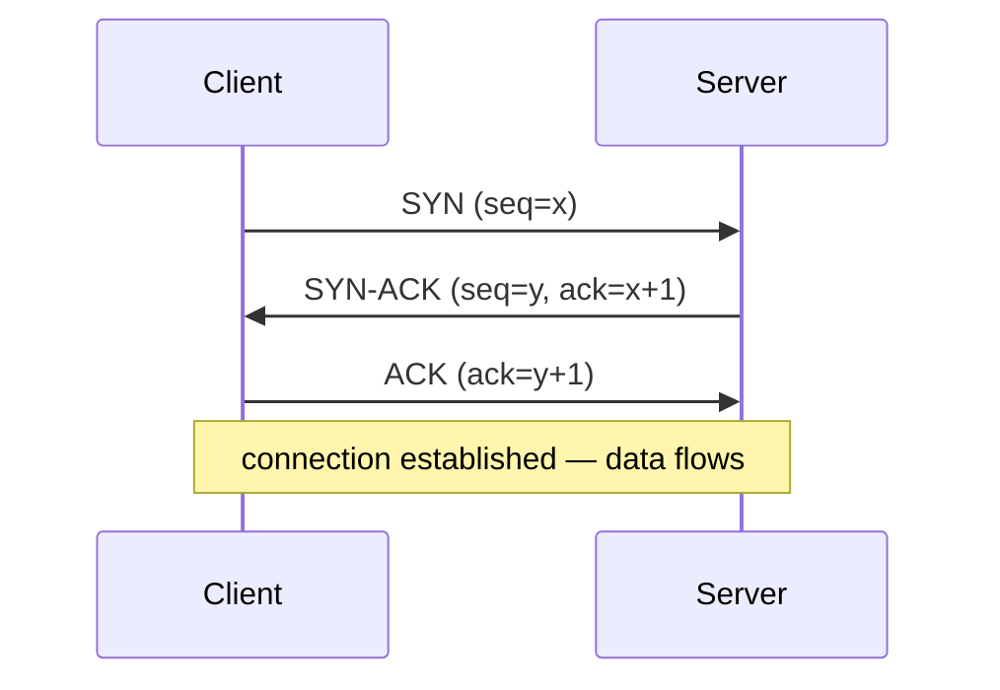

# Network Protocols

A **protocol** is an agreed set of rules for exchanging messages: their format,
their ordering, and the actions each side takes in response. Protocols are what
make heterogeneous machines interoperate — a Linux server and an iPhone talk
because both implement the same protocols exactly, down to the bit. This note
looks at the [TCP/IP stack](osi-and-tcp-ip-models.md) *in practice*: what each
core protocol guarantees, and how programs actually use them through ports and
sockets. The anchoring text is
[Stevens, *TCP/IP Illustrated*](stevens-tcp-ip-illustrated.md).

## Why standards matter

Because a protocol is a *contract*, both endpoints must agree before a single
useful byte flows. Written-down, versioned standards (IETF **RFCs**) are what let
independent teams implement the same protocol and interoperate without ever
coordinating. The value of a network protocol grows with adoption — a network
effect — which is why the internet converged on a small set of protocols rather
than many competing ones. The cost is that changing an entrenched protocol is
extremely hard (IPv4 → IPv6 has taken decades), so protocols are designed
conservatively.

## IP — best-effort host-to-host delivery

The **Internet Protocol** is the network-layer workhorse. It assigns every host
an address and defines how a packet is forwarded, hop by hop, toward its
destination (see [ip-addressing-and-routing](ip-addressing-and-routing.md)). IP
is deliberately **best-effort**: it does *not* promise a packet arrives, arrives
once, or arrives in order. That minimalism is the "thin waist" that keeps the
network core simple and pushes reliability to the endpoints — the **end-to-end
principle**. Everything below builds reliability *on top of* this unreliable base.

## TCP vs UDP — the two transports

Both run on top of IP and both add **ports** so bytes reach the right *process*,
not just the right host. Beyond that they are opposites.

| | **TCP** | **UDP** |
|---|---|---|
| Connection | connection-oriented (handshake first) | connectionless (just send) |
| Reliability | guaranteed delivery, retransmits lost data | none — packets may vanish |
| Ordering | in-order byte stream | may arrive reordered |
| Flow/congestion control | yes (adapts to receiver + network) | no |
| Overhead | higher (headers, ACKs, state) | minimal |
| Model | a reliable pipe of bytes | independent datagrams |
| Used by | HTTP(≤2), email, file transfer, SSH | DNS, VoIP, video, gaming, QUIC |

**TCP** turns IP's lossy, unordered packets into a clean, ordered, reliable byte
stream using sequence numbers, acknowledgements, retransmission, and windowing.
It is the right choice when *every byte must arrive correctly*.

**UDP** is a thin wrapper over IP: it adds ports and a checksum, nothing more. It
is the right choice when *timeliness beats completeness* (a dropped video frame is
better than a late one) or when the application will manage reliability itself
(as QUIC does, giving HTTP/3 its own reliability over UDP).

## Ports and sockets

An IP address identifies a *host*; a **port** (a 16-bit number, 0–65535)
identifies a *process* on that host. The pair **(IP address, port)** names one
endpoint. A **socket** is the OS abstraction a program opens to send and receive
over the network — the API boundary between the application and the kernel's
networking stack, closely tied to the OS's
[I/O and device management](../operating-systems/io-and-device-management.md). A
TCP connection is uniquely identified by the **4-tuple**:

`(source IP, source port, destination IP, destination port)`

Servers listen on **well-known ports** (80 HTTP, 443 HTTPS, 22 SSH, 53 DNS);
clients get an **ephemeral** port assigned per connection. The kernel demultiplexes
arriving packets to the right socket using the 4-tuple.

## The TCP three-way handshake

Before any data flows, TCP establishes state on both ends and synchronizes
sequence numbers. This is the **three-way handshake**:

1. **SYN** — client picks an initial sequence number *x* and asks to open.
2. **SYN-ACK** — server acknowledges *x*, picks its own *y*.
3. **ACK** — client acknowledges *y*; both sides now agree on starting sequence
   numbers.

Tearing down uses an analogous exchange of **FIN**/**ACK** segments. This
per-connection setup and state is exactly what UDP skips — and why UDP is faster
but offers no guarantees.

## Common application protocols

Sitting on transports are the protocols programs speak directly:

- **HTTP / HTTPS** (TCP or QUIC) — the web; see [http-and-the-web](http-and-the-web.md).
- **DNS** (mostly UDP) — name → address resolution; see [dns](dns.md).
- **TLS** (over TCP) — encryption and identity; see [tls-ssl-and-certificates](tls-ssl-and-certificates.md).
- **SMTP / IMAP** (TCP) — email transfer and retrieval.
- **SSH** (TCP) — encrypted remote shell.
- **DHCP** (UDP) — automatic address assignment.

Each is defined by an RFC and layers cleanly on the transport beneath, the payoff
of the [layered model](osi-and-tcp-ip-models.md).

## References

- [Stevens, *TCP/IP Illustrated*](stevens-tcp-ip-illustrated.md)
- [Tanenbaum & Wetherall, *Computer Networks*](tanenbaum-computer-networks.md)
- [Kurose & Ross, *Computer Networking: A Top-Down Approach*](../computer-science/kurose-ross-computer-networking.md)
- [Computer Networks (survey)](../computer-science/computer-networks.md)
