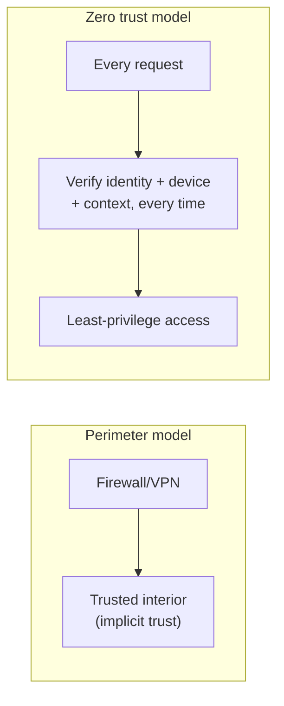

# Network Security

**Network security** is the discipline of protecting data and systems as they
communicate over links no one fully controls. The starting assumption is
adversarial: any packet can be observed, forged, replayed, or blocked, and any
host on the path may be hostile. The job is to preserve **confidentiality**,
**integrity**, and **availability** despite that. It builds directly on
[TLS and certificates](tls-ssl-and-certificates.md) as its baseline and connects
to application-level defense in [web security](../security/web-security.md).

## The threat model

You cannot defend what you have not named. The recurring network threats:

| Threat | What happens | Primary mitigation |
|--------|--------------|--------------------|
| **Packet sniffing** | Attacker on the path reads unencrypted traffic | Encrypt in transit ([TLS](tls-ssl-and-certificates.md)) |
| **Man-in-the-middle (MITM)** | Attacker relays and alters traffic, posing as each side | Authenticated encryption + certificate validation |
| **Spoofing** | Forged source IP/identity (IP, ARP, DNS spoofing) | Authentication, DNSSEC, ingress filtering |
| **DDoS** | Flood of traffic exhausts capacity | Rate limiting, scrubbing, CDN/edge absorption |
| **Replay** | Captured valid messages re-sent | Nonces, timestamps, sequence numbers |

MITM is the threat that motivates most of the cryptographic machinery elsewhere:
encryption alone stops sniffing, but only **authentication** (the CA-signed
certificate) stops an attacker from simply negotiating an encrypted channel while
impersonating the server.

## Firewalls

A **firewall** enforces a policy on which traffic may cross a boundary. A packet
filter allows or denies based on IP, port, and protocol; a **stateful** firewall
tracks connection state so it can permit return traffic for connections the
inside initiated while blocking unsolicited inbound. Application-layer firewalls
(including the **WAF** in front of web apps) inspect the payload itself. The
principle is **default-deny**: allow only what is explicitly needed, minimizing
the attack surface.

## VPNs and tunneling

A **VPN** creates an encrypted **tunnel** across an untrusted network, so hosts
behave as if on one private network and intermediaries see only ciphertext.
**Tunneling** — wrapping one protocol's packets inside another (IPsec, WireGuard,
TLS) — is the underlying mechanism: it both encrypts and bridges networks. VPNs
historically defined the security perimeter, letting remote workers "inside" the
trusted network, an assumption zero trust later challenges.

## Segmentation and defense in depth

**Network segmentation** divides a network into zones (a public DMZ for
internet-facing services, private subnets for databases, isolated segments for
sensitive systems) so a breach in one zone does not grant the whole network. Each
boundary is a control point, and layering independent controls is **defense in
depth**: no single failure is catastrophic. This limits **lateral movement** —
the way an attacker who compromises one host pivots to others.

## Zero trust

Perimeter security assumed "inside = trusted." Cloud, mobile, and remote work
dissolved the perimeter, and the **zero trust** model responds with a blunt
principle: **never trust, always verify**. Every request is authenticated and
authorized on its own merits regardless of network location; there is no implicit
trust from being "inside."

Zero trust leans on strong identity, least-privilege authorization, and
continuous verification rather than a wall. The same identity-and-verification
discipline extends to autonomous agents — a growing concern captured in the
[OWASP LLM Top 10](../ai-governance/owasp-llm-top-10.md), where an AI system with
network access becomes a new class of principal to authenticate and constrain.

## Why it matters

The network is the shared, hostile substrate under every application, and most
consequential breaches involve moving *through* a network — intercepting traffic,
spoofing identity, or pivoting after an initial foothold. Encryption on the wire,
strict boundaries, and verify-everything identity are what keep a compromise
local instead of total. Network security is also the layer where availability
lives: a service that is confidential and correct but knocked offline by a DDoS
has still failed its users.

## References

- [Cloudflare Learning Center](cloudflare-learning-center.md)
- [Stevens — TCP/IP Illustrated](stevens-tcp-ip-illustrated.md)
- [Web Security](../security/web-security.md)
- [Computer Networks](../computer-science/computer-networks.md)
