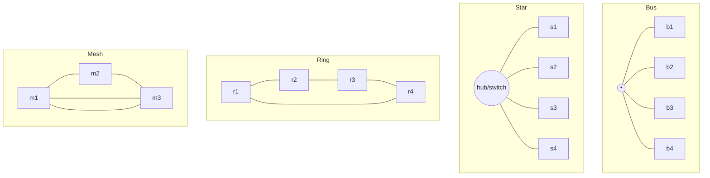

# Network Topologies and Types

Networks are classified two ways that are easy to conflate but distinct: by
**scale** (how much physical territory they span) and by **topology** (how the
nodes are wired and how data logically flows). Layered on top are the **devices**
that stitch segments together and the **standards bodies** that make any of it
interoperate. This note complements [computer-networks](../computer-science/computer-networks.md)
and feeds into [osi-and-tcp-ip-models](osi-and-tcp-ip-models.md) and
[ip-addressing-and-routing](ip-addressing-and-routing.md).

## Networks by scale

| Type | Span | Typical use | Owner |
|------|------|-------------|-------|
| **PAN** (Personal Area Network) | ~meters | phone ↔ earbuds (Bluetooth) | one person |
| **LAN** (Local Area Network) | a building/campus | home or office | one org |
| **MAN** (Metropolitan Area Network) | a city | ISP metro backbone | provider/city |
| **WAN** (Wide Area Network) | regional to global | connecting distant LANs | ISPs, telecoms |

The **internet** is the limiting case: not one network but a *network of
networks*, tens of thousands of independently owned networks
(**autonomous systems**) that agree to exchange traffic. No one owns it; it
coheres because everyone speaks IP (see
[ip-addressing-and-routing](ip-addressing-and-routing.md)) and honors a shared
set of standards.

## Physical vs logical topology

**Topology** is the shape of the connections. It has a *physical* form (how cables
actually run) and a *logical* form (the path signals take), and the two can
differ — classic Ethernet was physically a star but logically a bus.

- **Bus** — one shared backbone; cheap but a single break kills it and only one
  node can transmit at a time (collisions). Historical (early Ethernet).
- **Star** — every node connects to a central hub or switch. Dominant today: one
  failed link isolates only that node, and a switch gives each node its own
  collision-free path.
- **Ring** — each node connects to two neighbors; data circulates. Used in older
  token-ring and some fiber backbones (FDDI, SONET rings) for deterministic
  timing.
- **Mesh** — nodes interconnect with redundant paths. **Full mesh** wires every
  pair (robust, expensive, *n(n-1)/2* links); **partial mesh** is the usual
  compromise. The internet core is a partial mesh — its redundancy is what routing
  exploits (a [graph](../math/graph-theory.md) problem).

## Devices: hub vs switch vs router

These correspond to layers of the [OSI/TCP-IP model](osi-and-tcp-ip-models.md):

- **Hub** (physical layer, L1) — a dumb repeater: bits in one port go out *all*
  ports. Everyone shares one collision domain. Obsolete.
- **Switch** (data link layer, L2) — learns which **MAC address** lives on which
  port and forwards a frame only to the right port. Gives each port a private
  collision domain — the reason modern LANs are fast.
- **Router** (network layer, L3) — connects *different* networks and forwards
  **packets** by IP address using a routing table. Routers are the joints between
  networks that make an internetwork; they also isolate broadcast domains.

A home "router" is really all three plus a switch, Wi-Fi access point, DHCP
server, and NAT gateway in one box.

## Ethernet and Wi-Fi

- **Ethernet (IEEE 802.3)** — the dominant *wired* LAN standard. Frames carry
  48-bit MAC source/destination addresses; media access on shared media used
  **CSMA/CD** (listen, transmit, detect collisions, back off), though switched
  full-duplex links make collisions moot on modern networks. Speeds run from
  10 Mb/s historically to 100 Gb/s+ in data centers.
- **Wi-Fi (IEEE 802.11)** — wireless LAN. Because radios cannot reliably detect
  collisions while transmitting, Wi-Fi uses **CSMA/CA** (collision *avoidance*)
  with acknowledgements. It brings extra concerns absent on wire: signal
  strength, interference, and the need for link-layer encryption (WPA2/WPA3),
  which ties into [network-security](network-security.md).

## Standards bodies

Interoperability is not luck — it is standards. The key organizations:

- **IEEE** — the **802** family governs LAN/MAN hardware: 802.3 (Ethernet), 802.11
  (Wi-Fi), 802.1 (bridging/VLANs).
- **IETF** — defines the internet's protocols through **RFCs** (Requests for
  Comments): IP, TCP, UDP, HTTP, DNS, TLS. RFCs are numbered, versioned, and
  freely published — the operating documents of the internet.
- **W3C** — standardizes the *web* layer above: HTML, CSS, and web APIs (see
  [http-and-the-web](http-and-the-web.md)).

The rough division of labor: IEEE handles the wire and radio, IETF handles how
packets move end to end, W3C handles what browsers render.

## References

- [Tanenbaum & Wetherall, *Computer Networks*](tanenbaum-computer-networks.md)
- [Kurose & Ross, *Computer Networking: A Top-Down Approach*](../computer-science/kurose-ross-computer-networking.md)
- [Computer Networks (survey)](../computer-science/computer-networks.md)
