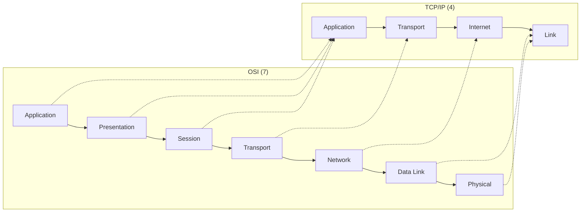
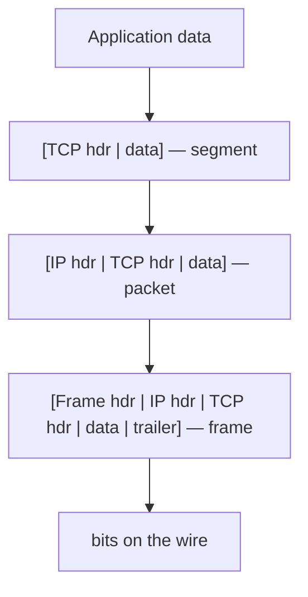

# OSI and TCP/IP Models

Networks are built as **layers**, each solving one part of the problem of moving
bytes between machines and relying only on the service the layer below exposes.
Layering is the organizing idea of the whole field: it lets a browser speak HTTP
without knowing whether the bits travel over fiber, Wi-Fi, or cellular, and it
lets a link technology change without touching the applications above. Two
layering schemes dominate — the seven-layer **OSI reference model** (a teaching
and design abstraction) and the pragmatic four-layer **TCP/IP model** (what the
internet actually runs). This note is the deep dive behind the survey in
[computer-networks](../computer-science/computer-networks.md). The anchoring text
is [Tanenbaum](tanenbaum-computer-networks.md).

## Why layer at all

A network has to bridge an enormous gap: on one end an application wants a clean,
ordered stream of bytes; on the other end a physical medium delivers voltage
transitions that are noisy, lossy, and unordered. Trying to solve everything in
one monolithic protocol would be unmanageable. Instead each layer adds exactly
one guarantee and hides the mess beneath it:

- **Abstraction** — a layer offers a well-defined *service interface* upward and
  hides its internals.
- **Peer protocols** — layer *N* on one host talks to layer *N* on the other
  using a **protocol** (see [network-protocols](network-protocols.md)); the
  conversation is *logical*, since the actual bits flow all the way down to the
  physical layer and back up.
- **Independence** — you can swap Ethernet for Wi-Fi at the link layer without
  the transport or application layers noticing.

## The OSI seven layers

| # | Layer | Job | Unit | Examples |
|---|-------|-----|------|----------|
| 7 | Application | What the program means; app-visible protocols | data | HTTP, DNS, SMTP, FTP |
| 6 | Presentation | Encoding, serialization, compression, encryption | data | TLS, ASCII/Unicode, JPEG |
| 5 | Session | Dialog control, checkpoints, session setup/teardown | data | RPC, sockets sessions |
| 4 | Transport | Process-to-process delivery, reliability, flow control | segment | TCP, UDP |
| 3 | Network | Host-to-host addressing and routing across networks | packet | IP, ICMP, routing |
| 2 | Data link | Node-to-node delivery over one hop; framing, MAC | frame | Ethernet, Wi-Fi (802.11), PPP |
| 1 | Physical | Bits as signals on a medium | bit | copper, fiber, radio |

A memory aid worth knowing: "All People Seem To Need Data Processing" (top down).

## The TCP/IP model

The internet was engineered before OSI was finished, so it uses a leaner stack.
It **collapses OSI's top three layers** (session, presentation, application) into
a single Application layer — in practice those concerns live in libraries and in
the applications themselves — and merges physical and data link into one Link
layer. The five-layer variant taught in [Kurose &
Ross](../computer-science/kurose-ross-computer-networking.md) keeps physical and
link separate; the classic four-layer variant does not.

The **internet's "thin waist"** is the Internet layer: everything funnels through
IP. Many applications and transports run on top, many link technologies run
beneath, but there is essentially one network protocol in the middle. That
narrow, simple, best-effort core is precisely what let the internet scale to
billions of hosts — see [ip-addressing-and-routing](ip-addressing-and-routing.md).

## Encapsulation and decapsulation

Data moving down the sending stack is wrapped in a **header** (and sometimes a
trailer) at each layer; the whole unit from the layer above becomes the *payload*
of the layer below. This nesting is **encapsulation**. On the receiving host each
layer strips its own header and hands the payload up — **decapsulation**. The
name of the unit changes as it descends: a transport **segment** becomes the
payload of a network **packet**, which becomes the payload of a link **frame**,
which is finally sent as **bits**.

Crucially, only the *peer* layer reads a given header. A router works up to the
network layer to read the IP header and forward the packet, then re-frames it for
the next hop — it never inspects the transport or application headers. This is
why routers stay simple and fast.

## Why it matters

Layering is the reason the internet is *evolvable*. HTTP/3 could adopt a new
transport (QUIC over UDP) without changing IP; IPv6 can replace IPv4 at the
network layer without rewriting applications; Wi-Fi 6 can replace older radios at
the link layer transparently. Each layer is an independent axis of change — the
architectural payoff of clean interfaces, the same principle that governs good
[distributed systems](../distributed-systems/distributed-systems-fundamentals.md).

## References

- [Tanenbaum & Wetherall, *Computer Networks*](tanenbaum-computer-networks.md)
- [Kurose & Ross, *Computer Networking: A Top-Down Approach*](../computer-science/kurose-ross-computer-networking.md)
- [Computer Networks (survey)](../computer-science/computer-networks.md)
