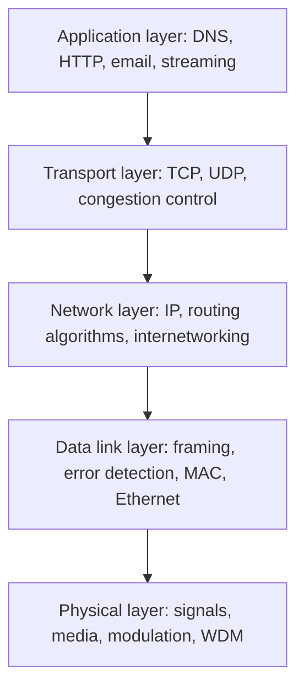

# Computer Networks (Tanenbaum & Wetherall)

Andrew S. Tanenbaum and David J. Wetherall's *Computer Networks* is the classic
comprehensive introduction to networking, widely used as the undergraduate survey text
for the field. Its organizing idea is the **layered model**: the book works through the
stack one layer at a time, from the physical transmission of bits up to the applications
people actually use, so that each chapter builds on the guarantees the layer beneath it
provides. This makes it the natural companion to any study of the
[OSI and TCP/IP models](osi-and-tcp-ip-models.md), whose vocabulary of layers and
encapsulation the book explains in depth.

## Scope and approach

Rather than treating networking as a catalog of protocols, Tanenbaum motivates each
mechanism by the problem it solves, then shows the concrete protocols that solve it. The
progression is bottom-up through the layers:

- **Physical layer** — how bits become signals over copper, fiber, and radio; bandwidth,
  the Nyquist and Shannon limits, and multiplexing.
- **Data link layer** — framing, error detection and correction, and multiple-access
  (MAC) protocols; Ethernet and switching are the running examples.
- **Network layer** — packet forwarding, the many routing algorithms, and the
  internetworking that ties heterogeneous networks together, covered in
  [IP addressing and routing](ip-addressing-and-routing.md).
- **Transport layer** — reliable delivery, flow control, and congestion control, with
  TCP and UDP as the canonical [network protocols](network-protocols.md).
- **Application layer** — DNS, email, the Web, and multimedia delivery.

Two cross-cutting themes run the length of the book: **network security** (cryptography,
authentication, and secure protocols get their own extended treatment) and **wireless and
mobile networks** (Wi-Fi, cellular, and the physics of shared radio media), reflecting
how much of modern networking is neither wired nor fixed.

## Why it endures

The book's strength is breadth with clarity: it gives a working mental model of the whole
stack before drilling into any one protocol, and its layer-by-layer structure mirrors how
the standards themselves are organized. For a treatment that leans top-down (starting from
the applications a user sees and descending toward the wire), the standard alternative is
[Kurose & Ross, Computer Networking](../computer-science/kurose-ross-computer-networking.md);
the two books are complementary surveys of the same territory taken from opposite ends of
the stack.

## References

- [Computer Networks — Pearson](https://www.pearson.com/en-us/subject-catalog/p/computer-networks/P200000003188)
