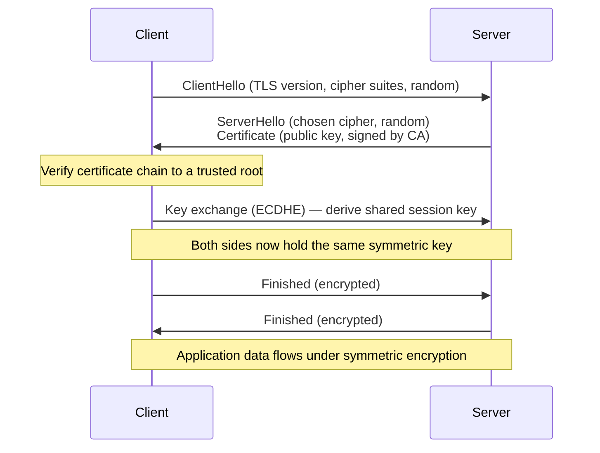
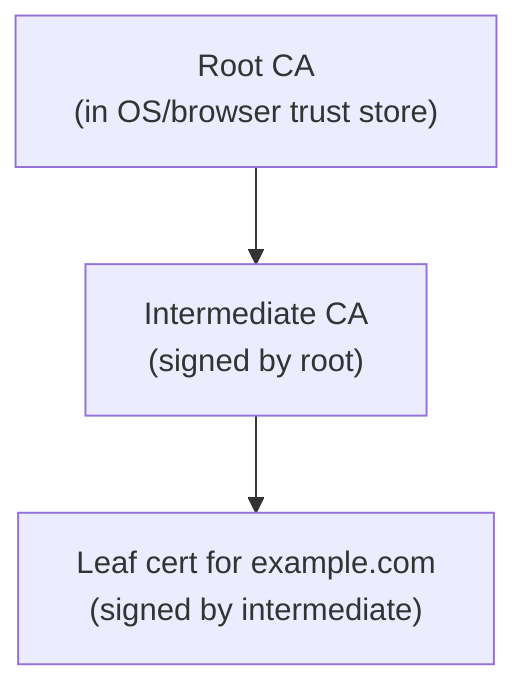

# TLS, SSL, and Certificates

**TLS** (Transport Layer Security — the modern successor to the deprecated SSL)
is the protocol that secures data in transit. It gives three guarantees over an
otherwise open network: **confidentiality** (eavesdroppers see only ciphertext),
**integrity** (tampering is detected), and **authentication** (you are talking to
who you think you are). Layered under [HTTP](http-and-the-web.md) it becomes
**HTTPS**, and it is the baseline defense assumed throughout
[network security](network-security.md).

## Symmetric vs. asymmetric cryptography

The engineering trick behind TLS is combining two kinds of cryptography:

- **Symmetric** encryption uses one shared secret key for both encrypting and
  decrypting (e.g. AES). It is fast, but both parties must already share the key —
  the chicken-and-egg problem of getting that key to a stranger over a hostile
  network.
- **Asymmetric** (public-key) encryption uses a mathematically linked **key pair**:
  a public key anyone may hold and a private key kept secret. What one encrypts
  the other decrypts, and a private key can produce **signatures** anyone can
  verify with the public key. Its security rests on hard problems in
  [number theory](../math/number-theory.md) and
  [abstract algebra](../math/abstract-algebra.md) — factoring large integers
  (RSA) or discrete logarithms on elliptic curves (ECDHE). It is slow, but it
  needs no pre-shared secret.

TLS uses the slow asymmetric method **once**, to authenticate the server and
agree on a fresh symmetric **session key**, then switches to fast symmetric
encryption for the actual data. Best of both.

## The handshake

Modern TLS 1.3 streamlines this to a single round trip (and supports 0-RTT
resumption), which is part of why [HTTP/3](http-and-the-web.md) folds the
handshake into QUIC's connection setup. Crucially, the key exchange uses
**ephemeral** Diffie-Hellman keys discarded after the session, giving **forward
secrecy**: capturing today's traffic and later stealing the server's private key
still does not decrypt it.

## Certificates and the chain of trust

Encryption alone would let an attacker in the middle negotiate an encrypted
channel *as* the server. Authentication closes that gap with an **X.509
certificate**: a document binding a domain name to a public key, **digitally
signed** by a **Certificate Authority (CA)**. The client trusts the certificate
only if it can follow a **chain** of signatures up to a **root CA** already in
its trust store (shipped with the OS or browser).

The whole arrangement — CAs, roots, revocation, the signing hierarchy — is the
**Public Key Infrastructure (PKI)**. Trust is transitive: if you trust the root
and each signature verifies, you trust the leaf.

## Let's Encrypt and ACME

Historically certificates were bought and installed by hand. **Let's Encrypt**, a
free nonprofit CA, and the **ACME** protocol automated it: a server proves it
controls a domain (typically by answering an HTTP challenge or publishing a DNS
[`TXT` record](dns.md)), and the CA issues a short-lived (90-day) certificate that
the client auto-renews. This automation is why HTTPS is now the default rather
than a premium feature, and it drops cleanly into modern
[hosting and deployment](hosting-and-deployment.md) pipelines.

## What the padlock actually means

The browser padlock means only that the connection is **encrypted** and the
certificate **validly chains to a trusted CA for this domain** — that you have a
private channel to the domain named in the address bar. It does **not** mean the
site is honest, safe, or the one you intended: a phishing domain can hold a
perfectly valid certificate. The padlock authenticates the *pipe*, not the
*intentions* — a distinction central to [web security](../security/web-security.md).

## Why it matters

TLS is the single most widely deployed application of cryptography, and it is the
reason it is safe to bank, log in, and transact over networks you do not control.
It is also the baseline every other network defense assumes; when it is
misconfigured (expired certs, weak ciphers, unvalidated chains) everything
layered above it is exposed.

## References

- [Cloudflare Learning Center](cloudflare-learning-center.md)
- [Stevens — TCP/IP Illustrated](stevens-tcp-ip-illustrated.md)
- [Computer Networks](../computer-science/computer-networks.md)
