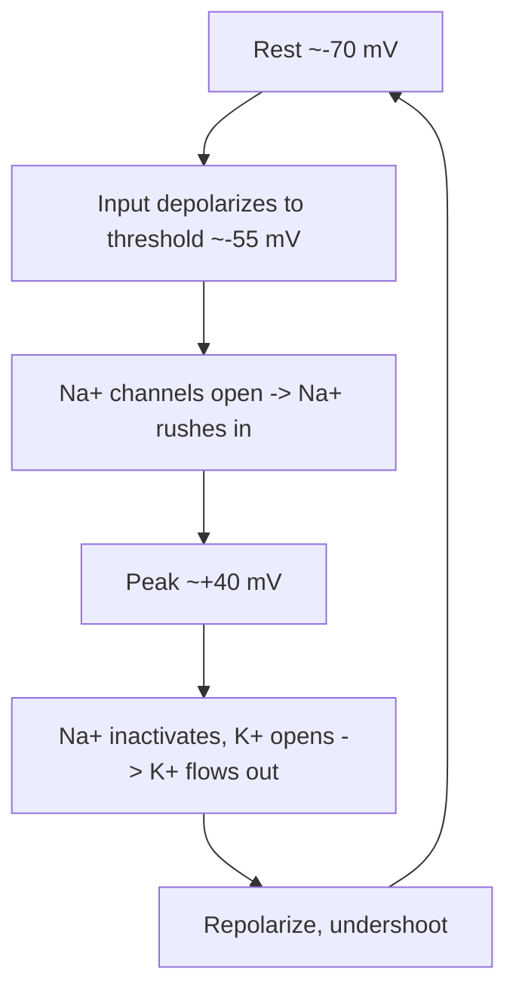

# The Action Potential

The **action potential** — the "spike" — is the fundamental electrical signal a
[neuron](neuron.md) uses to communicate over distance. It is a rapid, self-regenerating
reversal of the membrane potential that sweeps down the axon and triggers signaling at the
[synapse](synapse-and-neurotransmission.md). Where the resting neuron sits near −70 mV, a
spike briefly drives the membrane to about +40 mV and back, all in roughly one to two
milliseconds.

## The mechanism: voltage-gated Na⁺ and K⁺ dynamics

The spike is generated by **voltage-gated ion channels** whose opening depends on the
membrane voltage itself — a positive-feedback loop that makes the event explosive and
stereotyped.

1. **Threshold.** Inputs summed at the axon hillock depolarize the membrane. If the voltage
   reaches **threshold** (around −55 mV), enough voltage-gated **Na⁺ channels** pop open to
   trigger the spike. Below threshold, nothing propagates.
2. **Depolarization (rising phase).** Open Na⁺ channels let Na⁺ rush inward down its
   gradient. This depolarizes the membrane further, opening *more* Na⁺ channels — runaway
   positive feedback that shoots the voltage sharply positive.
3. **Repolarization (falling phase).** Na⁺ channels **inactivate** (a built-in timer shuts
   them), while slower voltage-gated **K⁺ channels** open. K⁺ flows outward, driving the
   voltage back down toward rest.
4. **Hyperpolarization / undershoot.** K⁺ channels close sluggishly, so the membrane
   briefly overshoots below rest before the leak channels and the Na⁺/K⁺ pump restore the
   resting state.

The Hodgkin–Huxley model captures this quantitatively as coupled
[differential equations](../math/differential-equations.md) for the voltage and the
gating variables — a foundational result in
[computational-neuroscience](computational-neuroscience.md).

## All-or-none, and the refractory period

The spike is **all-or-none**: once threshold is crossed the amplitude is fixed and does not
scale with how strongly threshold was exceeded. A neuron cannot signal "a little" — it
either fires a full spike or it doesn't.

During and just after a spike the neuron is **refractory**. In the *absolute* refractory
period the Na⁺ channels are inactivated and cannot reopen, so no second spike is possible;
in the relative refractory period a stronger-than-usual input is needed. This enforces a
ceiling on firing rate and ensures spikes stay discrete and one-directional.

## Propagation down the axon

A spike at one patch of membrane depolarizes the adjacent patch past threshold,
regenerating itself as it travels — so unlike a passive electrical signal it does **not
decay** over distance. In **myelinated** axons, the insulating myelin sheath forces the
spike to jump between gaps (nodes of Ranvier) in **saltatory conduction**, dramatically
speeding transmission.

## Rate of firing as the signal

Because every spike is identical, the *amplitude* carries no information — the **pattern**
does. A neuron encodes stimulus strength largely in its **firing rate** (spikes per second):
a bright light or a strong push produces faster firing. Precise **timing** of spikes can
carry information too. How this is read out is the subject of [neural-coding](neural-coding.md).

This is the biological root of a key abstraction in artificial
[neural networks](../ai/neural-networks.md): the all-or-none threshold is the ancestor of
the step/activation function, and firing rate is the ancestor of a unit's continuous
output. **Spiking neural networks** in [deep learning](../ai/deep-learning.md) go further
and model discrete spikes directly.

## Canonical example: the squid giant axon

Hodgkin and Huxley won the Nobel Prize for recording from the squid's giant axon — thick
enough to insert an electrode — and reconstructing the Na⁺ and K⁺ conductances that produce
the spike. It remains the canonical demonstration and the model every later account builds on.

## References

- [Kandel, *Principles of Neural Science*](kandel-principles-of-neural-science.md)
- [Purves, *Neuroscience*](purves-neuroscience.md)
- [Gerstner, *Neuronal Dynamics*](gerstner-neuronal-dynamics.md)
- [Dayan & Abbott, *Theoretical Neuroscience*](dayan-abbott-theoretical-neuroscience.md)
