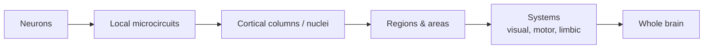

# Brain Organization

**Brain organization** is the study of how nervous tissue is arranged across scales — from
single [neurons](neuron.md), through the [circuits](neural-circuits.md) they form, up to the
large anatomical regions and systems that produce perception, movement, memory, and thought.
The central lesson is that the brain is neither a uniform mush nor a set of isolated
modules: it is a **hierarchy of specialized-but-interconnected parts**, and understanding
behavior means understanding both *where* a function lives and *how widely it is distributed*.

## Scales of organization

Each level constrains the next. A [neuron](neuron.md) fires an
[action potential](action-potential.md); many neurons wired through
[synapses](synapse-and-neurotransmission.md) form a [circuit](neural-circuits.md); circuits
tile into regions; regions cooperate as systems. This is the same nested-composition idea
that appears in artificial [neural networks](../ai/neural-networks.md), where simple units
compose into layers and layers into whole architectures.

## Gross anatomy

- **Cerebral cortex** — the wrinkled outer sheet, divided into four lobes per hemisphere:
  **frontal** (planning, motor control, executive function), **parietal** (somatosensation,
  spatial attention), **temporal** (hearing, object recognition, memory), and **occipital**
  (vision). Its folding packs a large surface area into the skull; cortex is layered
  (canonically six layers) and organized into repeating columnar microcircuits.
- **Thalamus** — the central relay: nearly all [sensory](sensory-systems.md) information
  (except smell) passes through thalamic nuclei on its way to cortex, and cortex sends
  massive feedback back — a loop central to attention and
  [predictive coding](predictive-coding-and-cognition.md).
- **Basal ganglia** — deep nuclei that gate action selection and are the substrate of
  reward-based, habit, and procedural [learning](learning-and-memory.md); their dopaminergic
  circuitry is the biological anchor for
  [reinforcement learning](../ai/reinforcement-learning.md).
- **Cerebellum** — a densely packed structure that refines timing and coordination of
  movement (and, increasingly recognized, cognition). It holds most of the brain's neurons.
- **Limbic system** — the hippocampus, amygdala, and associated structures underlying
  emotion and memory formation (see [learning and memory](learning-and-memory.md)).
- **Brainstem** — regulates the vital functions (breathing, heart rate, arousal).

## Maps and hemispheres

Cortex preserves **topographic maps**: the primary visual cortex is *retinotopic* (adjacent
retinal points map to adjacent cortical points), somatosensory and motor cortex are
*somatotopic* (the "homunculus"), and auditory cortex is *tonotopic* (ordered by pitch).
Map area scales with importance, not physical size — the hands and lips dominate the motor
map. The two **hemispheres** are broadly symmetric but functionally lateralized (e.g.
language is typically left-dominant), linked by the corpus callosum.

## Localization vs. distributed function

A recurring tension in neuroscience: some functions are strikingly **localized** (damage to
a specific area reliably abolishes a specific ability — the classic lesion evidence for
language areas), yet most real cognition is **distributed**, emerging from coordinated
activity across many regions. The modern synthesis is *localized processing within a
distributed network*. This mirrors debates in AI about modular vs. end-to-end
[deep learning](../ai/deep-learning.md) systems, and about whether capabilities in a
[large language model](../ai/large-language-models.md) live in identifiable circuits or are
spread across the whole network.

## Why it matters

Knowing the brain's layout is the map every other neuroscience topic hangs on: it tells you
where a [sensory pathway](sensory-systems.md) goes, which structure consolidates
[memory](learning-and-memory.md), and where reward signals originate. For AI, the brain's
architecture is a persistent source of inspiration and contrast — hierarchy, feedback loops,
and topographic maps recur in artificial systems, while the brain's tight energy budget and
massive recurrence highlight where today's models diverge.

## References

- [Kandel, *Principles of Neural Science*](kandel-principles-of-neural-science.md) — the
  standard reference on nervous-system organization.
- [Purves, *Neuroscience*](purves-neuroscience.md) — accessible coverage of gross anatomy
  and functional systems.
