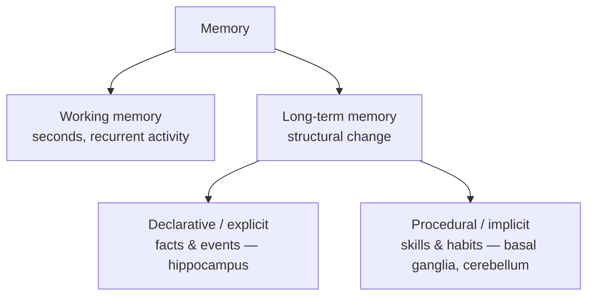

# Learning and Memory

**Learning** is the process by which experience changes the nervous system; **memory** is
the retention of that change over time. Neuroscience treats them as two sides of one
mechanism: experience alters [synapses](synapse-and-neurotransmission.md) — see
[synaptic plasticity](synaptic-plasticity.md) — and the pattern of altered connections *is*
the stored information. Rather than one uniform store, the brain has **multiple memory
systems** with different capacities, timescales, and anatomy.

## A taxonomy of memory

- **Working memory** — a small, fast, actively-maintained buffer (seconds, a handful of
  items), held by sustained recurrent firing in prefrontal and parietal
  [circuits](neural-circuits.md) rather than by structural change. It is the biological
  cousin of a context window.
- **Long-term memory** — large-capacity, durable storage laid down by structural synaptic
  change. It divides into:
  - **Declarative (explicit)** memory — facts (*semantic*) and events (*episodic*), which
    you can consciously recall and verbalize. Critically dependent on the **hippocampus**.
  - **Procedural (implicit)** memory — skills and habits ("how to ride a bike"), acquired
    gradually and expressed through action, depending on the
    [basal ganglia](brain-organization.md) and cerebellum, not the hippocampus.

## The hippocampus and consolidation

The **hippocampus** is the gateway to new declarative memory. The famous patient H.M., who
lost both hippocampi to surgery, could no longer form new explicit memories yet could still
learn new *skills* — decisive evidence that declarative and procedural systems are
separable. New memories are initially hippocampus-dependent, then over time **consolidated**
into distributed neocortical storage, in part through replay of activity patterns during
sleep. This division of labor — a fast-learning index that gradually trains slower,
capacious cortical storage — is a recurring engineering theme.

## Engrams and plasticity

The physical trace of a memory is an **engram**: a specific ensemble of neurons whose
synaptic weights were changed together during an experience, such that reactivating that
ensemble recalls the memory. The change is implemented by
[synaptic plasticity](synaptic-plasticity.md), especially long-term potentiation — the
Hebbian principle that *neurons that fire together wire together*. Recall is then pattern
completion: a partial cue reactivates the full ensemble, the same attractor dynamics that
appear in [neural circuits](neural-circuits.md).

## Why it matters (and the memory-engineering tie)

The brain's multi-store design maps almost eerily onto the challenges of building agent
memory. [Memory engineering](../harness-engineering/memory-engineering.md) for AI systems
recreates the same distinctions the brain evolved: a small fast working buffer (the
context window) versus large durable stores; explicit retrievable facts (a knowledge base
or vector store) versus learned procedural skill (weights adjusted by
[training](../ai/deep-learning.md)); and a consolidation step that promotes ephemeral
session state into long-term storage — the artificial analogue of hippocampal-to-cortical
transfer. Biology's answer to *what to keep, where, and for how long* is a well-tested
prior for harness design. Conversely, artificial [neural networks](../ai/neural-networks.md)
store all "memory" in weights and suffer *catastrophic forgetting*, a failure mode the
brain's separate systems largely avoid — a pointed contrast.

## References

- [Kandel, *Principles of Neural Science*](kandel-principles-of-neural-science.md) — memory
  systems, H.M., and the biology of learning (Kandel's own Nobel work).
- [Purves, *Neuroscience*](purves-neuroscience.md) — hippocampus and consolidation.
