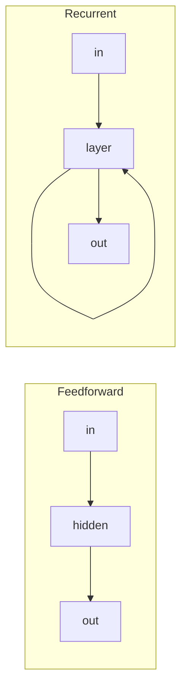

# Neural Circuits

A **neural circuit** is a set of interconnected [neurons](neuron.md) whose wiring performs
a computation — the level at which single-cell activity becomes collective behavior. Just
as a few logic gates arranged well make an adder, a handful of neuron types wired in a
recurring pattern make a detector, a memory, or a decision. Understanding circuits is
understanding how the brain *computes*, bridging single [action potentials](action-potential.md)
and whole-[system](brain-organization.md) function.

## Excitation and inhibition balance

Neurons come in two broad functional classes: **excitatory** (typically glutamatergic,
raising the postsynaptic membrane toward firing) and **inhibitory** (typically GABAergic,
pushing it away). Healthy circuits maintain a tight **E/I balance** — excitation is
constantly checked by inhibition. This balance sharpens tuning (lateral inhibition makes
neighbors compete, enhancing contrast, as in the retina's center-surround
[sensory](sensory-systems.md) fields), controls gain, and prevents runaway activity;
breaking it produces epilepsy on one side or silence on the other. Inhibition is not merely
subtraction — it shapes *when* and *how precisely* neurons fire.

## Feedforward vs. recurrent

**Feedforward** circuits pass signals in one direction, transforming input to output stage
by stage — the pattern behind hierarchical [feature detection](sensory-systems.md) and the
template for feedforward [neural networks](../ai/neural-networks.md). **Recurrent** circuits
feed activity back on themselves, so the current state depends on past states. Recurrence
gives circuits *memory over time* and the ability to sustain activity with no ongoing
input — the basis of [working memory](learning-and-memory.md). This is precisely the idea
that artificial [sequence models and RNNs](../ai/sequence-models-and-rnns.md) borrow: a
hidden state carried forward in time. Cortex is overwhelmingly recurrent, far more than most
artificial networks, which is a major architectural difference.

## Oscillations and canonical microcircuits

Populations of neurons tend to fire rhythmically, producing **oscillations** (theta, gamma,
and other bands) that coordinate timing across regions — a candidate mechanism for binding
distributed activity and routing information by phase. Cortex also appears to reuse a
**canonical microcircuit**: a stereotyped six-layer wiring motif of excitatory and
inhibitory cells, repeated across areas with different inputs. If true, it means much of
cortex runs the *same* basic algorithm on different data — a tantalizing parallel to using
one repeated architectural block (a transformer layer, a conv block) throughout a
[deep network](../ai/deep-learning.md).

## Attractor dynamics

Recurrent circuits can settle into stable activity patterns called **attractors**. A cue
that partially matches a stored pattern is pulled to the nearest attractor — implementing
**pattern completion** and content-addressable recall (the mechanism behind
[engrams](learning-and-memory.md)). *Point attractors* hold discrete memories or decisions;
*ring/continuous attractors* represent continuous variables like head direction or spatial
position. These dynamical-systems ideas are formalized in
[computational neuroscience](computational-neuroscience.md) and connect directly to
Hopfield networks and the recurrent state of modern
[sequence models](../ai/sequence-models-and-rnns.md).

## Why it matters

Circuits are where structure becomes function. The recurring motifs — E/I balance,
feedforward hierarchies, recurrence for memory, oscillatory coordination, attractor
stability — are the brain's reusable computational primitives, and each has a counterpart in
artificial architectures. Studying them tells us which design choices in AI are principled
echoes of biology and which are pragmatic departures (the brain's heavy recurrence and
inhibition being a notable, still-underexploited, source of ideas).

## References

- [Kandel, *Principles of Neural Science*](kandel-principles-of-neural-science.md) — circuit
  organization and cortical microcircuitry.
- [Dayan & Abbott, *Theoretical Neuroscience*](dayan-abbott-theoretical-neuroscience.md) —
  network dynamics and attractor models.
