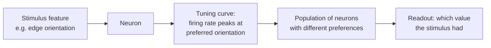

# Neural Coding

**Neural coding** is the study of how the nervous system *represents* information in the
activity of [neurons](neuron.md) — how a firing pattern stands for a color, a tone, a
location, or a decision. Since every [action potential](action-potential.md) is
all-or-none and essentially identical, the message cannot live in the shape of a spike; it
must live in *which* neurons fire, *how fast*, and *when*. Cracking the code — reading the
stimulus off the spikes — is a central goal of
[computational neuroscience](computational-neuroscience.md), and its concepts map directly
onto [representation learning and embeddings](../ai/representation-learning-and-embeddings.md)
in AI.

## Rate coding vs temporal coding

- **Rate coding.** Information is carried by the **firing rate** — spikes per second,
  averaged over a window. A stimulus that is twice as intense drives roughly twice the
  firing. Rate coding is robust and easy to read out, and it is the notion of "activity"
  that artificial [neural networks](../ai/neural-networks.md) inherit: a unit's continuous
  output stands in for a firing rate.
- **Temporal coding.** Information is carried by the **precise timing** of spikes — their
  latency, their exact pattern, or their **phase** relative to an ongoing brain rhythm. A
  purely rate-based readout would discard this. Temporal codes let a neuron transmit more
  per spike and support timing-sensitive learning rules like
  [STDP](synaptic-plasticity.md).

The two are not exclusive; real neurons often carry both a rate and a timing component.

## Population coding

Single neurons are noisy and ambiguous, so the brain almost always represents things across
a **population**. In **population coding**, a value is encoded by the *joint* activity of
many neurons, each contributing a piece. Averaging across the population cancels individual
noise and can pin a value down far more precisely than any one cell — a **population vector**
readout, for instance, recovers movement direction from motor cortex by summing each
neuron's preferred direction weighted by its firing. This distributed representation is the
biological cousin of a distributed **embedding vector**: meaning lives in the pattern across
many units, not in any single one.

## Receptive fields and tuning curves

Two tools describe *what a neuron cares about*:

- A **receptive field** is the region of sensory space (a patch of retina, a spot of skin,
  a band of sound frequency) in which a stimulus changes the neuron's firing — *where* /
  *what* the neuron listens to. See [sensory-systems](sensory-systems.md).
- A **tuning curve** plots the neuron's firing rate against a stimulus feature (orientation,
  frequency, direction). It usually peaks at a **preferred** value and falls off to either
  side, so the cell fires hardest for its favorite stimulus and less for others.

The canonical example is **Hubel and Wiesel's** discovery that neurons in primary visual
cortex are tuned to the **orientation of edges** — a given cell fires maximally for a bar at,
say, 45°. These oriented-edge detectors are famously mirrored by the filters that emerge in
the first layers of a [convolutional neural network](../ai/convolutional-neural-networks.md),
one of the most striking convergences between the brain and
[deep learning](../ai/deep-learning.md).

## Sparse coding

In **sparse coding**, any given stimulus is represented by only a *small* subset of the
available neurons firing at once, while most stay silent. This is metabolically efficient
(spikes are expensive), increases the number of distinguishable patterns, and tends to
produce representations in which each active unit stands for a meaningful, relatively
independent feature. Sparse-coding models of the visual cortex famously *derive*
Hubel–Wiesel-like edge detectors from natural images alone — a result that fed directly into
[representation learning](../ai/representation-learning-and-embeddings.md), where sparsity is
a common objective for learning useful features.

## Why it matters — and the AI tie

Neural coding is the "data format" of the brain: everything perception and cognition do
(see [sensory-systems](sensory-systems.md), [predictive-coding-and-cognition](predictive-coding-and-cognition.md))
rests on how information is encoded and read out. The parallels to AI are concrete and
load-bearing: firing rate ↔ unit activation, population code ↔ distributed embedding,
tuning curve ↔ learned feature detector, sparsity ↔ a regularization objective. Studying how
biological codes are structured continues to inform how we build and interpret artificial
representations — and how we might interpret theirs.

## References

- [Dayan & Abbott, *Theoretical Neuroscience*](dayan-abbott-theoretical-neuroscience.md)
- [Purves, *Neuroscience*](purves-neuroscience.md)
- [Kandel, *Principles of Neural Science*](kandel-principles-of-neural-science.md)
- [Gerstner, *Neuronal Dynamics*](gerstner-neuronal-dynamics.md)
