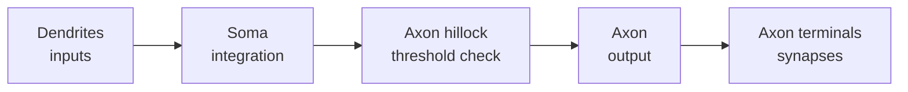

# The Neuron

The **neuron** is the fundamental signaling cell of the nervous system: a specialized
cell that receives, integrates, and transmits electrical and chemical signals. The human
brain contains on the order of 86 billion of them, wired into [neural circuits](neural-circuits.md)
whose collective activity produces perception, movement, memory, and thought. A neuron is
the brain's basic **computational unit**, and it is the loose biological inspiration for
the artificial "unit" or "node" in an [artificial neural network](../ai/neural-networks.md).

## Anatomy: the three functional compartments

A prototypical neuron is polarized into three parts, each with a distinct job:

- **Dendrites** — branching, tree-like processes that form the neuron's *input* surface.
  Most of the synaptic contacts a neuron receives land here (see
  [synapse-and-neurotransmission](synapse-and-neurotransmission.md)). Dendrites collect
  thousands of incoming signals.
- **Soma (cell body)** — houses the nucleus and metabolic machinery. It sums the incoming
  signals; if the net input at the axon's origin (the axon hillock) crosses threshold, the
  cell fires.
- **Axon** — a single, often long, output fiber that carries the neuron's signal — the
  [action potential](action-potential.md) — away from the soma to its targets, where the
  axon terminals form synapses onto other cells.

This input → integrate → output flow is exactly the abstraction an artificial neuron
copies: weighted inputs are summed and passed through a nonlinearity that decides the
output. The biological version is vastly richer (dendrites do local nonlinear computation,
timing matters, signaling is both electrical and chemical), but the skeleton is the same.

## The resting membrane potential

A neuron at rest is not electrically neutral. Its membrane maintains a voltage difference,
the **resting membrane potential**, typically around **−70 mV** (inside negative relative
to outside). This voltage is the stored energy the neuron spends when it signals.

Two ingredients create it:

1. **Ion concentration gradients.** The **Na⁺/K⁺-ATPase pump** uses ATP to push 3 sodium
   ions (Na⁺) out and pull 2 potassium ions (K⁺) in per cycle. The result: high Na⁺ and
   Cl⁻ outside, high K⁺ and negatively-charged proteins inside.
2. **Selective permeability.** The membrane is studded with **ion channels**. At rest it
   is far more permeable to K⁺ than to Na⁺, so K⁺ leaks outward down its gradient, leaving
   the inside negative. The potential settles near the point where the electrical pull
   inward balances the concentration push outward (the Nernst/Goldman equilibrium).

The membrane behaves electrically like a capacitor (the lipid bilayer) in parallel with
resistors (the channels), so its voltage responds to current over time as an RC circuit —
the starting point for the biophysical models in
[computational-neuroscience](computational-neuroscience.md) and the classic Hodgkin–Huxley
equations, which are coupled [differential equations](../math/differential-equations.md).

## Canonical example: the motor neuron

A spinal **motor neuron** is a textbook case. Its dendrites and soma receive excitatory and
inhibitory synapses from thousands of upstream neurons; it integrates them; and when
threshold is reached it fires an action potential down a long axon to a muscle fiber,
triggering contraction. One cell thus links the abstract decision "move" to a physical act.

## Why it matters

The neuron is where biology and computation meet. Everything downstream in this folder —
[action-potential](action-potential.md), [synapse-and-neurotransmission](synapse-and-neurotransmission.md),
[synaptic-plasticity](synaptic-plasticity.md), [neural-coding](neural-coding.md) — is a
detail of how neurons signal and change. And the neuron's input–integrate–output logic is
the historical seed of connectionism: [deep learning](../ai/deep-learning.md) networks are
built from millions of drastically simplified "neurons," a resemblance that is real at the
level of the metaphor but should not be mistaken for biological fidelity. See
[../philosophy/index.md](../philosophy/index.md) for the deeper questions this raises about
minds and machines.

## References

- [Kandel, *Principles of Neural Science*](kandel-principles-of-neural-science.md)
- [Purves, *Neuroscience*](purves-neuroscience.md)
- [Dayan & Abbott, *Theoretical Neuroscience*](dayan-abbott-theoretical-neuroscience.md)
