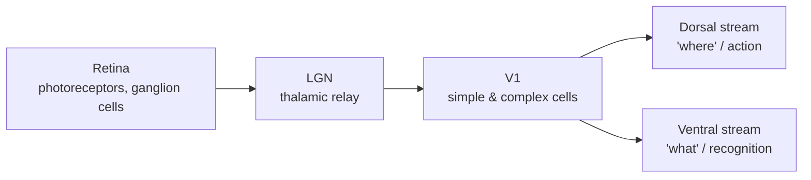

# Sensory Systems

**Sensory systems** are the pathways that transduce physical energy — light, sound
pressure, chemical concentration, mechanical force — into the electrical language of
[neurons](neuron.md) and then progressively transform it into perception. The governing
principle is that **perception is computation**: raw receptor signals are refined stage by
stage into increasingly abstract, useful representations. The visual system is the best
understood, and its layered feature-detecting design directly inspired one of AI's most
important architectures.

## The visual pathway

- **Retina.** Photoreceptors (rods and cones) transduce light. Downstream retinal cells
  already begin computing — *center-surround* receptive fields make ganglion cells respond
  to local contrast rather than absolute brightness, an early form of edge detection.
- **LGN (lateral geniculate nucleus).** A relay in the [thalamus](brain-organization.md)
  that gates and routes retinal signals to cortex, and receives heavy cortical feedback —
  an entry point for attention and [top-down prediction](predictive-coding-and-cognition.md).
- **V1 (primary visual cortex).** Hubel and Wiesel's Nobel-winning work showed **simple
  cells** respond to edges of a specific orientation at a specific location, while
  **complex cells** respond to that orientation over a range of positions — i.e. some
  position invariance. This is exactly *feature detection followed by pooling for
  invariance.*
- **Ventral and dorsal streams.** Beyond V1, processing splits into a **ventral "what"
  stream** (V1→V2→V4→inferotemporal cortex) building up from edges to textures to object
  parts to whole objects and faces, and a **dorsal "where/how" stream** for spatial
  location and guiding action.

## Hierarchical feature detection → CNNs

The ventral stream is a **hierarchy of feature detectors**: each stage combines simpler
features from the stage below into more complex, more invariant ones. This is the direct
biological ancestor of the
[convolutional neural network](../ai/convolutional-neural-networks.md). The CNN's
alternation of local feature detection (convolution, echoing simple cells) with pooling
(echoing complex-cell position invariance), stacked into a deep hierarchy, is a
computational restatement of the visual cortex. The lineage runs from Hubel & Wiesel to
Fukushima's Neocognitron to modern [deep learning](../ai/deep-learning.md) vision models —
and, satisfyingly, trained CNNs turn out to predict neural responses in the ventral stream
better than any hand-built model, making the analogy two-directional. Both build useful
[representations](../ai/representation-learning-and-embeddings.md) by composing simple
features into abstract ones.

## Audition, briefly

The **auditory system** transduces sound at the cochlea, whose basilar membrane performs a
mechanical frequency analysis — different positions resonate to different pitches, yielding
a **tonotopic** map preserved up through auditory cortex (the pitch analogue of
retinotopy). As in vision, higher stages build toward complex, behaviorally relevant
features (spectrotemporal patterns, and ultimately speech and music). The same
detect-then-abstract motif recurs, and 1-D convolutional models applied to audio
spectrograms borrow the same idea.

## Why it matters

Sensory systems are the clearest case where neuroscience and AI share a design: the visual
cortex is not a loose metaphor for CNNs but their literal inspiration, and the resemblance
holds up quantitatively. Studying them shows how robust perception can be built from
layered [circuits](neural-circuits.md) of simple detectors — and where biological vision
still outstrips machines (efficiency, generalization from little data, active sensing under
top-down [prediction](predictive-coding-and-cognition.md)).

## References

- [Purves, *Neuroscience*](purves-neuroscience.md) — sensory systems and the visual
  pathway.
- [Kandel, *Principles of Neural Science*](kandel-principles-of-neural-science.md) — Hubel
  & Wiesel and cortical visual processing.
