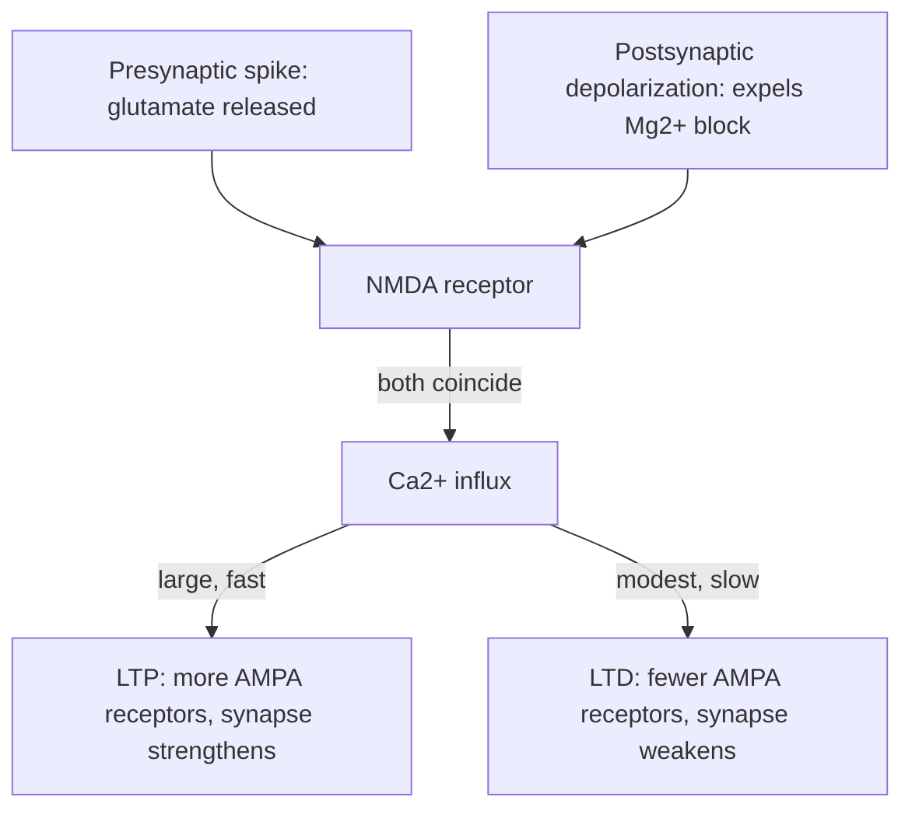

# Synaptic Plasticity

**Synaptic plasticity** is the capacity of a [synapse](synapse-and-neurotransmission.md) to
change its strength — how much a presynaptic spike influences the postsynaptic cell — as a
function of activity. It is the leading biological account of how brains learn and store
memory: experience reshapes the connection weights of a [neural circuit](neural-circuits.md),
and those altered weights *are* the trace of what was learned. This is the neuroscience
that most directly rhymes with machine learning, where learning likewise *is* the adjustment
of connection weights (see [neural networks](../ai/neural-networks.md) and
[backpropagation and gradient descent](../ai/backpropagation-and-gradient-descent.md)).

## Hebb's rule: "cells that fire together wire together"

In 1949 Donald Hebb proposed a principle now stated as: *if neuron A repeatedly takes part
in firing neuron B, the connection from A to B is strengthened.* The slogan is **"cells
that fire together wire together."** The essential feature is that the rule is **local** and
**correlational** — it depends only on the joint activity of the two cells it connects, with
no global error signal. This locality is both Hebbian plasticity's biological plausibility
and the key way it differs from [gradient descent](../ai/backpropagation-and-gradient-descent.md),
which propagates a global error backward through the network.

## LTP and LTD: the physiological machinery

Hebb's abstract rule is realized concretely as long-lasting changes in synaptic strength:

- **Long-Term Potentiation (LTP)** — a persistent *strengthening* of a synapse after
  correlated, high-frequency activity.
- **Long-Term Depression (LTD)** — a persistent *weakening* after weakly correlated or
  low-frequency activity.

At many excitatory (glutamatergic) synapses the switch is the **NMDA receptor**, which acts
as a molecular **coincidence detector**. It opens only when *both* conditions hold at once:
glutamate is bound (the presynaptic cell fired) *and* the postsynaptic membrane is already
depolarized (the postsynaptic cell is active), because depolarization is needed to expel a
Mg²⁺ ion blocking the channel. When both coincide, Ca²⁺ enters through the NMDA receptor and
sets off cascades that insert more AMPA receptors and enlarge the synapse — implementing
"fire together, wire together" at the molecular level. This gives plasticity both directions
and a built-in bias against runaway strengthening (paired with homeostatic mechanisms that
keep total activity stable).

## Spike-timing-dependent plasticity (STDP)

Refining Hebb, **spike-timing-dependent plasticity** makes the change depend on the *precise
order and timing* of pre- and postsynaptic spikes, within a window of tens of milliseconds:

- Presynaptic spike arrives **just before** the postsynaptic spike (the input helped cause
  the output) → **strengthen** (LTP).
- Presynaptic spike arrives **just after** → **weaken** (LTD).

STDP turns Hebb's vague "together" into a **causal, temporal** rule — the synapse is
reinforced when it plausibly *contributed* to firing. It is a widely studied learning rule
in [computational neuroscience](computational-neuroscience.md) and inspires
learning rules in spiking [deep learning](../ai/deep-learning.md) models.

## Canonical example: the hippocampus

The **hippocampus** is the classic site: LTP was first characterized there, and it is the
structure most implicated in forming new declarative memories (see
[learning-and-memory](learning-and-memory.md)). Blocking NMDA receptors impairs both
hippocampal LTP and the ability to learn spatial tasks — a direct experimental link between
a synaptic mechanism and behavioral learning.

## Why it matters — and the AI tie

Synaptic plasticity is the bridge between molecules and mind: it explains how a fixed set of
cells can encode an unbounded variety of experiences by re-weighting their connections. That
is exactly the premise of connectionist AI. An artificial [neural network](../ai/neural-networks.md)
learns by nudging its weights to reduce error via
[backpropagation and gradient descent](../ai/backpropagation-and-gradient-descent.md); a
brain learns by nudging its synaptic strengths via local Hebbian/STDP rules. The convergence
is conceptually deep — *learning is weight change* — but the mechanisms diverge: biology's
rule is local and unsupervised-ish, while backprop requires a differentiable, global error
signal that has no clean biological counterpart. Bridging that gap (biologically plausible
credit assignment) is an active research frontier, and reward-modulated plasticity connects
to [reinforcement learning](../ai/reinforcement-learning.md) via dopamine as a teaching
signal.

## References

- [Kandel, *Principles of Neural Science*](kandel-principles-of-neural-science.md)
- [Purves, *Neuroscience*](purves-neuroscience.md)
- [Dayan & Abbott, *Theoretical Neuroscience*](dayan-abbott-theoretical-neuroscience.md)
- [Gerstner, *Neuronal Dynamics*](gerstner-neuronal-dynamics.md)
