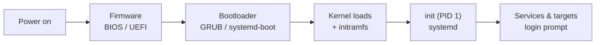

# Boot and Init

**Booting** is the sequence that takes a machine from a cold, powered-off state to a
running operating system with services and a login prompt. The word comes from
"bootstrapping" — pulling yourself up by your own bootstraps — because the problem is
circular: to run the OS you need the OS loaded, but loading it is itself a program that
must run. The system breaks the circle in stages, each one just capable enough to find
and hand off to the next. This is the moment the
[hardware/software boundary](../electrical-engineering/hardware-software-boundary.md) is
crossed for real.

## The boot chain

Each stage has exactly one job: find, load, and jump to the next.

## Stage 1: firmware (BIOS / UEFI)

When power arrives, the CPU begins executing at a fixed address wired into hardware,
which points at **firmware** stored in ROM/flash on the motherboard. Firmware's job is
the **POST** (power-on self-test — check RAM, CPU, basic devices) and then to locate a
bootable device and hand off.

- **BIOS** (the legacy standard) knows almost nothing about file systems. It reads the
  first 512-byte sector of a disk — the **Master Boot Record (MBR)** — into memory and
  jumps to it. That tiny space (446 bytes of code) is barely enough to load a bigger
  bootloader in a second stage.
- **UEFI** (the modern replacement) is far more capable: it understands the FAT-based
  **EFI System Partition (ESP)**, so bootloaders are ordinary `.efi` files it can load
  directly — no cramped MBR dance. UEFI also introduces **Secure Boot**, which
  cryptographically verifies each stage's signature before running it, extending the
  chain of trust from firmware upward (a foundation for
  [OS security and protection](os-security-and-protection.md)).

## Stage 2: the bootloader

The **bootloader** (GRUB, systemd-boot) exists to find and load the kernel. It reads a
configuration, optionally presents a menu (choose a kernel version, boot parameters, or
a different OS), and then loads two things into memory:

1. the **kernel** image, and
2. an **initramfs / initrd** — a small in-memory root file system.

The initramfs solves another chicken-and-egg problem: the kernel needs a driver to read
the real root disk, but that driver might live *on* the root disk (or the disk might be
encrypted, on RAID, or on LVM). The initramfs is a minimal userland packed with just
enough drivers and tools to mount the true root file system, after which it pivots to it.

## Stage 3: the kernel takes over

The bootloader jumps into the kernel, and control passes to the software described in
[the-kernel-and-system-calls.md](the-kernel-and-system-calls.md). The kernel
decompresses itself, initializes the CPU into protected/kernel mode, sets up
[virtual memory](memory-management-and-virtual-memory.md), probes and initializes
hardware via its [device drivers](io-and-device-management.md), mounts the root file
system, and then does the one thing it cannot do without userspace: it starts the first
user process.

## Stage 4: init (PID 1)

The kernel launches a single user-mode process and gives it **process ID 1** — the
**init** process, the ancestor of every other process on the system (via `fork`, see
[processes-and-threads.md](processes-and-threads.md)). PID 1 is special: it can never
die (that would panic the kernel) and it inherits orphaned processes. From here on the
system is driven from userspace.

Historically init was **SysV init**, which ran shell scripts in a fixed order and
organized the system into **runlevels** (numbered states: 0 = halt, 1 = single-user,
3 = multi-user text, 5 = graphical, 6 = reboot). Booting to a runlevel meant running its
directory of start scripts one after another — simple but slow and strictly sequential.

Modern Linux uses **systemd**, which replaces runlevels with **targets** (named states
like `multi-user.target`, `graphical.target`) and, crucially, models services as **units**
with explicit **dependencies**. Because it knows what depends on what, systemd starts
independent services **in parallel** and only waits where a real dependency exists —
dramatically faster boots. It also supports **socket activation** (start a service lazily
the first time something connects) and supervises services after startup, restarting
them if they crash. The Linux specifics live in
[../linux/init-and-services.md](../linux/init-and-services.md).

| | SysV init | systemd |
|---|---|---|
| States | numbered runlevels | named targets |
| Startup | sequential shell scripts | parallel, dependency-ordered |
| Service model | fire-and-forget scripts | supervised units, auto-restart |
| Activation | at boot only | on-demand (socket/timer) |

## Where the OS hands control to userspace

The handoff point is precise: it is `fork`/`exec` of PID 1. Before it, everything is
firmware and kernel; after it, the system is a tree of user processes managed through
system calls. Init brings up the services — networking, logging, the display manager —
and finally the **getty** / login manager that presents a prompt. At that point the
boot is complete and the machine is a running system.

## Why it matters

Boot is where all the other OS abstractions get bootstrapped into existence — you can't
have processes until init runs, can't have init until the kernel loads, can't load the
kernel until firmware finds it. Understanding the chain is what lets you diagnose the
worst failures (a machine that won't boot gives no login to debug from), reason about
**Secure Boot** and the chain of trust, and understand why services come up in the order
they do. It is also the clearest illustration of the layered handoff that defines an
operating system: each stage builds exactly enough capability to summon the next.

## References

- [Operating Systems](../computer-science/operating-systems.md) — field survey.
- [silberschatz-operating-system-concepts.md](silberschatz-operating-system-concepts.md) — canonical text.
- [tanenbaum-modern-operating-systems.md](tanenbaum-modern-operating-systems.md) — canonical text.
