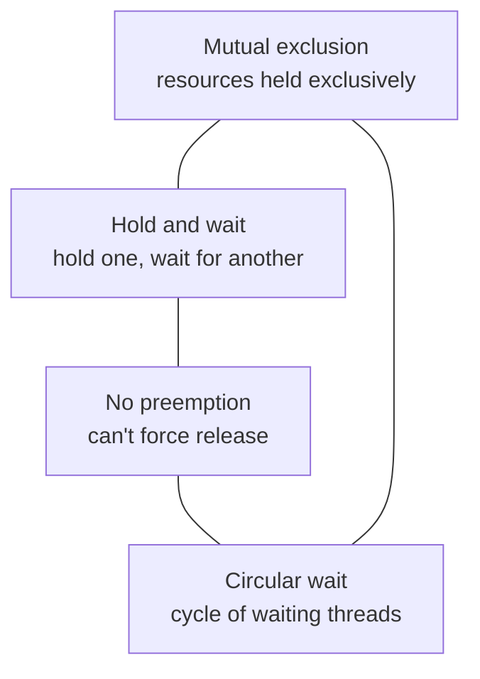

# Concurrency and Synchronization

Once an OS runs many [threads and processes](processes-and-threads.md) that share data,
correctness stops being about *what* each thread does and starts being about *how their
steps interleave*. Concurrency is widely considered the hardest part of operating systems —
and of programming generally — because bugs are non-deterministic: the same code passes a
thousand times and fails the thousand-and-first, on a schedule set by the
[scheduler](cpu-scheduling.md) you don't control. This is the OS-side deep dive; the broader
model of parallel computation lives in
[../computer-science/concurrency-and-parallelism.md](../computer-science/concurrency-and-parallelism.md).

## Race conditions and the root cause

A **race condition** is when the result of a computation depends on the *timing* of
otherwise-independent threads. The classic example is two threads each running `counter =
counter + 1`. That single line is really three machine steps — **read**, **add**, **write**
— and they can interleave:

```
Thread A: read counter (5)
Thread B: read counter (5)
Thread A: add 1 → 6, write 6
Thread B: add 1 → 6, write 6      ← one increment lost
```

The root cause is that the read-modify-write is **not atomic**: another thread can slip in
between the steps. The region of code that touches shared state and must not interleave is
called a **critical section**. The job of synchronization is to enforce **mutual exclusion**
— at most one thread in the critical section at a time — plus **progress** (a waiting thread
eventually enters) and **bounded waiting** (no starvation).

## Synchronization primitives

### Locks / mutexes

A **mutex** (mutual-exclusion lock) is the simplest tool: a thread `acquire()`s it before
the critical section and `release()`s it after; a second thread blocks on `acquire` until
it's free. The lock itself must be built atomically, which requires hardware support —
**atomic instructions** like test-and-set or compare-and-swap (see
[../electrical-engineering/hardware-software-boundary.md](../electrical-engineering/hardware-software-boundary.md)).
A **spinlock** busy-waits (good only for very short critical sections on multicore); a
blocking mutex parks the thread and lets the [scheduler](cpu-scheduling.md) run others (good
when the wait may be long).

### Semaphores

A **semaphore** is an integer with two atomic operations: `wait`/`P` (decrement; block if it
would go negative) and `signal`/`V` (increment; wake a waiter). A **binary** semaphore acts
like a mutex; a **counting** semaphore tracks N interchangeable resources (e.g. N free
buffer slots). Semaphores are powerful but error-prone — a forgotten `signal` deadlocks, an
extra one corrupts the invariant, and the code that acquires need not be the code that
releases.

### Monitors and condition variables

A **monitor** raises the abstraction level: it bundles shared data with the procedures that
access it and guarantees that only one thread is active inside at a time — mutual exclusion
by construction. **Condition variables** let a thread inside a monitor `wait` (release the
lock and sleep until signaled) and `signal` (wake a waiter) so threads can coordinate on
*conditions*, not just exclusion. This is the model behind Java's `synchronized` and
`pthread` condition variables. The tradeoff across the primitives is the usual one:
higher-level constructs (monitors) are safer and harder to misuse, lower-level ones
(semaphores, raw atomics) are more flexible and faster but leave correctness entirely to the
programmer.

## The canonical problems

These recurring patterns are how the field stress-tests synchronization ideas:

- **Producer–consumer (bounded buffer).** Producers add items to a fixed-size buffer,
  consumers remove them. Needs a mutex for the buffer plus counting semaphores for "empty
  slots" and "full slots" so producers block when full and consumers block when empty. This
  is exactly how pipes ([../linux/the-shell-and-pipes.md](../linux/the-shell-and-pipes.md))
  and I/O queues ([io-and-device-management.md](io-and-device-management.md)) work.
- **Readers–writers.** Many readers may share the data concurrently, but a writer needs
  exclusive access. The subtlety is *policy*: reader-preference can starve writers,
  writer-preference can starve readers — the primitive doesn't decide fairness, you do.
- **Dining philosophers.** Five philosophers, five forks, each needs two adjacent forks to
  eat. The textbook illustration of deadlock and how resource-ordering avoids it.

## Deadlock

A **deadlock** is a set of threads each blocked waiting for a resource another holds — no one
can ever proceed. Coffman's **four necessary conditions** must *all* hold:



Because all four are required, breaking *any one* prevents deadlock — the basis of every
strategy:

- **Prevention** — negate a condition structurally. The common one: impose a global
  **lock-ordering** and always acquire in that order, killing *circular wait* (this is how
  dining philosophers is solved).
- **Avoidance** — grant a request only if the system stays in a "safe" state (e.g. Banker's
  algorithm). Requires knowing max resource needs in advance; rarely practical.
- **Detection and recovery** — let deadlocks happen, detect cycles in the resource-allocation
  graph, then recover by killing or rolling back a thread. Used where deadlocks are rare.
- **The ostrich algorithm** — ignore it and reboot when it happens. Chosen more often than
  anyone admits, because detection/avoidance can cost more than the rare deadlock.

A related hazard, **priority inversion**, ties this back to
[scheduling](cpu-scheduling.md): a high-priority thread blocks on a lock held by a
low-priority thread that a medium-priority thread keeps preempting — the fix (priority
inheritance) famously saved the Mars Pathfinder mission.

## Why it matters

Every shared resource the OS manages — the run queue, the buffer cache, the open-file table,
device queues — is touched concurrently and must be synchronized. Get it wrong and you get
data corruption that's invisible in testing and catastrophic in production, or a deadlock
that freezes the machine. Concurrency correctness can't be tested in, only *designed* in,
which is why the primitives and problems above are foundational rather than academic. They
recur in [file systems](file-systems.md), [I/O](io-and-device-management.md), and the
[kernel](the-kernel-and-system-calls.md) itself.

## References

- [tanenbaum-modern-operating-systems.md](tanenbaum-modern-operating-systems.md) — interprocess communication, synchronization, and deadlock.
- [silberschatz-operating-system-concepts.md](silberschatz-operating-system-concepts.md) — synchronization tools and the classic problems (the "dinosaur book").
- [ostep-operating-systems.md](../computer-science/ostep-operating-systems.md) — the "Concurrency" part builds locks, semaphores, and condition variables from scratch.
- [love-linux-kernel-development.md](love-linux-kernel-development.md) — kernel synchronization: spinlocks, mutexes, and RCU in practice.
