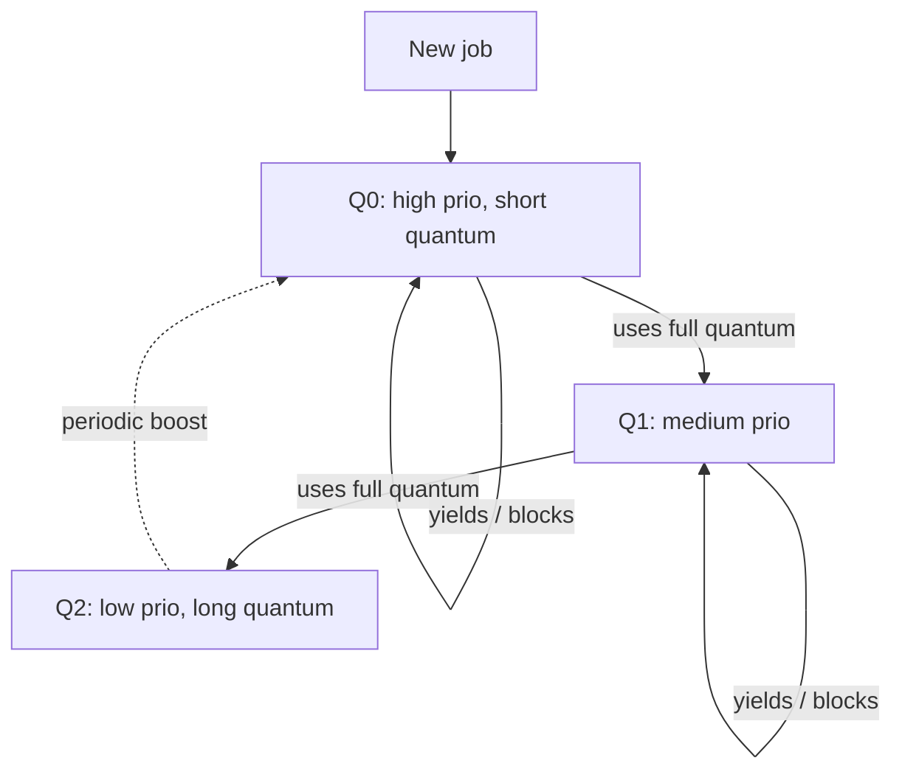

# CPU Scheduling

When more runnable [processes and threads](processes-and-threads.md) exist than CPU cores,
something must decide *who runs next and for how long*. That something is the **scheduler**,
and its policy shapes whether a system feels snappy, whether batch jobs finish quickly, and
whether any task ever gets starved. This is the deep dive under the survey in
[../computer-science/operating-systems.md](../computer-science/operating-systems.md).

## The scheduling problem

The scheduler is invoked whenever the set of runnable work changes — a process blocks,
unblocks, is created, exits, or a timer fires. From the ready queue it picks one entity to
run and hands it the CPU via a [context switch](processes-and-threads.md). Two design axes
frame everything:

- **Preemptive vs. cooperative.** Under **cooperative** scheduling a process keeps the CPU
  until it voluntarily yields or blocks — simple, but one misbehaving process hangs the
  machine. Under **preemptive** scheduling a periodic **timer interrupt** lets the kernel
  forcibly take the CPU back, guaranteeing responsiveness. This depends on the
  [hardware-software boundary](../electrical-engineering/hardware-software-boundary.md): the
  timer interrupt is the hardware hook that makes preemption possible. Modern general-purpose
  OSes are preemptive.
- **The metrics you optimize** — and they conflict:

| Metric        | Meaning                                        | Favors                     |
|---------------|------------------------------------------------|----------------------------|
| Throughput    | Jobs completed per unit time                   | Long uninterrupted runs    |
| Turnaround    | Submission → completion                        | Getting short jobs out fast|
| Response time | Request → first reaction                       | Frequent preemption        |
| Fairness      | Every task gets a proportional share           | Equal time slices          |
| Latency (RT)  | Meeting deadlines                              | Priority + predictability  |

You cannot maximize all at once. Frequent preemption improves response time (good for
interactive use) but adds [context-switch](processes-and-threads.md) overhead that hurts
throughput. This tension is the core of scheduler design.

## Classic algorithms and their tradeoffs

**First-Come, First-Served (FCFS).** A simple FIFO. Fair in ordering, but suffers the
**convoy effect**: one long job at the head makes every short job behind it wait, wrecking
average turnaround and response time.

**Shortest Job First (SJF) / Shortest Remaining Time First (SRTF).** Run the job with the
smallest (remaining) burst. Provably optimal for average turnaround time — but requires
*knowing* burst lengths (impossible in general, so they're estimated) and can **starve**
long jobs indefinitely. SRTF is the preemptive variant.

**Round-Robin (RR).** Each ready job gets a fixed **time quantum**, then is preempted and
sent to the back of the queue. Excellent, bounded response time and no starvation — the
workhorse of interactive fairness. The quantum is the key knob: too large and RR degrades
toward FCFS; too small and context-switch overhead dominates.

**Priority scheduling.** Each job has a priority; the highest runs. Flexible, but low
priorities can **starve**. The standard fix is **aging** — gradually raising the priority
of jobs that have waited too long.

## Multi-Level Feedback Queue (MLFQ)

MLFQ is the practical synthesis: several priority queues, each with its own quantum. New
jobs enter at the top. Rules:

1. Run the highest-priority non-empty queue (RR within a queue).
2. A job that uses its whole quantum (CPU-bound) is **demoted** to a lower queue.
3. A job that yields early / blocks for I/O (interactive) stays high.
4. Periodically **boost** everything back to the top to prevent starvation and adapt to
   changing behavior.

The elegance: MLFQ *learns* a job's nature without being told. Interactive jobs float to
the top and get fast response; CPU-bound jobs sink but still get served. It approximates SJF
using observed behavior as the predictor of future behavior.

## The Completely Fair Scheduler (CFS)

Linux's long-standing default (see [../linux/the-linux-kernel.md](../linux/the-linux-kernel.md))
takes a different route: instead of discrete queues it targets **proportional fairness**
directly. Each task accrues **virtual runtime (vruntime)** — the CPU time it has consumed,
weighted by its "nice" priority (lower-priority tasks accumulate vruntime faster). CFS
always runs the task with the *smallest* vruntime, stored in a red-black tree for
O(log n) selection (see [../computer-science/data-structures.md](../computer-science/data-structures.md)).

Conceptually CFS models an ideal machine that runs all N tasks simultaneously at 1/N speed,
then approximates it: whoever has fallen furthest behind their fair share runs next. There
is no fixed quantum — the granularity is derived from a target latency divided among
runnable tasks. This gives smooth fairness and good interactivity without MLFQ's tuning
knobs. (Newer kernels use EEVDF, a related deadline-aware refinement of the same fair-share
idea.)

## Multiprocessor and real-time wrinkles

- **Multicore** scheduling adds **load balancing** across cores and **CPU affinity** —
  keeping a task on the core whose caches are already warm, because migrating a task pays the
  same cold-cache penalty as a context switch.
- **Real-time** scheduling optimizes for *deadlines*, not fairness or throughput: policies
  like Rate-Monotonic or Earliest-Deadline-First guarantee timing for control systems and
  media, trading average performance for predictability.

## Why it matters

Scheduling is where the OS's promise of concurrency meets physics: one CPU, many demands.
The policy is invisible when it works and infuriating when it doesn't (a frozen cursor, a
job that never finishes). It interacts directly with
[synchronization](concurrency-and-synchronization.md) — a poorly scheduled thread holding a
lock can stall everyone (priority inversion) — and with the
[process state machine](processes-and-threads.md) that defines who is even eligible to run.

## References

- [ostep-operating-systems.md](../computer-science/ostep-operating-systems.md) — the scheduling chapters develop FCFS → SJF → RR → MLFQ pedagogically.
- [silberschatz-operating-system-concepts.md](silberschatz-operating-system-concepts.md) — CPU scheduling and real-time scheduling.
- [tanenbaum-modern-operating-systems.md](tanenbaum-modern-operating-systems.md) — scheduling in batch, interactive, and real-time systems.
- [love-linux-kernel-development.md](love-linux-kernel-development.md) — CFS internals and the Linux run queue.
