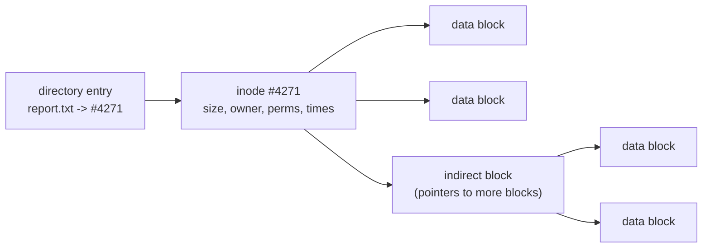

# File Systems

A **file system** is the operating system's abstraction over persistent storage. Raw
storage — a disk, an SSD, a flash chip — is nothing but a large array of fixed-size
**blocks** (typically 512 or 4096 bytes) addressed by number. That is a terrible
interface for humans and programs: it has no names, no hierarchy, no notion of "this
run of bytes belongs together." The file system turns that flat block array into
**files** (named, growable byte sequences) organized in a **directory** tree. It is
the persistence leg of the classic OS triad — CPU, memory, persistence — anchored in
[silberschatz-operating-system-concepts.md](silberschatz-operating-system-concepts.md).

## Files and directories

A **file** is just a named sequence of bytes plus **metadata**: size, owner,
permissions, timestamps, and the block locations that hold its data. Unix deliberately
gives files no internal structure — the "line," the "record," the "image" all live in
userspace convention, not the file system. This minimalism is the root of the Unix
idea that [everything is a file](../linux/everything-is-a-file.md): devices, pipes,
and sockets present the same open/read/write/close interface as ordinary files.

A **directory** is itself a special file whose contents map names to file
identifiers. The hierarchy is a tree (with escapes: hard links let one file appear
under several names; symbolic links are files whose contents are another path). Linux
imposes a conventional layout on that tree, the
[filesystem hierarchy standard](../linux/the-filesystem-and-fhs.md).

## Inodes: separating name from data

The central data structure in Unix-style file systems is the **inode** (index node).
An inode holds all of a file's metadata *and* the pointers to its data blocks — but
**not** its name. Names live only in directory entries, which point at inodes by
number. This separation is what makes hard links possible: two directory entries can
reference the same inode, and the file survives until the last name is removed (the
inode tracks a link count).

A single inode cannot list every block of a huge file inline, so it uses a **multi-level
index**: a handful of direct block pointers for small files, then single-, double-, and
triple-**indirect** pointers — blocks that themselves hold block pointers. Small files
resolve in one hop; large files pay for extra indirection only when they need it.

## Allocation strategies

How does a file system decide *which* blocks hold a file's data? The choice trades off
sequential-read speed, fragmentation, and the cost of growing a file:

| Strategy | Idea | Strength | Weakness |
|---|---|---|---|
| Contiguous | one unbroken run of blocks | fastest sequential read | external fragmentation; hard to grow |
| Linked | each block points to the next | grows freely, no fragmentation | random access is O(n); pointers waste space |
| FAT (linked, table) | next-pointers pulled into one table | random access via cached table | table scales with disk size |
| Indexed (inode) | per-file index of block pointers | fast random access; grows well | index overhead for tiny files |
| Extents | (start, length) runs instead of per-block | compact for large contiguous files | needs defragmentation-aware allocation |

Modern file systems favor **extents** — recording a contiguous run as a single
(start, length) pair rather than thousands of individual pointers — which keeps
metadata small and encourages large sequential layouts. Free space is tracked with
**bitmaps** or **free lists** so the allocator can find blocks quickly.

## The VFS layer

A running system usually has several file systems mounted at once — ext4 on the root
disk, a FAT USB stick, a network share, and pseudo file systems like `/proc`. The
**Virtual File System (VFS)** is a kernel abstraction layer that gives them all one
interface. VFS defines generic objects — superblock, inode, dentry (directory entry),
file — and each concrete file system implements a table of operations against them.
System calls like `open`, `read`, and `stat` (see
[the-kernel-and-system-calls.md](the-kernel-and-system-calls.md)) hit VFS first, which
dispatches to the right driver. This is why `cat` works identically on every mounted
file system, and it is the mechanism behind Unix's uniform file interface.

## Journaling and consistency

A file operation like "create a file" touches several on-disk structures — a
directory entry, an inode, a free-space bitmap. If power fails between those writes,
the file system is left **inconsistent** (an inode with no name, a block marked both
free and used). The old recovery tool, `fsck`, scans the entire disk to find and
repair such damage — unbearably slow on large volumes.

**Journaling** fixes this by borrowing the database idea of write-ahead logging. Before
touching the main structures, the file system writes its intended changes to a
**journal** (log) and commits that record. If a crash interrupts the real update,
recovery just **replays** the journal — a bounded, fast operation. Most journals log
only **metadata** by default (ext4's `data=ordered` mode), which protects structure
without doubling every data write. This is a concrete instance of the broader problem
of surviving partial failure, treated generally in
[../distributed-systems/fault-tolerance-and-failure.md](../distributed-systems/fault-tolerance-and-failure.md).

## Caching and buffering

Disk access is orders of magnitude slower than memory, so the kernel keeps a **page
cache** (buffer cache) of recently used file blocks in RAM. Reads are served from
cache when possible; writes are usually **buffered** and flushed lazily — which is why
data can be "written" yet lost in a crash, and why `fsync` (force to stable storage)
and the `sync` command exist. **Read-ahead** prefetches sequential blocks a program is
likely to want next. This caching sits above the block device layer described in
[io-and-device-management.md](io-and-device-management.md), which handles the actual
transfer to and from hardware.

## Modern file systems: copy-on-write

**ext4** is the mainstream Linux workhorse: inode-based, extent-allocated, and
metadata-journaled — a mature evolution of the classic Unix design.

Newer designs (**ZFS**, **Btrfs**) are built on **copy-on-write (CoW)**. Instead of
overwriting a block in place, CoW writes the new version to a *free* block and then
updates the pointers to reference it. The old data is untouched until nothing points to
it. This buys several properties almost for free:

- **Crash consistency without a journal** — the on-disk state is always a valid
  previous version until the atomic pointer switch commits.
- **Snapshots** — a snapshot is just a retained set of old pointers, effectively free.
- **End-to-end checksums** — every block is checksummed, so silent corruption ("bit
  rot") is detected and, with redundancy, repaired.

ZFS goes further by folding the volume manager, RAID, and file system into one layer,
letting it place data intelligently across many disks. The cost of CoW is
fragmentation over time and higher memory use, but for integrity-critical storage the
trade is usually worth it.

## Why it matters

The file system is where the durable state of a computer lives — every document,
database, and log. Its guarantees (or lack of them) determine whether a crash costs
you a millisecond of buffered writes or a corrupted volume, and its layout determines
whether a workload runs at disk speed or thrashes. Understanding inodes, journaling,
and caching is what separates "my data is gone" from "the journal replayed and we're
fine."

## References

- [Operating Systems](../computer-science/operating-systems.md) — field survey.
- [silberschatz-operating-system-concepts.md](silberschatz-operating-system-concepts.md) — canonical text.
