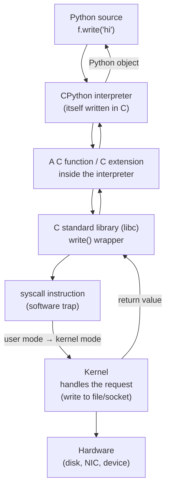

# From Code to Kernel

When a high-level program does something as ordinary as writing a line to a file, that
single statement sets off a descent through many layers — from the friendly source
language, down through a runtime written in C, through the C standard library, across a
protected boundary into the operating-system kernel, and finally to the hardware. Every
layer speaks to the one below it in a narrower, more machine-facing vocabulary, and the
pivot around which the whole chain turns is **C**. This note traces that call chain,
using **Python** as the high-level example and C as the connective tissue. It sits
between the language side —
[../computer-science/c-language.md](../computer-science/c-language.md) — and the OS side,
[the-kernel-and-system-calls.md](the-kernel-and-system-calls.md).

## The layered chain

Consider `open("log.txt", "w").write("hi")` in Python. Here is what actually happens:

1. **Python source.** You call a method. Python itself has no idea how to write to a
   disk — it has no direct access to hardware.
2. **The CPython interpreter — written in C.** The reference Python implementation is a
   C program (see [../languages-and-frameworks/python.md](../languages-and-frameworks/python.md)).
   Executing your bytecode is really running C code in the interpreter loop.
3. **A C function / C extension.** The interpreter dispatches the write to a built-in
   implemented in C (or a compiled extension module). Now we are running plain C.
4. **The C standard library (libc).** That C code calls libc's `write()` — a thin
   wrapper whose whole job is to set up the arguments and cross into the kernel. libc is
   the last user-space code before the boundary; see
   [../computer-science/c-language.md](../computer-science/c-language.md).
5. **The system call — a software trap.** The wrapper executes a special CPU
   instruction (`syscall` on x86-64) that deliberately traps into the kernel. This is
   not an ordinary function call; it is a controlled *mode transition*.
6. **User mode → kernel mode.** The CPU switches privilege level, saves the caller's
   state, and jumps to a fixed kernel entry point.
7. **The kernel handles the request.** The kernel validates the arguments, does the real
   work (writes bytes to the file's buffer, queues them to the device), then returns a
   result and switches the CPU back to user mode.
8. **Back up the stack.** The return value propagates back through libc, the C function,
   the interpreter, and finally becomes a Python object (a byte count or an exception)
   handed back to your code.

## User mode vs. kernel mode

Modern CPUs run in at least two privilege levels. **User mode** is restricted: it cannot
touch hardware directly, cannot access another process's memory, cannot execute
privileged instructions. **Kernel mode** is unrestricted — the kernel can do anything.
Ordinary application code (including the entire Python interpreter) runs in user mode;
only the kernel runs in kernel mode. This split is the foundation of process isolation
and protection; it is developed in
[../operating-systems/os-security-and-protection.md](os-security-and-protection.md)
and [processes-and-threads.md](processes-and-threads.md).

## Why the trap boundary exists

A user program cannot simply *call* a kernel function the way it calls a library
function — that would let any program touch any hardware or any other process's memory,
and isolation would collapse. The **trap** (software interrupt / `syscall` instruction)
is a single, guarded doorway: it is the *only* way to enter the kernel, it enters at a
fixed, kernel-controlled address, and the kernel validates every request before acting.
The boundary is deliberately expensive and deliberately narrow — a small, fixed menu of
system calls — because that narrowness is exactly what makes the protection enforceable.
This is the mechanism side of the file abstraction in
[../linux/everything-is-a-file.md](../linux/everything-is-a-file.md): a uniform `read`/
`write` interface over files, sockets, and devices, all reached through the same trap.

## Why "everything eventually speaks C to the OS"

Notice that no matter what language you start in, the chain converges on the same layers:
a runtime that is itself C (or that exposes a C foreign-function interface), then libc,
then the syscall. The operating system's public interface is defined in **C headers** and
reached through the **C ABI**; there is no Python-native or Ruby-native way into the
kernel. So high-level languages implement their runtimes in C, or interoperate with the
world through a C FFI, precisely so they can reach this boundary. C is not just one
language among many here — it is the *shared vocabulary* between every language and the
machine, which is the deeper claim argued in
[../computer-science/c-language.md](../computer-science/c-language.md) and made concrete
by the toolchain in
[../computer-science/compilers-and-interpreters.md](../computer-science/compilers-and-interpreters.md).
The final rung, where the kernel's instructions meet actual silicon, is the
[../electrical-engineering/hardware-software-boundary.md](../electrical-engineering/hardware-software-boundary.md).

## Why it matters

Understanding this chain demystifies performance and failure. It explains why crossing
into the kernel (a syscall) is measurably costly and why high-performance code batches
I/O to cross less often; why a "Python" error can surface a C-level or OS-level cause;
and why the C ABI is the universal joint of software. The whole edifice of modern
software rests on this narrow, C-shaped doorway between user code and the kernel.

## References

- Synthesized from the standard operating-systems account of system calls and privilege
  levels; see [the-kernel-and-system-calls.md](the-kernel-and-system-calls.md) and
  [../computer-science/c-language.md](../computer-science/c-language.md).
