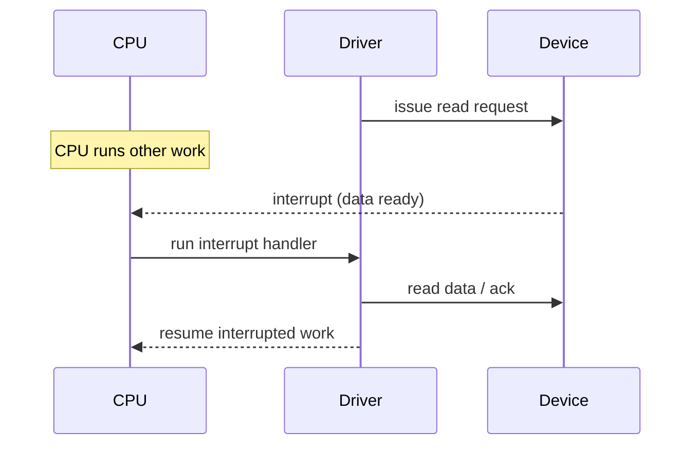

# I/O and Device Management

Managing input/output is the messiest job an operating system has. CPUs and memory are
uniform and fast; **devices** are a zoo of disks, keyboards, network cards, GPUs, and
sensors — each with its own registers, timing, and quirks, and most of them
maddeningly slow relative to the processor. The OS's I/O subsystem has one overriding
goal: hide that diversity behind a small, uniform interface while extracting as much
performance as the hardware allows. This is the software half of the
[hardware/software boundary](../electrical-engineering/hardware-software-boundary.md).

## The device abstraction

A program should not need to know whether "read the next byte" means spinning a disk
platter, draining a network buffer, or waiting for a keypress. The OS presents every
device through the same handful of operations — open, read, write, close, plus a
catch-all `ioctl` for device-specific controls — and in Unix, through the same
namespace as files, so that [everything is a file](../linux/everything-is-a-file.md):
a device shows up as a special file (e.g. `/dev/sda`) that programs manipulate with
ordinary file system calls. Those calls enter the kernel through
[the system-call interface](the-kernel-and-system-calls.md) and are routed to a driver.

## Device drivers

A **device driver** is the kernel module that knows the specifics of one class of
hardware. It sits between the generic kernel interface above and the device's raw
registers below, translating "write these bytes" into the exact sequence of register
pokes the hardware demands. Drivers are the single largest and most bug-prone part of
most kernels — they run with kernel privilege but are written to match hardware
datasheets, and a driver fault can take the whole system down. Linux mitigates this
with **loadable kernel modules** (drivers loaded and unloaded at runtime) and a stable
internal driver API; the design is covered in
[the-linux-kernel.md](../linux/the-linux-kernel.md).

## Block vs character devices

Unix splits devices into two broad families, reflecting how they move data:

| | **Character devices** | **Block devices** |
|---|---|---|
| Unit | a stream of bytes | fixed-size blocks |
| Access | sequential | random (addressable) |
| Buffering | usually unbuffered / line | goes through the buffer/page cache |
| Examples | terminal, serial port, `/dev/random` | disks, SSDs, USB storage |

Block devices are addressable and cacheable, which is exactly what a
[file system](file-systems.md) needs; the file system layer sits on top of the block
layer. Character devices are streams — you read what's there when it's there. (A third
category, **network devices**, doesn't fit the file namespace cleanly and is handled
through the socket interface instead.)

## Interrupts vs polling

The core problem of talking to slow hardware is: how does the CPU learn a device is
ready without wasting cycles?

- **Polling** — the CPU repeatedly reads a status register in a loop until the device
  signals ready. Simple and low-latency, but it **busy-waits**, burning the CPU on
  nothing. Only sensible for devices that are always fast or for tight, brief waits.
- **Interrupts** — the device raises a hardware **interrupt** line when it's ready; the
  CPU drops what it's doing, jumps to an **interrupt handler** (interrupt service
  routine), services the device, and resumes. The CPU is free to run other work in the
  meantime. This is the default for most I/O.

Interrupts have their own cost — each one is effectively a forced [context
switch](processes-and-threads.md) — so under heavy load (a saturated network card
firing thousands of interrupts per second) systems switch to **interrupt coalescing**
or hybrid **NAPI**-style polling: take one interrupt, then poll a batch of pending work
before re-enabling interrupts. Linux also splits handlers into a fast **top half**
(acknowledge the device now) and a deferred **bottom half** (do the real work later),
keeping interrupt latency low.

## DMA: getting the CPU out of the data path

For a large transfer — say, reading a megabyte from disk — having the CPU copy every
byte through a register would be catastrophic. **Direct Memory Access (DMA)** solves
this: the CPU programs a **DMA controller** with a source, destination, and length,
then walks away. The controller moves the data between the device and main memory on
its own, and raises a single interrupt when the whole transfer is done. The CPU spends
a few instructions setting it up instead of thousands of cycles copying. DMA is why a
disk read or network receive can proceed at full bus speed while the CPU does other
useful work.

## Buffering

Buffers absorb the impedance mismatch between producers and consumers of data:

- **Speed matching** — a fast CPU writing to a slow disk fills a buffer that drains at
  disk speed, so the program isn't blocked on every byte.
- **Size matching** — a stream of one-byte writes is accumulated into a full block
  before hitting a block device.
- **Copy semantics** — buffering lets a `write` call return once the data is safely
  copied into the kernel, so the application can reuse its buffer immediately even
  though the device hasn't actually consumed the data yet.

This is the same buffering that lets file-system writes be deferred and batched (see
[file-systems.md](file-systems.md)), and it's why an unexpected power loss can lose
data that a program believes it already wrote.

## The I/O subsystem as a stack

Put together, I/O is a layered stack. A `read` call descends from the application
through the system-call interface, into VFS and the file system, down to the generic
block layer (which schedules and merges requests), into the device driver, and finally
to the hardware — with DMA moving the bytes and an interrupt announcing completion on
the way back up. Each layer adds one abstraction and hides one detail, which is exactly
how the OS turns a chaotic hardware zoo into `open`/`read`/`write`/`close`.

## Why it matters

I/O is almost always the bottleneck. CPU-bound work is rare; most real programs spend
their time waiting on disks, networks, and users. The mechanisms here — interrupts to
avoid busy-waiting, DMA to free the CPU, buffering to smooth bursts — are what let a
system stay responsive and fast despite hardware that is glacial by CPU standards.
They also explain a lot of real-world behavior: why data can be "written" yet lost,
why a driver bug crashes the machine, and why device abstraction is what makes software
portable across wildly different hardware.

## References

- [Operating Systems](../computer-science/operating-systems.md) — field survey.
- [silberschatz-operating-system-concepts.md](silberschatz-operating-system-concepts.md) — canonical text.
- [tanenbaum-modern-operating-systems.md](tanenbaum-modern-operating-systems.md) — canonical text.
