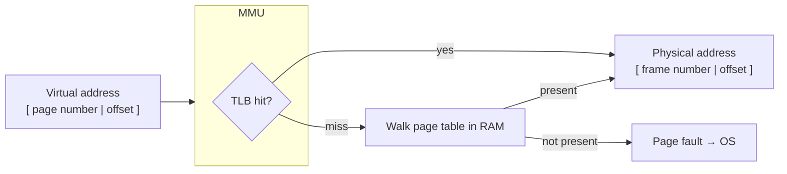

# Memory Management and Virtual Memory

Physical memory (RAM) is a single, finite array of bytes shared by every
[process](processes-and-threads.md). Yet each process is written as though it alone owns a
vast, contiguous, private memory starting at address zero. **Virtual memory** is the
mechanism that sustains that fiction — arguably the OS's most consequential abstraction. It
sits squarely on the [hardware-software boundary](../electrical-engineering/hardware-software-boundary.md):
the OS defines the policy, but dedicated hardware enforces it on every single memory access.
This deep dive complements the survey in
[../computer-science/operating-systems.md](../computer-science/operating-systems.md).

## Virtual vs. physical addresses

Every address a program uses is a **virtual address**. Before it can touch RAM it must be
**translated** to a **physical address**. This indirection buys three things at once:

1. **Isolation** — process A cannot even *name* process B's memory, because the translations
   are per-process. This is the foundation of
   [protection](os-security-and-protection.md).
2. **Abstraction** — each process sees a simple, contiguous space regardless of how
   fragmented physical RAM actually is.
3. **Overcommit** — the sum of all virtual address spaces can exceed physical RAM, because
   not all of it needs to be resident at once.

## Paging: the dominant mechanism

Both address spaces are chopped into fixed-size **pages** (virtual) and **frames**
(physical), typically 4 KiB. A **page table** per process maps each virtual page number to a
physical frame number (or records that the page isn't resident). Fixed-size pages eliminate
the *external* fragmentation that plagued older variable-size **segmentation** schemes —
any free frame fits any page — at the cost of some *internal* fragmentation (the slack in
the last page). See the physical substrate in
[../electrical-engineering/memory-and-storage-hardware.md](../electrical-engineering/memory-and-storage-hardware.md).

### The MMU and the translation walk

The **Memory Management Unit (MMU)** is the hardware that performs translation on every
load and store — software could never afford to. A virtual address splits into a **page
number** (index into the page table) and an **offset** (untranslated, since a page maps
whole). Because a flat page table for a 64-bit space would be astronomically large, real
systems use **multi-level (hierarchical) page tables**: the page number is split across
several index fields, and unused regions cost nothing (their sub-tables simply don't exist).
This connects to [../electrical-engineering/cpu-and-datapath.md](../electrical-engineering/cpu-and-datapath.md)
and the broader [../computer-science/computer-architecture.md](../computer-science/computer-architecture.md).

### The TLB: making translation fast

A multi-level walk means several extra memory accesses *per* instruction — ruinous. The
**Translation Lookaside Buffer (TLB)** is a small, fast associative cache of recent
virtual→physical translations inside the MMU. Because programs exhibit **locality** (they
reuse nearby addresses), TLB hit rates are very high and the walk is rare. A TLB *miss*
triggers the full walk (in hardware or the OS); a [context switch](processes-and-threads.md)
that changes the address space may **flush** the TLB (or the entries are tagged with an
address-space ID to avoid it) — one reason process switches cost more than thread switches.

## Page faults and demand paging

A page table entry can say "not present." When the MMU hits such an entry it raises a
**page fault** — a trap into the OS. The fault handler decides what happened:

- **Demand paging** — the page is legitimate but not yet loaded (e.g. first touch of code
  or a page evicted to disk). The OS finds a free frame, loads the page from disk/swap,
  updates the page table, and restarts the faulting instruction. The process never knew.
  This is why programs can start before their whole image is in RAM.
- **Copy-on-write** — the page is shared read-only (e.g. after `fork`); the write fault
  triggers a private copy. See [processes-and-threads.md](processes-and-threads.md).
- **Invalid access** — the address is genuinely illegal; the OS delivers a fault (a
  segmentation fault) to the process.

Page faults are the hook that lets the OS lie convincingly: memory *appears* fully present
and is materialized lazily, on demand.

## Swapping and replacement

When RAM fills, the OS must **evict** a resident page to a backing store (**swap** space on
disk/SSD, see [io-and-device-management.md](io-and-device-management.md)) to make room. The
**page replacement algorithm** chooses the victim, and the goal is to evict the page least
likely to be needed soon:

- **OPT** (evict the page used furthest in the future) is optimal but unrealizable — it
  needs the future. It's the yardstick.
- **LRU** (least recently used) approximates OPT using the past as a predictor, but exact LRU
  is too costly to track; real systems use **clock/second-chance** approximations driven by a
  hardware "referenced" bit.
- **FIFO** is simple but can suffer **Bélády's anomaly** (more frames → more faults).

### Thrashing

If the *working sets* of the running processes together exceed physical RAM, the system
spends more time paging than computing — every fault evicts a page another process is about
to fault back in. This is **thrashing**, and performance collapses catastrophically (disk is
orders of magnitude slower than RAM). The cure is not a cleverer replacement policy but
**reducing the multiprogramming level** — suspending whole processes until the remaining
working sets fit. Thrashing is where the overcommit gamble finally loses.

## Why it matters

Virtual memory is what makes the [process](processes-and-threads.md) abstraction whole: a
private address space is meaningless without hardware to isolate and translate it. It
underpins [protection](os-security-and-protection.md) (processes can't reach each other's
memory), enables [virtualization](virtualization-and-containers.md) (a second layer of
translation lets a hypervisor page a whole guest OS), and its performance hinges on hardware
caches (TLB) exactly as compute performance hinges on data caches. Get it wrong — thrash —
and no amount of CPU speed helps.

## References

- [tanenbaum-modern-operating-systems.md](tanenbaum-modern-operating-systems.md) — the memory-management chapter is the canonical treatment of paging, replacement, and thrashing.
- [ostep-operating-systems.md](../computer-science/ostep-operating-systems.md) — the "Virtualizing Memory" part builds paging, TLBs, and swapping from scratch.
- [silberschatz-operating-system-concepts.md](silberschatz-operating-system-concepts.md) — main memory and virtual memory.
- [patterson-hennessy-computer-organization.md](../computer-science/patterson-hennessy-computer-organization.md) — the hardware side of virtual memory, TLBs, and the memory hierarchy.
