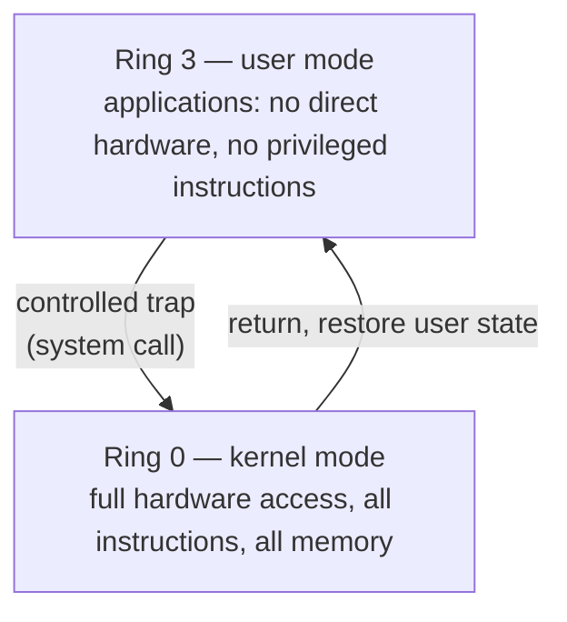

# OS Security and Protection

The operating system is the first and most important security boundary on a machine. It
is the only software that runs with full authority over the hardware, and it decides what
every other program is allowed to see and do. **Protection** is the set of mechanisms the
OS uses to enforce those decisions; **security** is the policy question of whether the
decisions are the right ones. The distinction matters: an OS can have flawless protection
mechanisms and still be insecure if the policy grants too much. Almost every real-world
compromise is a failure at one of these two layers — a mechanism that can be bypassed, or
a policy that was too permissive.

## Protection rings and privilege

Hardware gives the OS its authority through **privilege levels**, implemented on x86 as
four **protection rings** (though almost every OS uses only two of them):

Code in **kernel mode (ring 0)** can execute any instruction, touch any memory, and drive
any device. Code in **user mode (ring 3)** cannot — attempts to run privileged
instructions or access memory outside its address space trap into the kernel instead. The
CPU enforces this in hardware, which is what makes it a real boundary and not just a
convention. Everything else in OS security is built on top of this single distinction. (A
[hypervisor](virtualization-and-containers.md) effectively adds a ring "below" ring 0, and
CPU virtualization extensions give guest kernels their own privileged mode without letting
them touch the host.)

## User/kernel separation and the system call

Because applications cannot touch hardware directly, they request every privileged
service — opening a file, allocating memory, sending a packet — through a
**[system call](the-kernel-and-system-calls.md)**: a controlled trap that switches into
kernel mode, performs the operation *after checking permissions*, and returns to user
mode. This is the choke point. The kernel mediates **every** access to memory, files, and
devices, so a buggy or malicious process is structurally unable to bypass the checks —
there is no path to the hardware that doesn't go through the kernel. Combined with
[virtual-memory](memory-management-and-virtual-memory.md) address-space isolation (a
process literally cannot name another process's memory), this gives the two pillars of OS
protection: **you can't reach the hardware except through the kernel, and you can't reach
another process's memory at all.**

## Access control: users, permissions, capabilities

Within that boundary, the OS needs a policy for *who may do what*. Three models, in
increasing granularity:

- **Users and groups** — every process runs as a **subject** (a user identity), and every
  resource carries ownership and permission bits. Unix's owner/group/other read-write-execute
  model is the classic example; see
  [../linux/permissions-and-users.md](../linux/permissions-and-users.md). This is
  **discretionary access control (DAC)**: the resource owner sets the permissions.
- **Capabilities** — instead of "root can do everything," privilege is split into discrete
  tokens (Linux capabilities like `CAP_NET_BIND_SERVICE`, `CAP_SYS_ADMIN`). A process can be
  granted the one power it needs without the rest, shrinking what a compromise yields. This
  is the mechanism that makes least privilege practical.
- **Mandatory access control (MAC)** — a system-wide policy (SELinux, AppArmor) that even
  the resource owner cannot override, labeling subjects and objects and permitting only the
  interactions the policy allows. Used where DAC's owner-discretion is too loose.

## Isolation, sandboxing, and least privilege

**Isolation** is confining a process so that even if it misbehaves it cannot affect
anything outside its box. **Sandboxing** is isolation applied to code you don't trust —
you assume it is hostile and give it only what it needs to run. The tools are the ones
above, composed: namespaces and cgroups to restrict what it sees and uses (see
[virtualization-and-containers.md](virtualization-and-containers.md) and
[../linux/containers-and-namespaces.md](../linux/containers-and-namespaces.md)), dropped
capabilities, a restricted user, `seccomp` filters to block dangerous system calls, and —
for genuinely adversarial code — a VM-grade boundary.

The organizing principle throughout is the **principle of least privilege**: every
component should run with the minimum authority needed to do its job, and no more. A web
server that only serves files needs no ability to spawn shells; a database process needs
no raw network sockets. Least privilege doesn't prevent compromise, it *caps the damage* —
it turns "attacker got in" into "attacker got a tightly boxed process." This is exactly the
reasoning behind
[../ai-platform/why-and-how-to-sandbox-ai-generated-code.md](../ai-platform/why-and-how-to-sandbox-ai-generated-code.md)
and [../ai-platform/execution-sandboxing.md](../ai-platform/execution-sandboxing.md): AI-
generated code is untrusted code, so you run it with the least privilege that still lets it
do useful work, and you rely on OS isolation primitives to enforce the box.

## Common OS attack surfaces: privilege escalation

Attacks on the OS almost all aim at one thing: **crossing the privilege boundary** — moving
from unprivileged code to kernel- or root-level control. The main routes:

| Attack surface | How it crosses the boundary |
|---|---|
| **Privilege escalation** | a bug in privileged code (a setuid binary, a kernel driver) lets an unprivileged process gain root/kernel rights |
| **Vulnerable system calls / kernel bugs** | a malformed syscall or exploitable driver corrupts kernel memory — the highest-value target, since the kernel *is* the boundary |
| **Confused deputy** | tricking a privileged process into misusing its authority on the attacker's behalf |
| **Container / sandbox escape** | exploiting a kernel bug to break out of namespaces onto the host — a shared-kernel weakness |
| **Setuid / misconfigured permissions** | over-broad file permissions or an unnecessary setuid bit hand out privilege that was never needed (a least-privilege failure) |

The through-line: because the kernel holds all the authority, the kernel and every piece of
privileged code around it (drivers, setuid binaries, the syscall interface) are the surfaces
that matter. Reducing that surface — fewer privileged components, dropped capabilities,
syscall filtering, smaller trusted computing base — is the defensive counterpart to least
privilege.

## Why it matters

Every security property software has ultimately bottoms out in the OS: the address-space
isolation that stops one process from reading another, the user/kernel boundary that stops
untrusted code from touching hardware, the access-control policy that decides who may do
what. Application-level security (auth, input validation, crypto) sits *on top* of these
guarantees and is worthless if they fail — a kernel exploit voids every application
control above it. Understanding OS protection is understanding the foundation the entire
[security](../security/index.md) stack is built on.

## References

- [Modern Operating Systems (Tanenbaum)](tanenbaum-modern-operating-systems.md)
- [Operating System Concepts (Silberschatz)](silberschatz-operating-system-concepts.md)
