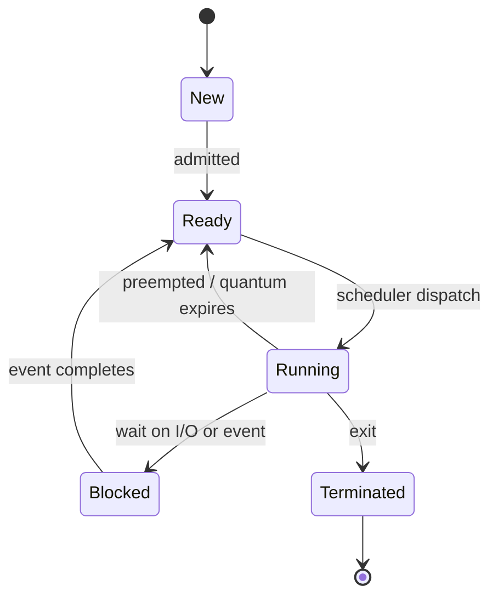

# Processes and Threads

The **process** is the operating system's central illusion: it lets a single machine
appear to run many programs "at once," each behaving as though it owns the CPU and
memory. Understanding processes and threads is understanding how that illusion is
constructed and torn down thousands of times a second. This is the deep-dive companion to
the general survey in [../computer-science/operating-systems.md](../computer-science/operating-systems.md)
and the concrete syscall-level view in [../linux/processes-and-signals.md](../linux/processes-and-signals.md).

## The process abstraction: two things bundled

A process is a *running program*, and it is really the union of two distinct resources:

1. **An address space** — the memory the program can name and touch: its code (text),
   initialized/uninitialized data, heap, and stack. This is virtualized; the addresses the
   process sees are not physical addresses. See
   [memory-management-and-virtual-memory.md](memory-management-and-virtual-memory.md).
2. **An execution context** — the CPU state that captures "where the program is": the
   program counter, the register file, the stack pointer, and privilege/mode bits. Plus
   OS-side bookkeeping: open file descriptors, the current working directory, signal
   handlers, user/group identity, and accounting data.

Separating these two is the key insight. The address space answers *what can this program
see*; the execution context answers *what is this program doing right now*. Threads exist
precisely because these can be decoupled.

## The Process Control Block (PCB)

For every process, the kernel keeps a **Process Control Block** — a data structure holding
everything needed to suspend and later resume the process. On Linux this is `task_struct`
(see [../linux/the-linux-kernel.md](../linux/the-linux-kernel.md)). It contains:

- **Identity**: process ID (PID), parent PID, user/group IDs.
- **State**: the current lifecycle state (below).
- **Saved CPU context**: registers, PC, stack pointer — restored on the next dispatch.
- **Memory info**: page tables / address-space descriptors.
- **Resources**: open-file table, signal disposition, working directory.
- **Scheduling info**: priority, time consumed, scheduling class (see
  [cpu-scheduling.md](cpu-scheduling.md)).

The PCB is the *materialized* form of a process: when the CPU is not executing it, the
process exists entirely as this record.

## The process state machine

A process moves through a small set of states as it competes for the CPU and waits on
events:

- **Ready** processes want the CPU but don't have it; the scheduler picks among them.
- **Running** is the (per-core) singular state — only one process runs per CPU at a time.
- **Blocked (waiting)** processes are asleep pending an event (disk read, network packet,
  lock). They consume no CPU. This is why I/O-bound workloads can multiplex efficiently:
  most processes are blocked most of the time.

A process leaving `Running` for `Ready` (preemption) versus `Blocked` (voluntary wait) is
the difference between the scheduler taking the CPU away and the process giving it up.

## Threads: multiple execution contexts, one address space

A **thread** is an independent execution context — its own PC, registers, and stack —
running *inside* a process's address space. A process starts with one thread; it can spawn
more, and they all share the same code, heap, globals, and open files.

| Dimension            | Process                          | Thread                              |
|----------------------|----------------------------------|-------------------------------------|
| Address space        | Private, isolated                | Shared with sibling threads         |
| Creation cost        | Heavy (fork, new page tables)    | Light (just a new stack + context)  |
| Communication        | Explicit IPC (below)             | Shared memory — just read/write     |
| Fault isolation      | A crash stays contained          | A bad pointer corrupts all siblings |
| Context-switch cost  | Higher (address space swap, TLB) | Lower (same address space)          |

The tradeoff is stark: threads are cheap and communicate for free through shared memory,
but that same sharing means one thread's memory bug can destroy the whole process, and
concurrent access must be synchronized (see
[concurrency-and-synchronization.md](concurrency-and-synchronization.md)). Processes pay
for isolation with heavier creation and explicit communication.

Threads may be scheduled by the kernel (**kernel threads**, the norm on modern systems,
each visible to the scheduler) or multiplexed in user space (**user threads**), which are
cheap but can't exploit multiple cores and block the whole process on a blocking syscall.
This maps onto the broader parallelism story in
[../computer-science/concurrency-and-parallelism.md](../computer-science/concurrency-and-parallelism.md).

## Context switching: the machinery of the illusion

A **context switch** is the act of stopping one thread/process and starting another. The
kernel:

1. Saves the running context (registers, PC, SP) into its PCB.
2. Chooses the next runnable entity (see [cpu-scheduling.md](cpu-scheduling.md)).
3. If it's a different process, swaps the address space (loads new page tables, which
   typically flushes or tags the TLB — see
   [memory-management-and-virtual-memory.md](memory-management-and-virtual-memory.md)).
4. Restores the new context and returns to user mode.

Context switching is pure overhead — no user work happens during it — so it must be fast,
yet frequent enough to keep the illusion smooth. The **cost** comes not just from the
register save/restore but from the *cache and TLB pollution* that follows: the new process
finds cold caches. Switching between threads of the *same* process is cheaper precisely
because the address space (and TLB) survives. This overhead is a central pressure on
scheduler design.

## Creating processes: fork/exec

The UNIX model creates a process by **`fork()`** (duplicate the caller, giving a
near-identical child that differs only in return value and PID) and then **`exec()`**
(replace the child's address space with a new program image). Modern kernels make `fork`
cheap with **copy-on-write**: parent and child share physical pages read-only until one
writes, at which point that page is copied. Details and signal handling live in
[../linux/processes-and-signals.md](../linux/processes-and-signals.md).

## Inter-Process Communication (IPC)

Because processes are isolated, they need explicit channels to cooperate. The major
mechanisms, and their tradeoffs:

- **Pipes / FIFOs** — a byte stream between related (or named) processes. Simple, but
  one-directional and unstructured. The backbone of the shell (see
  [../linux/the-shell-and-pipes.md](../linux/the-shell-and-pipes.md)).
- **Message queues** — discrete, structured messages with kernel-managed buffering.
- **Shared memory** — the kernel maps the same physical pages into two address spaces;
  the fastest IPC (no copying) but requires the processes to synchronize access
  themselves, reintroducing all the hazards of [concurrency-and-synchronization.md](concurrency-and-synchronization.md).
- **Sockets** — general endpoints that work locally *and* across the network, at the cost
  of copy and protocol overhead.
- **Signals** — asynchronous notifications (a lightweight "something happened"), covered in
  [../linux/processes-and-signals.md](../linux/processes-and-signals.md).

The recurring tradeoff: the more the OS mediates (message queues, sockets), the safer and
more structured the communication, but the more copying and syscall overhead; the more the
processes share directly (shared memory), the faster but the more the burden of correctness
falls on them.

## Why it matters

Processes and threads are the unit of everything else the OS does. Scheduling
([cpu-scheduling.md](cpu-scheduling.md)) decides which one runs; memory management
([memory-management-and-virtual-memory.md](memory-management-and-virtual-memory.md)) gives
each its private view; synchronization
([concurrency-and-synchronization.md](concurrency-and-synchronization.md)) keeps concurrent
threads from corrupting shared state; protection
([os-security-and-protection.md](os-security-and-protection.md)) keeps one process from
reaching into another. The abstraction is what turns a single sequential CPU into a
platform that runs a browser, a compiler, and a music player simultaneously.

## References

- [silberschatz-operating-system-concepts.md](silberschatz-operating-system-concepts.md) — the process and thread chapters are the canonical treatment.
- [tanenbaum-modern-operating-systems.md](tanenbaum-modern-operating-systems.md) — processes, threads, and IPC.
- [ostep-operating-systems.md](../computer-science/ostep-operating-systems.md) — the "Virtualization" part builds the process abstraction from first principles.
- [love-linux-kernel-development.md](love-linux-kernel-development.md) — how Linux realizes `task_struct`, fork, and context switching.
