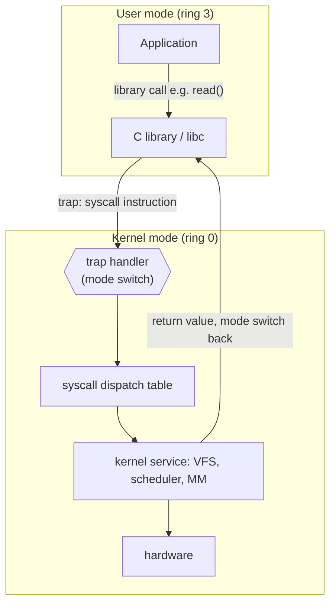

# The Kernel and System Calls

The **kernel** is the core of the operating system — the code that runs with full
privilege over the hardware and mediates every program's access to it. Everything else
(shells, browsers, databases) is a mere application that must ask the kernel for
anything it cannot do on its own: touching a device, allocating memory, creating a
[process](processes-and-threads.md). The kernel is anchored in two canonical texts,
[love-linux-kernel-development.md](love-linux-kernel-development.md) and
[tanenbaum-modern-operating-systems.md](tanenbaum-modern-operating-systems.md).

## Kernel mode vs user mode

Modern CPUs run in at least two **privilege levels**, a distinction enforced in
hardware — the OS side of the
[hardware/software boundary](../electrical-engineering/hardware-software-boundary.md):

- **Kernel mode** (supervisor mode, ring 0) — the CPU may execute any instruction:
  configure the memory-management unit, talk to devices, disable interrupts, halt the
  machine. Only the kernel runs here.
- **User mode** (ring 3) — a restricted subset. Privileged instructions and direct
  device access simply fault. Every application runs here.

This split is the foundation of protection. A buggy or malicious program cannot
directly scribble on another program's memory or seize a device, because the hardware
forbids the instructions that would let it. The only way up to full privilege is
through a controlled doorway the kernel defines — the system call.

## The system-call interface

A **system call** is the API between applications and the kernel — the complete list of
services the kernel offers. There are surprisingly few: process control (`fork`,
`execve`, `exit`, `wait`), file and I/O operations (`open`, `read`, `write`, `close`),
memory (`mmap`, `brk`), and communication (`pipe`, `socket`). Everything a program
accomplishes is ultimately some composition of these. Programs rarely invoke them
directly; the **C library** (libc) wraps each syscall in an ordinary function, handling
the argument marshalling and the trap. The full Unix/Linux surface is catalogued in
[kerrisk-linux-programming-interface.md](../linux/kerrisk-linux-programming-interface.md).

The system-call interface is a **stable contract**. Because it changes far more slowly
than the kernel internals behind it, a program compiled years ago still runs — the
kernel is free to rewrite its scheduler or file system as long as `read` still means
read. This stability is exactly what makes the kernel replaceable underneath a working
userland.

## The trap mechanism

How does a user-mode program, forbidden from privileged instructions, get the kernel to
act on its behalf? Through a **trap** (a software-triggered interrupt). Executing a
special instruction (`syscall` on x86-64, `svc` on ARM) does three things atomically:
it switches the CPU to kernel mode, saves the user program's state, and jumps to a
fixed kernel entry point — the **trap handler**. The handler reads a number the program
left in a register identifying *which* system call it wants, looks it up in the
**system-call dispatch table**, runs the corresponding kernel routine, and then returns:
restoring user state, switching back to user mode, and resuming the program right after
the trap. The controlled entry point is the whole point — user code never chooses where
in the kernel it lands, so it cannot jump into the middle of privileged code.

The same trap machinery handles **hardware interrupts** (a device needs attention, see
[io-and-device-management.md](io-and-device-management.md)) and **exceptions** (a
divide-by-zero, a page fault). All three transfer control into the kernel through
hardware-defined vectors; they differ only in what triggers them.

## Kernel architectures

Where should all this functionality live? This is the oldest structural debate in OS
design.

| Design | Structure | Pro | Con |
|---|---|---|---|
| **Monolithic** | drivers, file systems, scheduler, network stack all run in one kernel address space | fast (all in-process calls); simple sharing | large trusted base; a driver bug can crash everything |
| **Microkernel** | kernel keeps only the bare minimum (scheduling, memory, IPC); drivers and file systems run as *user-mode* servers | strong isolation; a crashed driver just restarts; small, verifiable core | IPC overhead between servers hurts performance |
| **Hybrid** | monolithic core with some services modularized or user-space | pragmatic middle ground | inherits some of both weaknesses |

The famous **Tanenbaum–Torvalds debate** pitted the microkernel ideal (MINIX, and later
the influential seL4) against the monolithic pragmatism of Linux. History gave a split
verdict: Linux and the traditional Unixes are monolithic and won on performance and
ecosystem, while microkernel ideas resurface wherever isolation is paramount (seL4 in
safety-critical systems, and Windows/macOS as hybrids). The reliability motivation
behind microkernels — contain the blast radius of a failure — echoes the general theme
of [fault tolerance](../distributed-systems/fault-tolerance-and-failure.md).

## Kernel modules

A pure monolithic kernel would need recompiling to add a driver — impractical. Linux
resolves the tension with **loadable kernel modules**: object files loaded into the
running kernel's address space on demand (`insmod`/`modprobe`) and unloaded when idle.
A module runs with full kernel privilege (so it is *not* isolation, unlike a microkernel
server) but it keeps the shipped kernel small and lets hardware support arrive without a
reboot. This is how a distribution supports thousands of devices from one kernel image;
the mechanics live in [the-linux-kernel.md](../linux/the-linux-kernel.md).

## Why it matters

The kernel/user split and the system-call interface are the two ideas that make modern
computing possible. The privilege split is why one misbehaving app can't take down the
machine or read another app's secrets — the basis of all
[OS security and protection](os-security-and-protection.md). The stable syscall contract
is why software is portable across kernel versions and why the OS can evolve underneath
a working userland. Nearly every interesting thing a program does — opening a file,
spawning a child, allocating memory — is a trap into this boundary.

## References

- [Operating Systems](../computer-science/operating-systems.md) — field survey.
- [love-linux-kernel-development.md](love-linux-kernel-development.md) — canonical text.
- [tanenbaum-modern-operating-systems.md](tanenbaum-modern-operating-systems.md) — canonical text.
