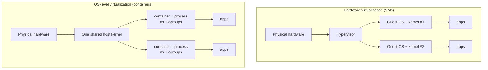

# Virtualization and Containers

Virtualization is the art of running many isolated systems on one physical machine by
convincing each guest that it owns the whole thing. It is the same illusion the OS
already sells to individual processes — a private address space, a private CPU — pushed
up a level: now the unit being multiplexed is an *entire operating system* (a virtual
machine) or an *entire userland* (a container). Two families of technique dominate, and
they differ in *where* the isolation boundary sits.

## Virtual machines and the hypervisor

A **virtual machine (VM)** is a software-defined computer: virtual CPUs, virtual memory,
virtual disks and NICs, running a complete guest OS that boots its own kernel exactly as
it would on bare metal. The component that creates and multiplexes VMs is the
**hypervisor** (or *virtual machine monitor*). Its job is the classic OS resource-manager
job one level down — it schedules guest vCPUs onto real cores, partitions RAM, and
mediates device access — except its "processes" are whole operating systems. The
foundational requirement, articulated by Popek and Goldberg, is that all *privileged*
instructions a guest executes must trap into the hypervisor so it can emulate them
safely; a guest kernel thinks it runs in kernel mode but actually runs deprivileged.

Hypervisors come in two arrangements:

| | **Type 1 (bare-metal)** | **Type 2 (hosted)** |
|---|---|---|
| Runs on | directly on hardware | on top of a host OS |
| Examples | Xen, VMware ESXi, KVM*, Hyper-V | VirtualBox, VMware Workstation, QEMU |
| Overhead | lower — no host OS in the path | higher — guest traps pass through the host |
| Typical use | data centers, cloud | developer laptops, desktops |

(*KVM is a hybrid: a Linux kernel module that turns the host [kernel](the-kernel-and-system-calls.md)
itself into a Type 1 hypervisor.)

### Full vs. para-virtualization

How the guest's privileged operations get handled defines the virtualization style:

- **Full virtualization** — the guest OS runs *unmodified*, believing it is on real
  hardware. Early x86 could not cleanly trap every sensitive instruction, so hypervisors
  used **binary translation** to rewrite dangerous instructions on the fly. Modern CPUs
  add **hardware-assisted virtualization** (Intel VT-x, AMD-V) that provides a real guest
  privilege mode and traps sensitive instructions in silicon, making full virtualization
  fast and the common case today.
- **Para-virtualization** — the guest OS is *modified* to know it is virtualized and
  makes explicit **hypercalls** to the hypervisor instead of trying privileged
  instructions. This avoids trap-and-emulate overhead but requires guest cooperation
  (classically Xen). The pattern survives in **paravirtualized drivers** (virtio) — even
  fully virtualized guests use PV drivers for disk and network because emulating real
  hardware devices is needlessly slow.

## OS-level virtualization: containers

A **container** takes the opposite approach: instead of a second kernel, it shares the
*host's* kernel and isolates only the userland. A container is, mechanically, just an
ordinary host process (and its children) that the kernel has placed inside a private view
of the system. On Linux this is built from two primitives — covered in depth in
[../linux/containers-and-namespaces.md](../linux/containers-and-namespaces.md):

- **Namespaces** isolate *what a process can see* — its own process IDs (pid), network
  stack (net), filesystem mounts (mnt), hostname (uts), IPC objects, and UID/GID mapping
  (user). A [user namespace](../linux/permissions-and-users.md) lets a process be root
  *inside* the container while being unprivileged on the host, which is what makes the
  boundary meaningfully secure.
- **cgroups (control groups)** limit *what a process can use* — CPU shares, a memory
  ceiling, block-I/O bandwidth, process count. Namespaces hide resources; cgroups ration
  them. Together they are the minimal recipe for multi-tenancy on a single kernel.

The image the container runs from is a stack of read-only layers unified by an overlay
filesystem, which is why containers start in milliseconds where a VM must boot.

## VMs vs. containers: the tradeoff

The whole comparison reduces to one question: *is there a second kernel?*

| | **Virtual machine** | **Container** |
|---|---|---|
| Guest kernel | yes, its own | no — shares the host kernel |
| Isolation boundary | hardware (hypervisor) | kernel features (ns + cgroups) |
| Startup | seconds to minutes (boot) | milliseconds |
| Footprint | GBs (full OS per guest) | MBs (userland + image layers) |
| Density on one host | tens | hundreds to thousands |
| Can run a different OS | yes (Windows guest on Linux) | no — same kernel as host |
| Blast radius of a kernel bug | contained per VM | shared across all containers |

VMs give **stronger isolation** at a **heavier cost**; containers give **density and
speed** by **sharing a kernel**. Neither is strictly better — the choice is a security
and efficiency tradeoff. This is why hardened designs blend them: microVMs (Firecracker),
gVisor (a user-space guest kernel), and Kata Containers wrap container ergonomics around a
VM-grade boundary, which is exactly the reasoning behind
[../ai-platform/execution-sandboxing.md](../ai-platform/execution-sandboxing.md) and
[../ai-platform/why-and-how-to-sandbox-ai-generated-code.md](../ai-platform/why-and-how-to-sandbox-ai-generated-code.md):
for genuinely adversarial code, a shared-kernel container alone is a weaker line than a VM.

## The OS view of what makes container isolation

From the operating system's perspective there is *nothing special* about a container — it
is a normal process. The isolation is not a container object; it is an emergent property
of ordinary kernel bookkeeping. When a process asks "which processes exist?" the kernel
answers only with those in its pid namespace; when it opens a path, the mnt namespace
scopes what the path resolves to; when it tries to allocate, the cgroup memory controller
enforces the ceiling. Every "boundary" is the [kernel](the-kernel-and-system-calls.md)
filtering a [system call](the-kernel-and-system-calls.md) through the requesting process's
namespaces and cgroups. This is why container isolation ultimately rests on the same
[user/kernel protection boundary](os-security-and-protection.md) as everything else: it is
strong exactly to the degree that the kernel's namespace and cgroup enforcement is correct,
and it fails wherever a kernel bug lets a guest escape that filtering. VMs, by contrast,
put a hardware-enforced wall between guest and host, so a guest kernel compromise does not
by itself reach the hypervisor.

## Why it matters

Virtualization is what makes cloud computing economically possible — one physical server
sold as many isolated units. [Kubernetes](../devops-sre/kubernetes.md) and other
orchestrators schedule, network, and heal *containers* at scale, but every pod and sidecar
resolves down to processes with namespaces and cgroups on some host kernel, and the cloud
substrate underneath those hosts is very often VMs. Knowing where the isolation boundary
sits — hardware or kernel feature — is what lets you reason about performance (boot time,
density), cost, and above all security: whether a given workload's isolation is strong
enough for the threat it faces.

## References

- [Modern Operating Systems (Tanenbaum)](tanenbaum-modern-operating-systems.md)
- [Operating System Concepts (Silberschatz)](silberschatz-operating-system-concepts.md)
