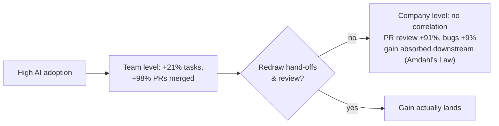

# Org Shape & Team Size

When agents change how much one person can ship, the constraint stops being
**headcount** and starts being the **org chart itself.** The shift: from managing
people who write code to **orchestrating outcomes.**

Headline cases are striking — **Oleve** (Quizard, Unstuck AI): ~$6M ARR, 5M
users, **four employees** — product engineers who each "CEO" a product plus a
small platform team. Ex-Pivotal engineers frame it bluntly: *"no longer limited
by the speed of writing code… limited by clarity of thought and domain
expertise"* — the "code scribe" role fades, tiny teams of senior engineers (<10)
attempt what once took dozens.

Two moves, partly in tension:

- **Teams get smaller** — a handful producing what once took many.
- **Operating models consolidate** the old hand-offs as the lifecycle compresses.

But the right shape is **genuinely contested** — the same productivity that
shrinks one team can just **relocate the bottleneck** to another.

## Why it matters: Amdahl's Law for org charts

The existing shape — sized and split for hand-written code — is **rarely right**
once agents are in the loop; leaving it untouched **wastes most of the gain.**
Faros AI (telemetry, 10,000+ devs / 1,255 teams): high-adoption teams **+21%
tasks, +98% PRs merged** — yet **PR review time +91%, bugs/dev +9%**, and **no
significant company-level correlation** (vendor, directional). Team gains
**absorbed by downstream review and coordination** — **Amdahl's Law:** a system
moves only as fast as its slowest link.

## The honest tension

Shrinking a team **only pays off if you also redraw the surrounding hand-offs and
review structure** — otherwise AI just moves the constraint downstream, where
unchanged org boundaries quietly erase the win. The viral four-person-unicorn
stories are **real but selective** — consumer studios, greenfield, few cross-team
deps — **not regulated enterprises** with legacy + compliance surface.

**Team Topologies** (team boundaries, cognitive load) still applies: agents change
the **math of how small a capable team can be**, not the need to draw boundaries
deliberately. The optimal structure is **being discovered, not settled.**

## Related

- [From Coder to Orchestrator](from-coder-to-orchestrator.md) — the individual
  shift that shrinks the team.
- [Rethinking Performance](rethinking-performance.md) /
  [Calculating ROI](calculating-roi.md) — where the team-vs-company gap shows up
  in the numbers.
- [Dark Factory](dark-factory.md) — the tiny-team endpoint taken to its limit.

## References
- [Org Shape & Team Size — Tessl Patterns](https://tessl.io/patterns/scaling-the-org/org-shape-team-size/)
