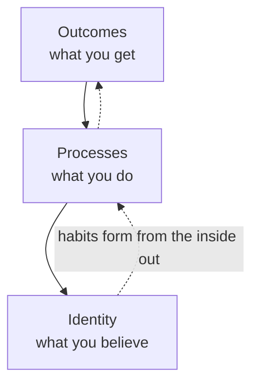

# Atomic Habits

James Clear's central claim is that outsized results come from tiny, compounding
changes rather than dramatic transformation. A habit improved by just **1% a day** is
~37x better over a year; a 1% daily decline drops nearly to zero. Habits are "the
compound interest of self-improvement" — their effect is invisible day to day and only
obvious in aggregate, which is why people abandon good habits before crossing the
**plateau of latent potential** (where progress accumulates unseen before it surfaces).

## Systems over goals

> You do not rise to the level of your goals. You fall to the level of your systems.

Goals set direction but don't produce progress; the system — the repeated process — does.
Goals are also shared by winners and losers alike, so they don't explain the difference.
Fixing behavior means fixing the system, not restating the goal. This reframing echoes the
"make change easy, then make the easy change" stance elsewhere in the wiki: design the
process so the desired action is the path of least resistance.

## Identity-based habits

Lasting change works from the inside out, across three layers. Most people start at the
outer layer (outcomes); durable habits start at the core (identity).

The aim is not "I want to run a marathon" but "I am a runner." Every action is a vote for
the type of person you wish to become; a habit sticks once it becomes part of your
self-image. Identity and habits are a two-way street — you build identity through repeated
evidence (small wins), and identity then sustains the behavior.

## The four laws of behavior change

Every habit runs a loop of **cue → craving → response → reward** (Clear's synthesis of the
same loop described in [the-power-of-habit.md](the-power-of-habit.md)). Each stage maps to a
law for *building* a good habit, and its inverse for *breaking* a bad one:

| Stage | Build a good habit | Break a bad habit |
|-------|--------------------|-------------------|
| Cue | 1. Make it **obvious** | Make it invisible |
| Craving | 2. Make it **attractive** | Make it unattractive |
| Response | 3. Make it **easy** | Make it difficult |
| Reward | 4. Make it **satisfying** | Make it unsatisfying |

Key tactics under each law:

- **Obvious** — implementation intentions ("I will [behavior] at [time] in [location]");
  **habit stacking** ("after [current habit], I will [new habit]"); designing the
  environment so cues for good habits are visible.
- **Attractive** — temptation bundling (pair a want-to with a need-to); joining a culture
  where your desired behavior is the norm.
- **Easy** — reduce friction; the **two-minute rule** (scale a new habit down to two
  minutes to make starting trivial); optimize for *reps*, not perfection.
- **Satisfying** — make success immediately rewarding; **habit tracking** ("don't break
  the chain"); never miss twice.

## Related notes

- [the-power-of-habit.md](the-power-of-habit.md) — the cue/routine/reward loop Clear builds on
- [grit.md](grit.md) — sustained effort over the long run; habits are how grit is executed daily
- [essentialism.md](essentialism.md) — fewer, better behaviors; disciplined pursuit
- [drive-daniel-pink.md](drive-daniel-pink.md) — mastery as gradual, compounding improvement
- [mindset-dweck.md](mindset-dweck.md) — identity and belief as levers for behavior

## References

- [Atomic Habits — James Clear](https://jamesclear.com/atomic-habits)
