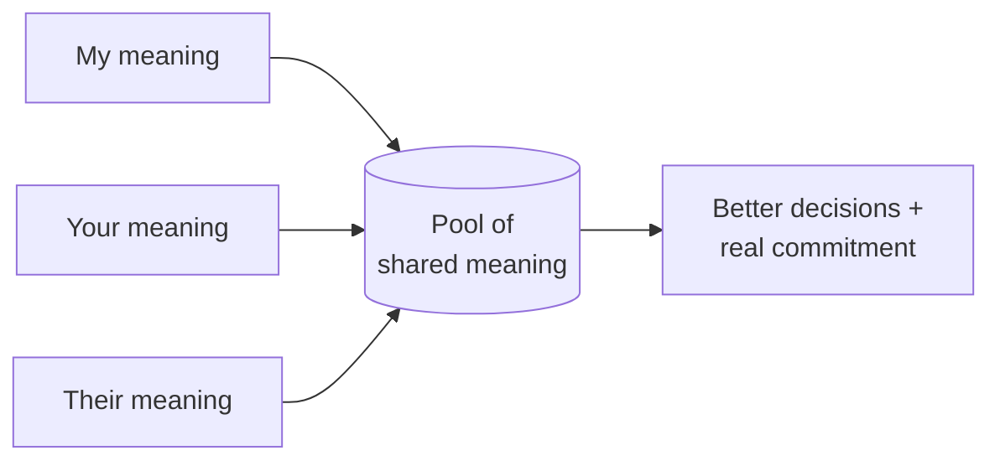

# Crucial Conversations

*Crucial Conversations: Tools for Talking When Stakes Are High* (2002, by Kerry
Patterson, Joseph Grenny, Ron McMillan, and Al Switzler) is about the specific
conversations that most determine outcomes and that people most often handle
badly. A conversation is **crucial** when three conditions coincide: the stakes
are high, opinions differ, and emotions run strong. Under those conditions our
instincts betray us — we default to fight (attack, control, force) or flight
(silence, avoidance, sarcasm), and both destroy the exchange.

## The core mechanism: the pool of shared meaning

The central metaphor is the **pool of shared meaning**. Each person brings their
own facts, feelings, opinions, and experiences. Skilled dialogue means getting
all of that relevant information — from everyone — safely into a shared pool.
The larger and more honest the pool, the better the decisions and the more
committed people are to acting on them. Everything else in the method serves
this one goal: keep information flowing into the pool.

## Key skills

**Start with heart — work on me first.** Before managing the conversation, get
clear on what you *really* want (for yourself, the other person, and the
relationship). Refuse the "sucker's choice" that you must pick between being
honest and keeping the peace.

**Learn to look.** Watch for the moment a conversation turns crucial and for the
signs that safety is breaking down — that's when people move to silence or
violence.

**Make it safe.** People go silent or aggressive when they feel unsafe, not
because of the content. Safety rests on two conditions: **mutual purpose** (they
believe you're working toward a goal they share, not against them) and **mutual
respect** (they believe you respect them). When either is lost, step out of the
content, restore it — apologize, contrast to fix misunderstanding, or find a
higher shared purpose — then step back in.

**Master my stories.** Between what happens and how we feel sits the story we
tell ourselves. Strong emotion comes from that interpretation, not the raw fact.
Retrace the "path to action" (see → tell a story → feel → act), question the
clever stories ("victim," "villain," "helpless"), and separate fact from story
so you can regain composure and speak from an accurate account.

**STATE my path.** A five-part sequence for sharing risky views without killing
safety: **S**hare your facts, **T**ell your story, **A**sk for the other's path,
**T**alk tentatively (hold your view as a view, not a verdict), and **E**ncourage
testing (invite dissent).

**Explore others' paths.** Draw out others' facts and stories with **AMPP**:
**A**sk, **M**irror, **P**araphrase, **P**rime. Then move to action — decide how
you'll decide and document who does what by when with follow-up.

## Relation to other work

Crucial Conversations operationalizes ideas that run through this shelf: the
"see it from their side" and "avoid making them defensive" instincts of
[How to Win Friends and Influence People](how-to-win-friends-and-influence-people.md);
the self-regulation and empathy competencies of
[Emotional Intelligence](emotional-intelligence.md) (mastering your stories is
literally managing an [amygdala hijack](emotional-intelligence.md)); and the
safety-first, label-and-empathize stance of
[Never Split the Difference](never-split-the-difference.md). Watching for the
turn to silence or violence is aided by reading nonverbal cues —
[How to Read People / Body Language](how-to-read-people-body-language.md).

## References

- [Crucial Conversations — Crucial Learning](https://cruciallearning.com/crucial-conversations-book/)
